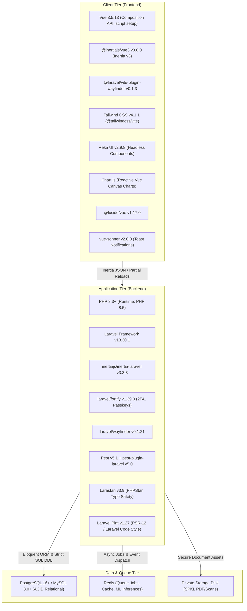
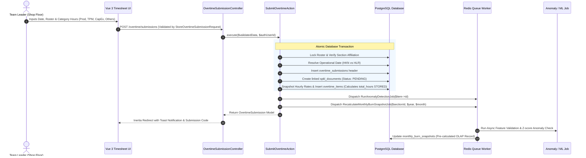
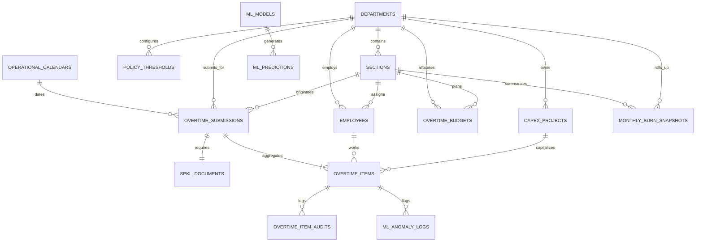
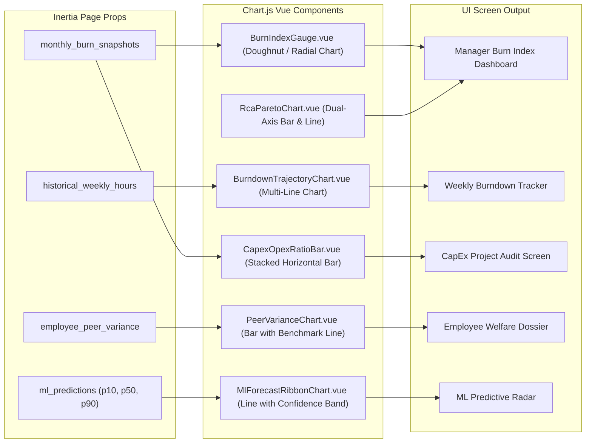

# System Architecture Document: Overtime & CapEx Labor Management System (OT-CapEx)

**Application Title:** Overtime & CapEx Labor Management System (OT-CapEx System – Manufacturing)  
**Lead Developer:** Zulfikar Hidayatullah (+62 857-1583-8733)  
**Architecture Version:** 1.0.0  
**Status:** Approved & Living Baseline  
**Target Deployment:** Linux (WSL2 / Production Ubuntu Server), Docker / Laravel Cloud  
**Standard Locales:** Timezone `Asia/Jakarta` (WIB, UTC+7) · Currency `Indonesian Rupiah (Rp, IDR)` · Language: Dev Docs (English), UI & User Docs (Bahasa Indonesia)

---

## 1. Executive Summary & Purpose

The **Overtime & CapEx Labor Management System (OT-CapEx)** is an enterprise manufacturing operations, labor governance, and financial analytical platform. Built for industrial manufacturing plants (production assembly lines, press/body welding, stamping, tooling workshops, and maintenance divisions), the system addresses critical operational challenges:

1. **Shift Handover Bottlenecks**: Rapid shift-end overtime data capture for 10–50 Team Leaders submitting timesheets simultaneously (800–1,500 daily line items across 35 sections).
2. **Flexible Non-Blocking SPKL Governance**: Operational shifts cannot be stalled by delayed paperwork. Overtime is submitted immediately, and formal _Surat Perintah Kerja Lembur_ (SPKL) documents are attached asynchronously within a policy grace period.
3. **CapEx vs. OpEx Capitalization Transparency**: Clear financial segregation between daily operational catch-up (OpEx) and capitalized labor on fixed asset projects (CapEx), fully compliant with tax and depreciation auditing standards.
4. **Burn Index & Budget Control**: Proactive monitoring of monthly section overtime hour consumption through an analytical **Burn Index**, categorizing burn velocity into actionable operational control zones.
5. **Supervised ML & Predictive Intelligence**: Transitioning from static formulas to supervised machine learning models for demand forecasting, burn trajectory projection, and operational anomaly detection.
6. **Modern High-Performance Tech Stack**: Powered by Laravel 13, Vue 3, Inertia.js v3, Wayfinder typed routing, Tailwind CSS v4, Reka UI, and Chart.js for data visualization.

---

## 2. Technology Stack & Verification Matrix

The application's technical stack is verified against installed packages in `composer.lock` and `package.json`:

### Detailed Component Specifications

| Layer                  | Component                    | Version              | Role in OT-CapEx System                                                                                              |
| ---------------------- | ---------------------------- | -------------------- | -------------------------------------------------------------------------------------------------------------------- |
| **Runtime**            | PHP                          | `^8.3` (Running 8.5) | Primary execution engine with native type safety and promoted constructor properties.                                |
| **Backend Core**       | `laravel/framework`          | `v13.30.1`           | Robust web application framework handling transactions, scheduling, and queue workers.                               |
| **Authentication**     | `laravel/fortify`            | `v1.39.0`            | Headless authentication backend supporting multi-factor auth (TOTP QR) and session security.                         |
| **Passkeys**           | `@laravel/passkeys`          | `^0.2.0`             | Passwordless WebAuthn biometric login for plant floor kiosks and tablets.                                            |
| **SPA Bridge**         | `inertiajs/inertia-laravel`  | `v3.3.3`             | Inertia v3 protocol connecting Laravel controllers with Vue views without REST API overhead.                         |
| **Routing**            | `laravel/wayfinder`          | `v0.1.21`            | Compile-time TypeScript route and controller action generator (`@/actions`, `@/routes`). Ziggy is strictly excluded. |
| **Frontend Framework** | `vue`                        | `^3.5.13`            | Single-page application layer utilizing `<script setup>` and Vue 3 Reactivity API.                                   |
| **Frontend Inertia**   | `@inertiajs/vue3`            | `^3.0.0`             | Reactive page visits, deferred props, instant visits, and partial reloads.                                           |
| **CSS Utility**        | `tailwindcss`                | `^4.1.1`             | Zero-config CSS-first engine via `@tailwindcss/vite` for responsive manufacturing dashboards.                        |
| **UI Primitives**      | `reka-ui`                    | `^2.9.8`             | Accessible headless component primitives (dialogs, dropdowns, accordions, popovers).                                 |
| **Data Visualization** | `chart.js`                   | Latest               | Canvas-based charting library for Burn Index dials, burndown lines, CapEx ratios, and ML bands.                      |
| **Icons & Alerts**     | `@lucide/vue` & `vue-sonner` | `^1.17.0` / `^2.0.0` | Modern SVG icons and non-blocking toast notifications for shift-end workflows.                                       |
| **Build Tooling**      | `vite` / `vite-plus`         | `^8.0.0` / `0.3.0`   | Fast HMR, TypeScript compilation (`vue-tsc`), and asset bundling (`vp build`, `vp check`).                           |
| **Package Manager**    | `pnpm`                       | Latest               | Fast, disk-efficient package manager required for all frontend dependencies.                                         |
| **Testing Engine**     | `pestphp/pest`               | `^5.1`               | Expressive testing framework for unit, feature, and transaction integration tests.                                   |

---

## 3. System Architecture & Component Topology

The system adheres to a pragmatic **Laravel Service Pattern** where controllers are strictly kept thin (≤ 30 lines) and business transactions reside within single-responsibility Domain Actions and Services.

---

## 4. Entity Relationship Model & Data Architecture

### Core Invariants & Database Integrity Rules

1. **Stored Generated Column for Total Hours (`CALC-01`)**:
   `overtime_items.total_hours` is defined as `GENERATED ALWAYS AS (hours_production + hours_tpm + hours_project + hours_others) STORED`. This prevents drift between category allocations and reported totals.
2. **Immutable Financial Cost Snapshotting**:
   `hourly_rate_snapshot` and `total_cost_snapshot` are written during submission/approval from `employees.hourly_rate` (or fallback to `departments.default_hourly_rate`). Historical overtime costs never shift when labor rates update in future fiscal years.
3. **CapEx Labor Attribution Integrity (`BR-08`)**:
   Enforced at the database constraint level:
   $$\text{CHECK } (hours\_project = 0.00 \text{ OR } (hours\_project > 0.00 \text{ AND } capex\_project\_id \text{ IS NOT NULL}))$$
4. **Optimistic Locking (`lock_version`)**:
   `overtime_items` maintains an integer `lock_version` incremented on review actions, eliminating race conditions during concurrent manager reviews.
5. **Foreign Key Deletion Safety**:
   All foreign keys to financial master data (`departments`, `sections`, `employees`, `capex_projects`) utilize `ON DELETE RESTRICT`. Physical deletion of operational records is blocked.

---

## 5. Chart.js Visualization Architecture

The OT-CapEx application visualizes operational trends and predictive analytics using **Chart.js** integrated with Vue 3 reactive components.

### Chart.js Component Specifications

| Chart Component               | Chart.js Type                     | Primary Metrics                                                            | Aesthetic & Operational Rules                                                                                                                                                      |
| ----------------------------- | --------------------------------- | -------------------------------------------------------------------------- | ---------------------------------------------------------------------------------------------------------------------------------------------------------------------------------- |
| `BurnIndexGauge.vue`          | `doughnut` (Half-circle gauge)    | Current Section Burn Index % (`CALC-02`)                                   | Color-coded arcs by threshold: `<85%` (Emerald/Green), `85-100%` (Blue), `101-115%` (Amber/Orange), `>115%` (Crimson/Red). Center text displays numeric percentage and Zone badge. |
| `BurndownTrajectoryChart.vue` | `line`                            | Week 1–5 Planned vs Cumulative Actual Hours                                | Solid line for actuals, dashed reference line for planned budget trajectory. Fill gradient beneath actuals.                                                                        |
| `CapexOpexRatioBar.vue`       | `bar` (Horizontal stacked)        | Production + TPM (OpEx) vs Project (CapEx)                                 | Indigo for CapEx hours, Slate for OpEx. Direct percentage labels on segments.                                                                                                      |
| `PeerVarianceChart.vue`       | `bar` + horizontal annotation     | Individual hours vs Dept Average (`CALC-06`)                               | Bar per employee; threshold line at department mean $\pm 1$ standard deviation. Flags overload (> 20 hrs/week).                                                                    |
| `MlForecastRibbonChart.vue`   | `line` with fill between datasets | Demand forecast ($P_{50}$) with $P_{10}$ and $P_{90}$ confidence intervals | Translucent area fill representing ML uncertainty ribbon; step-line for actual shifts.                                                                                             |
| `RcaParetoChart.vue`          | `bar` + `line` (Dual Y-Axis)      | Downtime / Overtime hours by RCA tag + Cumulative %                        | Left axis shows total hours; right axis shows 0–100% cumulative line with an 80/20 reference marker.                                                                               |

---

## 6. Business Calculations & Core Formulas Reference

| Rule ID   | Metric Name                | Mathematical Formula                                                                           | Purpose & Trigger                                                                  |
| --------- | -------------------------- | ---------------------------------------------------------------------------------------------- | ---------------------------------------------------------------------------------- |
| `CALC-01` | **Total OT Hours**         | $\sum(\text{Prod} + \text{TPM} + \text{Project} + \text{Others})$                              | Automatic generated column calculation for every worker line. Minimum `0.5` hours. |
| `CALC-02` | **Burn Index (%)**         | $\left( \frac{\text{Actual Hours Consumed}}{\text{Budget Hours Planned}} \right) \times 100\%$ | Evaluates monthly budget depletion status per section or department.               |
| `CALC-03` | **Remaining Budget**       | $\text{Budget Hours} - \text{Actual Hours}$                                                    | Live balance indicator on timesheet forms and management cards.                    |
| `CALC-04` | **Burn Velocity**          | $\frac{\text{Cumulative Hours Consumed}}{\text{Elapsed Operational Weeks}}$                    | Average weekly consumption rate for trend projection.                              |
| `CALC-05` | **Projected Period Total** | $\text{Burn Velocity} \times \text{Total Weeks in Period}$                                     | Forecasts month-end total based on current velocity.                               |
| `CALC-06` | **Peer Variance**          | $\text{Individual Hours} - \text{Dept Average Hours}$                                          | Evaluates workload distribution imbalances for employee welfare.                   |
| `CALC-07` | **CapEx Ratio (%)**        | $\left( \frac{\text{Project Hours}}{\text{Total OT Hours}} \right) \times 100\%$               | Proportion of overtime capitalized onto fixed assets.                              |
| `CALC-08` | **Financial Labor Cost**   | $\text{Total Hours} \times \text{Hourly Rate Snapshot}$                                        | Computes standard costing in Indonesian Rupiah (`NUMERIC(15,2)`).                  |

### Operational Control Matrix (Burn Index Zones)

| Range             | Status Designation             | Operational Zone Code | Action Required                                                     |
| ----------------- | ------------------------------ | --------------------- | ------------------------------------------------------------------- |
| `< 85.0%`         | Under Budget (High Efficiency) | `ZONE_1_EXCELLENT`    | Normal operations; potential surplus reallocation.                  |
| `85.0% – 100.0%`  | On Track (Balanced)            | `ZONE_2_GOOD`         | Plan adheres to monthly labor allocation.                           |
| `100.1% – 115.0%` | Warning (Approaching Deficit)  | `ZONE_3_WARNING`      | Review queue triggers alert; manager pre-approval recommended.      |
| `> 115.0%`        | Over Budget (Deficit Zone)     | `ZONE_4_POOR`         | Immediate operational escalation; CapEx/OpEx reallocation required. |

---

## 7. Role-Based Access Control (RBAC) Matrix

| Feature / Action                |      Admin       |      Manager      |       Team Leader       | User (Operator) |
| ------------------------------- | :--------------: | :---------------: | :---------------------: | :-------------: |
| **Daily Timesheet Entry**       |   All Sections   |   Dept Sections   |       Own Section       |  ❌ Read Only   |
| **SPKL File Attachment**        |  ✅ Full Access  |  ✅ Full Access   | ✅ Assigned Submissions |  ❌ No Access   |
| **Approve / Reject Line Items** |  ✅ Plant-wide   |   ✅ Dept-level   |      ❌ No Access       |  ❌ No Access   |
| **Bulk Decision Execution**     |  ✅ Plant-wide   |   ✅ Dept-level   |      ❌ No Access       |  ❌ No Access   |
| **Burn Index & Dashboard**      |  ✅ Plant-wide   |   ✅ Dept-level   |     ✅ Own Section      |  ❌ No Access   |
| **Personal Timesheet Dossier**  | ✅ All Employees | ✅ Dept Employees |     ✅ Section Crew     |  ✅ Self Only   |
| **CapEx Master & Allocation**   |   ✅ Full CRUD   | ✅ Dept Projects  |      ❌ Read Only       |  ❌ No Access   |
| **ML Inference & Tuning**       |  ✅ Full Config  | ✅ View Insights  |      ❌ View Only       |  ❌ No Access   |
| **Master Data (Roster, Rates)** |   ✅ Full CRUD   |   ❌ Read Only    |      ❌ Read Only       |  ❌ No Access   |

---

## 8. Asynchronous Processing & Queue Architecture

To ensure high-throughput shift handovers remain snappy, resource-intensive operations execute asynchronously via Redis queues:

1. **`RecalculateMonthlyBurnSnapshotJob`**:
   Dispatched on overtime submission, line-item approval, or batch status transitions. Aggregates monthly actuals, updates `monthly_burn_snapshots`, and keeps OLAP dashboard queries sub-millisecond.
2. **`RunAnomalyDetectionJob`**:
   Dispatched per overtime item. Calculates statistical Z-score against section history (e.g., sudden 8-hour overtime on normal weekdays without breakdown tags) and logs warnings in `ml_anomaly_logs`.
3. **`SpklGracePeriodReminderJob`**:
   Scheduled daily at 06:00 WIB via Laravel Scheduler. Queries `spkl_documents` where `status = 'PENDING'` and `due_date <= CURRENT_DATE`, notifying supervisors of impending grace period expiry.
4. **`ExtractMlTrainingFeaturesJob`**:
   Weekly scheduled job compiling multi-month feature matrices for supervised ML models.

---

## 9. Security, Compliance & Audit Standards

1. **Scar Tissue Audit Trail (`overtime_item_audits`)**:
   Every state change on an overtime item records actor ID, action type, IP address, and before/after JSON snapshots. Historical records are immutable.
2. **Indonesian Labor & Company Policy Compliance**:
   Separation of workdays (`HKN`) and weekends/holidays (`HLR`). Flags weekly soft limits (> 20 hours/week) to comply with worker welfare rules while preserving operational flexibility.
3. **Session & Kiosk Security**:
   Laravel Fortify session authentication augmented by `@laravel/passkeys` (WebAuthn biometric support) for rapid operator tablet authentication.
4. **Wayfinder Exclusivity**:
   All frontend requests utilize strongly-typed Wayfinder action functions (`@/actions/...`), preventing route URL drift and unauthorized parameter tampering.

---

## 10. Operational Guidelines for Developers

1. **Timezone Rule**: Always write `now('Asia/Jakarta')` or configure Carbon locale `id`. Never use server default timestamps.
2. **Currency Rule**: Always format currency using Indonesian Rupiah: `Intl.NumberFormat('id-ID', { style: 'currency', currency: 'IDR', minimumFractionDigits: 0 })`.
3. **Pint Code Style**: Run `vendor/bin/pint --dirty --format agent` after modifying PHP classes.
4. **Vite & Quality Gate**: Always execute `pnpm check` and `pnpm build` before pushing any branch.
