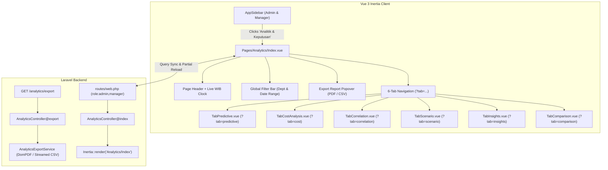
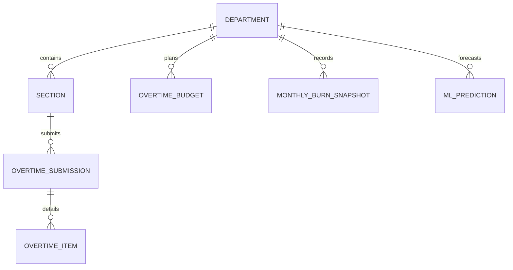

# Analytics & Decision Intelligence Hub

## Overview

The Analytics & Decision Intelligence Hub (`/analytics`) is PT Isuzu Astra Motor Indonesia's strategic decision support screen (Module B of Epic-09). Designed for Plant General Managers, Department Heads, and Finance Controllers, it consolidates predictive machine learning forecasts, financial OpEx/CapEx breakdowns, productivity sweet-spot correlations, what-if workload simulators, fatigue risk indicators, and cross-departmental benchmarking under a unified 6-tab interface.

## Architecture Diagram

## Data Model

## Key Files & UI Mapping

| Layer            | File / Route / Menu                                            | Purpose                                                     |
| :--------------- | :------------------------------------------------------------- | :---------------------------------------------------------- |
| Sidebar Menu     | `Analitik & Keputusan` (`testId: 'nav-analytics'`)             | User entry point in UI (Admin & Manager only)               |
| Page Component   | `resources/js/pages/Analytics/Index.vue`                       | Master shell, header, filter bar, tab switcher              |
| Sub-Tab 1        | `resources/js/pages/Analytics/TabPredictive.vue`               | Predictive analytics & ML forecasting (E09-07)              |
| Component        | `resources/js/components/analytics/ForecastBarChart.vue`       | Next month section bar chart with error whiskers            |
| Component        | `resources/js/components/analytics/TrendProjectionChart.vue`   | 6-month historical/projected line + CI ribbon               |
| Component        | `resources/js/components/analytics/SeasonalPatternChart.vue`   | 12-month annual seasonality curve + peak shadow             |
| Component        | `resources/js/components/analytics/SeasonalSummaryCards.vue`   | Peak, low season & cycle duration summary cards             |
| Sub-Tab 2        | `resources/js/pages/Analytics/TabCostAnalysis.vue`             | Overtime financial breakdown & OpEx/CapEx audit (E09-08)    |
| Component        | `resources/js/components/analytics/CostByDepartmentChart.vue`  | Horizontal bar chart sorted descending by spend (E09-08)    |
| Component        | `resources/js/components/analytics/CostTrendStackedChart.vue`  | 6-month stacked OpEx vs CapEx area chart (E09-08)           |
| Component        | `resources/js/components/analytics/BudgetVsActualBarChart.vue` | Grouped bar chart comparing planned vs actual (E09-08)      |
| Component        | `resources/js/components/analytics/CostBreakdownTable.vue`     | Sortable high-density audit table with grand total (E09-08) |
| Sub-Tab 3        | `resources/js/pages/Analytics/TabCorrelation.vue`              | Bivariate correlation & productivity sweet spot             |
| Sub-Tab 4        | `resources/js/pages/Analytics/TabScenario.vue`                 | Production volume & workload scenario simulator             |
| Sub-Tab 5        | `resources/js/pages/Analytics/TabInsights.vue`                 | Automated risk indicators & fatigue alerts                  |
| Sub-Tab 6        | `resources/js/pages/Analytics/TabComparison.vue`               | Period comparison & departmental benchmarking               |
| Export Component | `resources/js/components/analytics/ExportReportPopover.vue`    | Dropdown trigger for PDF and CSV exports                    |
| Controller       | `app/Http/Controllers/AnalyticsController.php`                 | Handles page rendering, API, and export requests            |
| Service Layer    | `app/Services/Analytics/PredictiveAnalyticsService.php`        | ML prediction query, MA-3 fallback, seasonality             |
| Service Layer    | `app/Services/Analytics/CostAnalysisService.php`               | Financial KPI aggregation, OpEx/CapEx, budget pacing        |
| Export Service   | `app/Services/Analytics/AnalyticsExportService.php`            | Generates executive PDF and streamed UTF-8 CSV              |
| PDF Template     | `resources/views/pdf/analytics-executive-summary.blade.php`    | Executive A4 summary layout with ISUZU branding             |

## Flow Explanation

1. **User triggers navigation**: An Admin or Manager clicks **Analitik & Keputusan** in the sidebar. (Team Leaders and Operators do not have this link and receive HTTP 403 if navigating directly).
2. **Request handling**: `AnalyticsController@index` intercepts the request, validates the requested `tab` (defaulting to `predictive`), scopes the department list based on role (full list for Admin, single assigned department for Manager), and renders `Analytics/Index`. When `tab === 'predictive'`, `PredictiveAnalyticsService::getPredictiveData()` is executed and hydrated as the initial `predictiveData` prop.
3. **Predictive Analytics Computation (E09-07)**:
    - Evaluates active `MlModel` (`DEMAND_FORECAST`) and queries `MlPrediction` (`MONTH_NEXT`) for next month's section and department forecasts.
    - If ML predictions are uninitialized (cold-start), seamlessly computes a 3-month Simple Moving Average ($MA_3$) from approved historical `overtime_items` and attaches a prominent "Moving Average" baseline badge.
    - Decomposes historical hours into a 12-month calendar seasonal cycle, identifying peak quarters (e.g. Q4), lowest months, and variance deltas against grand annual averages.
    - Generates a 6-month continuous trend trajectory: 3 solid historical months and 3 dashed projected months with a 90% confidence interval shaded ribbon.
    - Whisker plugins on Chart.js bar charts compute and draw physical confidence intervals for each section.
4. **Cost Analysis Computation (E09-08)**:
    - When `tab === 'cost'` or when asynchronously querying `GET /analytics/cost`, `CostAnalysisService::getCostData()` aggregates strictly approved overtime records from `overtime_items` within the filter period.
    - Computes 4 financial KPI cards: Total Overtime Cost (`Rp 125,5 Jt`), Remaining Budget with progress pacing bar, Average Cost per Active Employee, and CapEx Cost Ratio (`SUM(hours_project * rate) / total_cost * 100%`).
    - Produces a 6-month historical stacked area chart decomposing OpEx vs CapEx labor spend.
    - Generates horizontal bar charts ranking department spend with color-coded budget compliance tags, alongside a grouped Planned vs Actual bar chart highlighting budget deficits in red.
    - Renders an interactive, sortable high-density audit table with real-time text search and grand total footer.
5. **Tab Switching**: Clicking any tab button updates the local `activeTab` ref instantly. The URL query parameter is updated via `window.history.replaceState` without triggering a full page reload.
6. **Filter Adjustments**: Changing the department or date filter updates query parameters and initiates an Inertia partial reload (`preserveState: true`, `preserveScroll: true`) to update server-supplied datasets while keeping the active tab intact. Alternatively, client components query `GET /analytics/cost` or `GET /analytics/predictive` asynchronously.
7. **Exporting Reports**: Clicking **Ekspor Laporan** opens the popover displaying current filter scope. When on Tab 2, selecting PDF or CSV generates either a structured cost audit CSV or a branded executive PDF summary with financial KPI cards and department breakdown tables.

## API Endpoints & Routes

| Method | URI                     | Controller Action                  | Purpose                              | Auth / Middleware                    |
| :----- | :---------------------- | :--------------------------------- | :----------------------------------- | :----------------------------------- |
| `GET`  | `/analytics`            | `AnalyticsController@index`        | Render Analytics shell & active tab  | `auth, verified, role:admin,manager` |
| `GET`  | `/analytics/predictive` | `AnalyticsController@predictive`   | Fetch predictive analytics JSON data | `auth, verified, role:admin,manager` |
| `GET`  | `/analytics/cost`       | `AnalyticsController@costAnalysis` | Fetch cost analysis JSON data        | `auth, verified, role:admin,manager` |
| `GET`  | `/analytics/export`     | `AnalyticsController@export`       | Export PDF or CSV report             | `auth, verified, role:admin,manager` |

## Decisions & Trade-offs

- **Client-Side Dynamic Components vs Separate Pages**: Retaining all 6 tabs in a single route `/analytics` avoids route explosion, keeps filter state cached, and guarantees 0ms tab transitions.
- **Role-Based Scoping at Controller Level**: Managers are strictly prevented from viewing or exporting data belonging to other departments.
- **Wayfinder Route Generation**: Fully typed route functions imported from `@/routes/analytics` replace legacy Ziggy `route()` calls.

## Related

- [ADR-031: Analytics Page Shell and Client-Side Tab Navigation Architecture](../decisions/031-analytics-shell-and-tab-navigation-architecture.md)
- [ADR-032: Predictive Analytics ML and Moving Average Fallback Engine](../decisions/032-predictive-analytics-ml-and-moving-average-fallback.md)
- [ADR-034: Cost Analysis OpEx vs CapEx Segregation and Budget Variance Architecture](../decisions/034-cost-analysis-opex-capex-segregation-and-budget-variance.md)
- [Analytics API Endpoints](../api/analytics-endpoints.md)
- [Analytics & Decision Intelligence User Guide](../../user-docs/guides/analytics-decision-intelligence.md)
- [Epic-09: Executive Dashboard & Analytics Decision Intelligence](../../scrum/Epic-09.md)
