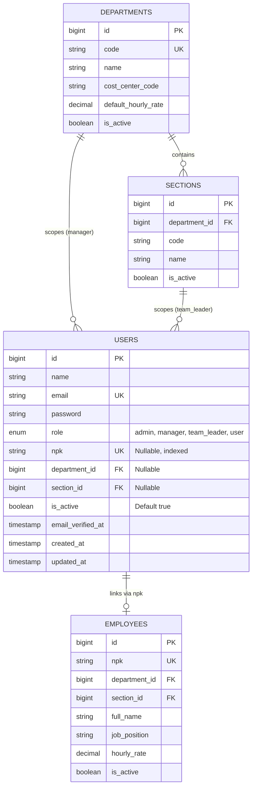

# Authentication & Role-Based Access Control (RBAC)

## Overview

Story **[E01-04]** implements plant-wide authentication and Role-Based Access Control (RBAC) across four operational tiers (`admin`, `manager`, `team_leader`, and `user`). Designed specifically for high-tempo automotive and discrete manufacturing shopfloors, it provides dual-identifier authentication (corporate Email or numeric shopfloor NPK), strict departmental and section-level access scoping, an active lockout safety countdown timer banner (>5 failed attempts), live `Asia/Jakarta` (WIB) shift awareness, and friendly in-layout access restriction (HTTP 403) recovery.

## Architecture Diagram

```mermaid
flowchart TD
    User([Factory Operator / Supervisor]) -->|Enters NPK/Email + Password| LoginUI[Login.vue]
    LoginUI -->|POST /login| FortifyAuth[Fortify AuthenticatedSessionController]

    subgraph AuthPipeline [Fortify Authentication Pipeline]
        RateLimiter{Failed Attempts >= 5?}
        RateLimiter -->|Yes| Lockout429[Return 429 + Lockout Countdown]
        RateLimiter -->|No| CaseInsensitiveSearch[Case-Insensitive Query: LOWER(email) or LOWER(npk)]
        CaseInsensitiveSearch --> ActiveCheck{Is User Active?}
        ActiveCheck -->|No| DeactivatedError[ValidationException: Account Deactivated]
        ActiveCheck -->|Yes| HashVerify{Hash::check password}
        HashVerify -->|No| CredentialError[ValidationException: Invalid Credentials]
        HashVerify -->|Yes| Authenticated[Establish Stateful Session]
    end

    FortifyAuth --> AuthPipeline
    Lockout429 -->|Display Lockout Banner| LoginUI
    Authenticated -->|Redirect /dashboard| InertiaHandle[HandleInertiaRequests Middleware]
    InertiaHandle -->|Share User, Role, Department, Section, Locale, Translations| DashboardPage[Dashboard.vue]

    subgraph RBACBoundary [Authorization & Scoping Pipeline]
        RouteRequest[Route Request] --> EnsureRoleMw{EnsureRole Middleware}
        EnsureRoleMw -->|Unauthorized Role| Error403[Friendly 403 Error.vue]
        EnsureRoleMw -->|Authorized| GateCheck{Laravel Authorization Gate}
        GateCheck -->|Pass| FeatureAction[Execute Action / View Data]
        GateCheck -->|Cross-section/Dept breach| Error403
    end

    DashboardPage --> RouteRequest
```

## Data Model



## Key Files & UI Mapping

| Layer                   | File / Route / Menu                             | Purpose                                                                                     |
| ----------------------- | ----------------------------------------------- | ------------------------------------------------------------------------------------------- |
| **Login Screen**        | `resources/js/pages/auth/Login.vue`             | Dual-identifier (Email/NPK) login form with password toggle and lockout countdown           |
| **Friendly 403 View**   | `resources/js/pages/Error.vue`                  | In-layout access restricted view with non-technical guidance and return button              |
| **Dashboard**           | `resources/js/pages/Dashboard.vue`              | Operational dashboard with welcome greeting, assignment cards, role matrix, and shift clock |
| **Layout Shell**        | `resources/js/layouts/AuthenticatedLayout.vue`  | Authenticated layout wrapper standardizing page structure                                   |
| **Top Header Bar**      | `resources/js/components/AppSidebarHeader.vue`  | Live WIB clock, active shift badge (`Shift 1/2/3`), and user role badge pill                |
| **User Identity Menu**  | `resources/js/components/UserMenuContent.vue`   | Displays NPK, department, section, role badge, and inline sign-out confirmation             |
| **Role Badge**          | `resources/js/components/RoleBadge.vue`         | Color-coded role indicator (Admin: Purple, Manager: Blue, TL: Green, User: Slate)           |
| **Shift Composable**    | `resources/js/composables/useShiftInfo.ts`      | Reactive Asia/Jakarta clock and three-shift rotational schedule calculator                  |
| **i18n Composable**     | `resources/js/composables/useTrans.ts`          | Reactive translation function `__()` with placeholder replacement                           |
| **Translations**        | `lang/id.json` & `lang/en.json`                 | Bilingual translation dictionaries for Indonesian and English                               |
| **Role Enum**           | `app/Enums/UserRole.php`                        | Backed string enum (`admin`, `manager`, `team_leader`, `user`) with labels & colors         |
| **User Model**          | `app/Models/User.php`                           | Eloquent entity with scoping helpers (`canAccessSection`, `canAccessDepartment`)            |
| **RBAC Middleware**     | `app/Http/Middleware/EnsureRole.php`            | Route middleware checking role membership and active status; alias: `'role'`                |
| **Inertia Props**       | `app/Http/Middleware/HandleInertiaRequests.php` | Shares user entity with department, section, locale, and translations                       |
| **Fortify Auth**        | `app/Providers/FortifyServiceProvider.php`      | Custom dual-identifier authentication callback and 5-attempt rate limiter                   |
| **Authorization Gates** | `app/Providers/AppServiceProvider.php`          | Laravel Gates defining plant capability matrix and departmental/section scoping             |

## Flow Explanation

1. **User Authentication Request**:
    - The user opens `/login`. The dual-identifier input displays placeholder `"email@example.com or EMP-1001"` with a 48px touch target.
    - User submits either their corporate email or alphanumeric NPK along with their password.
2. **Rate Limiting & Credential Evaluation**:
    - `FortifyServiceProvider` executes the 5-attempt per-minute rate limiter. If throttled, Fortify throws a `ValidationException` with HTTP 429 status. `Login.vue` detects the retry-after duration and initiates a live countdown banner.
    - For valid attempt counts, `Fortify::authenticateUsing` performs a case-insensitive lookup (`LOWER(email) = ? OR LOWER(npk) = ?`).
    - If the user account is flagged as inactive (`is_active = false`), authentication is rejected with a deactivated message.
    - Password hash verification runs via `Hash::check()`. Upon success, the session is regenerated.
3. **Session Population & Inertia Sharing**:
    - On redirect to `/dashboard`, `HandleInertiaRequests` loads the user's assigned `department` and `section` relations and shares them alongside active `locale` and translation dictionaries.
4. **UI Operational Shell Rendering**:
    - `AppSidebarHeader.vue` queries `useShiftInfo` to show live WIB time and active shift (`Shift 1: 07:00–15:00`, `Shift 2: 15:00–23:00`, `Shift 3: 23:00–07:00`).
    - The user menu renders the user's NPK, assigned department, assigned section, and color-coded role badge.
5. **Role-Based Authorization & Error Handling**:
    - When a user attempts to access a protected route (e.g. `/admin/overview`), the `EnsureRole` middleware intercepts the request.
    - If the user does not possess the requisite role, `abort(403)` is invoked.
    - `bootstrap/app.php` intercepts the 403 HTTP response and renders `Error.vue` in-layout with a prominent "Return to Dashboard" action, avoiding raw HTTP status dumps.

## API Endpoints & Routes

| Method | URI                     | Name                   | Middleware                       | Purpose                                              |
| ------ | ----------------------- | ---------------------- | -------------------------------- | ---------------------------------------------------- |
| GET    | `/login`                | `login`                | `guest`                          | Displays dual-identifier login screen                |
| POST   | `/login`                | `login.store`          | `guest`, `throttle:login`        | Authenticates via Email or NPK and creates session   |
| POST   | `/logout`               | `logout`               | `auth`                           | Invalidates session and returns to home/login        |
| GET    | `/dashboard`            | `dashboard`            | `auth`, `verified`               | Renders operational dashboard and assignment status  |
| GET    | `/admin/overview`       | `admin.overview`       | `auth`, `role:admin`             | Protected demonstration route for Administrator role |
| GET    | `/manager/overview`     | `manager.overview`     | `auth`, `role:admin,manager`     | Protected route for Manager & Administrator          |
| GET    | `/team-leader/overview` | `team-leader.overview` | `auth`, `role:admin,team_leader` | Protected route for Team Leader & Administrator      |

## Decisions & Trade-offs

1. **Dual-Identifier Login (Email or NPK)**:
    - _Context_: Shopfloor operators and team leaders frequently lack active email access on production lines and identify exclusively by their NPK badge number.
    - _Decision_: Configured `Fortify::authenticateUsing` with normalized `LOWER(email) = ? OR LOWER(npk) = ?` queries, preserving compatibility with standard Fortify controllers and tests.
2. **Single Active Sidebar Navigation for Sprint 1**:
    - _Context_: Epic E01 focuses on foundational infrastructure. Future modules (Overtime Entry, Approvals, Analytics) will be implemented in subsequent epics.
    - _Decision_: Bound exactly 1 active item (`Dashboard`) in `AppSidebar.vue`. Hidden placeholder routes prevent dead clicks and operator confusion.
3. **In-Layout Friendly 403 Recovery (`Error.vue`)**:
    - _Context_: Industrial users should never see raw developer error pages (e.g. Flare or Laravel default 403 pages).
    - _Decision_: Registered an exception handler in `bootstrap/app.php` rendering `Error.vue` inside the Inertia app layout with a clear return button.
4. **Browser Testing Engine**:
    - _Context_: Full user interaction verification required per workspace standards.
    - _Decision_: Integrated `pestphp/pest-plugin-browser` with Playwright Chromium, asserting real browser DOM state across login, role badges, shift indicators, and 403 recovery.

## Related

- [ADR-007: Role-Based Access Control and Scoping](../decisions/007-role-based-access-control-and-scoping.md)
- [User Guide: Authentication & Access Control](../../user-docs/guides/authentication-rbac.md)
- [Epic-01: Foundation & Infrastructure Backlog](../../scrum/Epic-01.md)
- [Epic-01 UX Plan](../../scrum/Epic-01-ux-plan.md)
