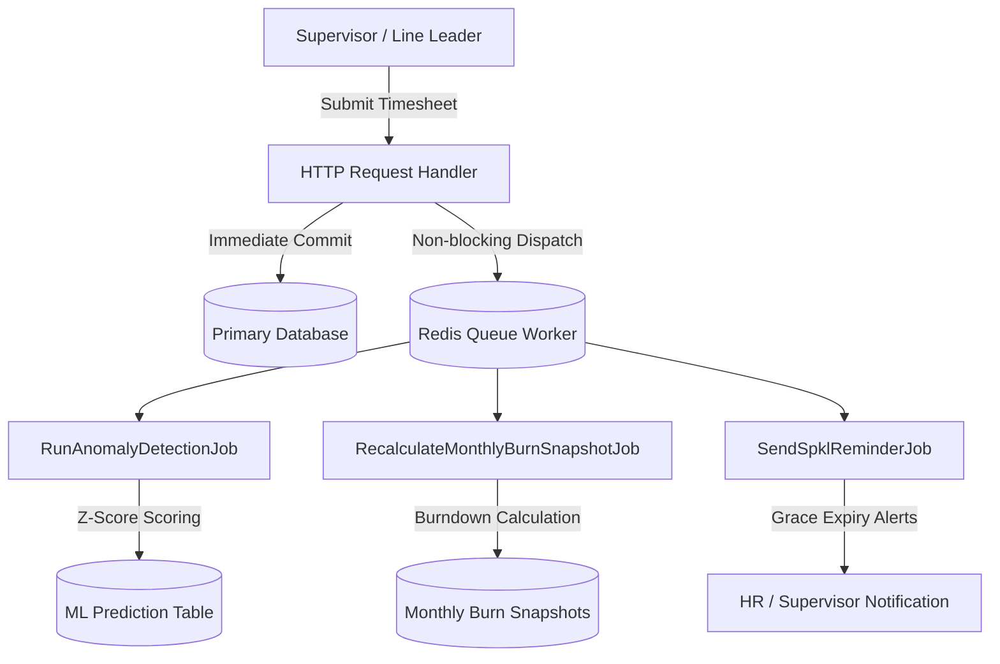

# Background Jobs & Redis Queue Infrastructure

## Overview

The Background Jobs and Redis Queue infrastructure provides asynchronous execution for intensive manufacturing operations, including statistical anomaly detection on overtime entries, monthly financial burndown rollups, and post-shift physical SPKL document upload reminders. Asynchronous execution guarantees that time-critical HTTP requests from line supervisors remain low-latency and non-blocking.

## Architecture Diagram

## Key Files & UI Mapping

| Layer              | File / Route / Menu                              | Purpose                                                                 |
| ------------------ | ------------------------------------------------ | ----------------------------------------------------------------------- |
| Job                | `app/Jobs/RunAnomalyDetectionJob.php`            | Asynchronous Z-score and ML anomaly scoring                             |
| Job                | `app/Jobs/RecalculateMonthlyBurnSnapshotJob.php` | Asynchronous recalculation of section and departmental burn snapshots   |
| Job                | `app/Jobs/SendSpklReminderJob.php`               | Dispatches reminder notifications for missing physical SPKL uploads     |
| Configuration      | `config/queue.php`                               | Redis driver definition, default retry interval, and connection options |
| Environment        | `.env.example`                                   | Specifies `QUEUE_CONNECTION=redis` and `REDIS_*` connection variables   |
| Process Supervisor | `README.md`                                      | Supervisor and Horizon production worker daemon configuration           |

## Flow Explanation

1. **User Action**: A line leader submits an overtime batch or a department manager approves timesheet items.
2. **Synchronous Commit**: The primary transaction commits line items to the database immediately to release database row locks without computing expensive aggregations.
3. **Queue Dispatch**: The controller dispatches relevant queue jobs (`RunAnomalyDetectionJob`, `RecalculateMonthlyBurnSnapshotJob`) onto the Redis queue connection.
4. **Worker Processing**: Background workers running via Redis (`php artisan queue:work redis`) pick up the payload and execute computation tasks. If transient failures occur, jobs automatically retry up to 3 times with exponential backoff intervals of 30s, 120s, and 300s.

## Decisions & Trade-offs

- **Strict Retry & Backoff Configuration**: All background jobs configure `$tries = 3` and `$backoff = [30, 120, 300]` to avoid hammering external services or databases during temporary connectivity blips.
- **Decoupled Snapshotting**: Offloading monthly snapshot recalculations ensures timesheet approvals complete in milliseconds regardless of the historical data volume in the section.

## Related

- [ADR-005: Denormalized Monthly Burn Snapshots](../decisions/005-denormalized-monthly-burn-snapshots.md)
- [ADR-008: Redis Queue Worker and Background Job Architecture](../decisions/008-redis-queue-worker-and-background-job-architecture.md)
- [Budget Management & Burn Index Dashboard](budget-burn-index.md)
