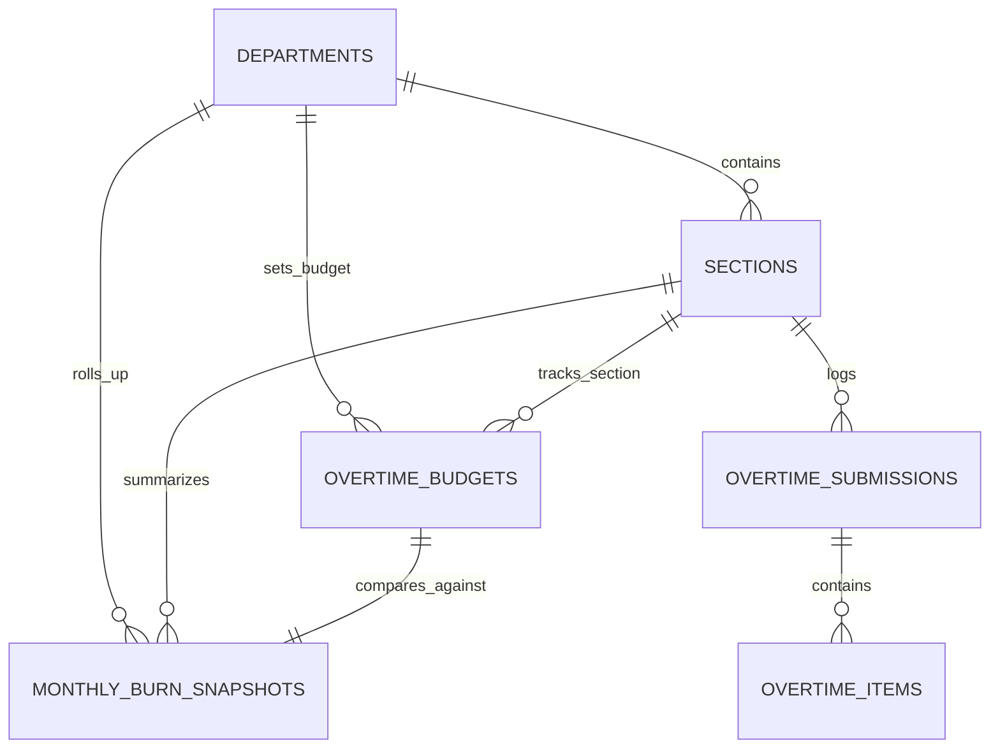

# Budget Management & Burn Index Dashboard

## Overview

The **Budget Management & Burn Index Dashboard** provides department managers, plant leaders, and finance controllers with an analytical command center to monitor monthly overtime hour burn across manufacturing sections. It tracks actual consumption against monthly allocated budgets via a standardized **Burn Index (%)**, evaluates sections against the 4-quadrant **Budget Control Matrix**, projects end-of-period burn trajectories, and renders high-density visual cards with CapEx/OpEx labor split indicators.

## Architecture Diagram

```mermaid
flowchart TD
    MGR[Manager / Admin / Team Leader] -->|View Dashboard| DBIC[DashboardBurnIndexController@index]
    DBIC -->|Query Snapshots & Scope| MSS[MonthlySnapshotService]
    MSS -->|Fast Indexed Read| MBS[(monthly_burn_snapshots)]
    MSS -->|Missing/Stale: On-Demand Calc| BICS[BurnIndexCalculatorService]
    BICS -->|Fetch Raw Sums| OTI[(overtime_items)]
    BICS -->|Fetch Quota| OTB[(overtime_budgets)]
    BICS -->|Upsert Rollup| MBS
    DBIC -->|Return Inertia Props| VUE[BurnIndex.vue Dashboard]

    subgraph VueComponents["Vue 3 Frontend Layer"]
        VUE --> CARDS[BurnIndexCard.vue - Section Grid]
        CARDS --> SPLIT[CapexOpexSplitBar.vue - CapEx/OpEx Split]
        VUE --> SUMMARY[Department KPI Macro Summary Bar]
    end

    subgraph AsyncSnapshotEngine["Background Recalculation Engine"]
        EVENT[Approval / Submission Trigger] --> RMBSJ[RecalculateMonthlyBurnSnapshotJob]
        RMBSJ --> MSS
    end
```

## Data Model



## Key Files & UI Mapping

| Layer               | File / Route / Menu                                          | Purpose                                                       |
| ------------------- | ------------------------------------------------------------ | ------------------------------------------------------------- |
| Sidebar Menu        | `Burn Index` (`/dashboard/burn-index`)                       | Operational health dashboard for Managers and Admins          |
| Page Component      | `resources/js/pages/dashboard/BurnIndex.vue`                 | Analytical hub with KPI summary, filters, and section grid    |
| Card Component      | `resources/js/components/dashboard/BurnIndexCard.vue`        | Section card with large burn %, zone badge, and velocity      |
| Drawer Component    | `resources/js/components/dashboard/SectionBurndownSheet.vue` | Slide-in drawer with 5-week burndown, breakdown, and matrix   |
| Burndown Chart      | `resources/js/components/dashboard/BurndownLineChart.vue`    | Chart.js 5-week line chart with zone corridor shading plugin  |
| Breakdown Table     | `resources/js/components/dashboard/WeeklyBreakdownTable.vue` | High-density table with weekly planned, actual, HKN, HLR      |
| Scatter Matrix      | `resources/js/components/dashboard/BudgetMatrixScatter.vue`  | Chart.js 4-quadrant budget control matrix scatter plot        |
| Bar Component       | `resources/js/components/dashboard/CapexOpexSplitBar.vue`    | High-density horizontal bar displaying CapEx vs OpEx hours    |
| Controller          | `app/Http/Controllers/DashboardBurnIndexController.php`      | Controller querying snapshots and handling manual refresh     |
| Snapshot Service    | `app/Services/Analytics/MonthlySnapshotService.php`          | Read-layer service fetching or lazily calculating snapshots   |
| Calculation Service | `app/Services/Analytics/BurnIndexCalculatorService.php`      | Domain engine executing formulas `CALC-02` through `CALC-08`  |
| Queue Job           | `app/Jobs/RecalculateMonthlyBurnSnapshotJob.php`             | Async queue job recalculating section snapshots post-approval |
| Model               | `app/Models/MonthlyBurnSnapshot.php`                         | Denormalized snapshot entity with velocity and projection     |
| Predictive Model    | `app/Models/MlPrediction.php`                                | Supervised ML predictions for month-end trajectory comparison |

## Formulas & Calculation Engine (Story E05-06)

The calculation engine (`BurnIndexCalculatorService`) implements the following core formulas:

- **CALC-02: Burn Index (%)**:
  $$\text{Burn Index (\%)} = \left(\frac{\text{Cumulative Actual Hours}}{\text{Planned Budget Hours}}\right) \times 100\%$$
- **CALC-03: Remaining Budget Hours**:
  $$\text{Remaining Hours} = \text{Planned Budget Hours} - \text{Cumulative Actual Hours}$$
- **CALC-04: Weekly Burn Velocity (`burn_velocity`)**:
  $$\text{Burn Velocity} = \frac{\text{Cumulative Actual Hours}}{\text{Elapsed Weeks in Period}}$$
    - **Elapsed Weeks**: Evaluated in `Asia/Jakarta` timezone (`days_elapsed_in_month / 7.0`), clamped to a minimum of `1.0` week to prevent division skew during early days of the month.
    - **Historical Months**: Fixed at `4.3` weeks for closed fiscal periods.
    - **Future Months**: Fixed at `1.0` week fallback.
    - Persisted in `monthly_burn_snapshots.burn_velocity`.
- **CALC-05: Projected Period-End Total Hours (`projected_total_hours`)**:
  $$\text{Projected Total Hours} = \text{Burn Velocity} \times 4.3$$
    - Dynamically calculated on demand and exposed via `MonthlyBurnSnapshot` accessor `$snapshot->projected_total_hours` and service payload.
- **Trajectory Indicator (`trajectory`)**:
    - `on_pace`: $\text{Projected Total} \le 100\%$ of planned budget hours (`→ Aman (On Pace)`).
    - `trending_over`: $100\% < \text{Projected Total} \le 120\%$ of planned budget hours (`↗ Waspada (Trending Over)`).
    - `will_overrun`: $\text{Projected Total} > 120\%$ of planned budget hours (`↑ Kritis (Will Overrun)`).
    - If planned hours is 0: `will_overrun` if actual hours > 0, else `on_pace`.
- **Supervised ML Month-End Comparison (`ml_forecast`)**:
    - `MonthlySnapshotService` queries `ml_predictions` table for `target_type = 'SECTION'`, `prediction_horizon = 'MONTH_END'` ordered by latest `id`.
    - When present, passes `ml_forecast` object containing `predicted_value`, confidence interval bounds, `confidence_delta` ($\pm \text{margin}$), and `risk_level` alongside heuristic projections for executive side-by-side comparison.

## Flow Explanation

1. **User triggers**: A manager or admin clicks **Burn Index** in the sidebar. The request is routed to `DashboardBurnIndexController@index`.
2. **Scoping & query resolution**:
    - `MonthlySnapshotService` resolves accessible departments (`Manager` locked to their assigned department, `Admin` selectable, `TeamLeader` scoped to their section).
    - Reads pre-calculated rollups from `monthly_burn_snapshots` table with sub-15ms response times.
    - If a section's snapshot is missing for the active period, `MonthlySnapshotService` lazily computes and creates it.
3. **Card rendering**: Each section renders an interactive card showing:
    - Planned budget vs actual approved hours with `font-mono tabular-nums`.
    - Remaining balance in hours.
    - Large color-coded **Burn Index %**:
        - Green (`< 85%`): Safe / Under Budget
        - Blue (`85–100%`): On Track / Caution
        - Orange (`101–115%`): Warning
        - Red (`> 115%`): Critical Deficit / Over Budget
    - 4-Quadrant Budget Control Matrix Zone badge (`ZONE_1_EXCELLENT`, `ZONE_2_GOOD`, `ZONE_3_WARNING`, `ZONE_4_POOR`).
    - Weekly Burn Velocity (`jam/minggu`) and Projected Period-End Total.
    - Trajectory badge: `→ Aman (On Pace)`, `↗ Waspada (Trending Over)`, `↑ Kritis (Will Overrun)`.
    - CapEx vs OpEx mini split bar.
    - "Last Recalculated" timestamp in WIB.
4. **Unconfigured budget handling**: If a section has no `overtime_budgets` record for the period, the card renders a friendly "Anggaran Belum Dikonfigurasi" empty state with a direct link to `/budgets/planning`, avoiding division-by-zero or NaN errors.
5. **Real-time freshness**: The dashboard auto-refreshes every 60 seconds via `router.reload({ only: ['snapshots', 'summary'], preserveScroll: true, preserveState: true })`.

## Section 5-Week Burndown & Budget Control Matrix Drawer (Story E05-02)

To enable weekly granularity without navigating away from the dashboard ("Zero Context Loss" principle in [Epic-05 UX Plan](../../scrum/Epic-05-ux-plan.md)), clicking any section card or the **Lihat Burndown & Matriks** action slides open the **Section Burndown Drawer** (`SectionBurndownSheet.vue`).

### 1. 5-Week Date Partitioning & Future Week Handling

- Months are partitioned into 5 weekly buckets evaluated in `Asia/Jakarta`:
    - **Minggu 1**: Days 1–7 (e.g., `01 - 07 Sep`)
    - **Minggu 2**: Days 8–14 (e.g., `08 - 14 Sep`)
    - **Minggu 3**: Days 15–21 (e.g., `15 - 21 Sep`)
    - **Minggu 4**: Days 22–28 (e.g., `22 - 28 Sep`)
    - **Minggu 5**: Days 29 to end of month (e.g., `29 - 30 Sep` or `-` if February 28 days)
- **Non-Dropping Trajectory Rule**: Future weeks in the current month have their cumulative actual hours set to `null` so that Chart.js breaks the line instead of plummeting to zero.
- **Weekly Actuals Aggregation**: Queries approved `overtime_items` joined with `overtime_submissions` for the section and separates hours into regular working days (`HKN`) and weekend/holidays (`HLR`).

### 2. Chart.js Visualization Engine (ADR-004)

Standardized on Chart.js v4 and `vue-chartjs` per [ADR-004](../decisions/004-chartjs-visualization-engine.md):

- **`BurndownLineChart.vue`**:
    - **Line 1 (Target Rencana)**: Dashed slate line displaying weekly cumulative planned quota.
    - **Line 2 (Realisasi Disetujui)**: Solid line colored dynamically by burn health (Emerald `< 85%`, Sky Blue `85–100%`, Amber `101–115%`, ISUZU Red `> 115%`).
    - **Line 3 (Proyeksi AI / ML)**: Dotted purple line interpolating from the active week's actual cumulative total up to the month-end machine learning projection (`ml_predictions`).
    - **Zone Shading Plugin**: Custom inline canvas plugin shading the warning deficit zone (`> 100%` quota ceiling) in soft red (`rgba(239, 68, 68, 0.08)`) and the on-track corridor (`85–100%`) in soft sky blue (`rgba(2, 132, 199, 0.06)`).
- **`WeeklyBreakdownTable.vue`**:
    - High-density tabular layout with `font-mono tabular-nums`.
    - Columns: Minggu, Rentang Tanggal, Rencana, Realisasi, Jam HKN, Jam HLR, Akumulasi Burn %, Deviasi.
    - Active week is marked with a subtle `Aktif` badge.
- **`BudgetMatrixScatter.vue`**:
    - Plots section's current position ($X = \text{Burn Index \%}$, $Y = \text{Cumulative Actual Hours}$).
    - Custom canvas plugin draws crosshairs at $X = 100\%$ and $Y = 75\%$ of budget quota, creating 4 distinct quadrants:
        - **Zona 1 (Sangat Baik / Aman)**: Bottom-Left (Burn $\le 100\%$, Hours $< 75\%$).
        - **Zona 2 (Terkendali / Baik)**: Top-Left (Burn $\le 100\%$, Hours $\ge 75\%$).
        - **Zona 3 (Peringatan / Burn Cepat)**: Bottom-Right (Burn $> 100\%$, Hours $< 75\%$).
        - **Zona 4 (Defisit Kritis)**: Top-Right (Burn $> 100\%$, Hours $\ge 75\%$).

### 3. Zero-Context-Loss Slide-in Drawer & Deep Linking

- Implemented using `@/components/ui/sheet` (`SectionBurndownSheet.vue`) on `/dashboard/burn-index`.
- **Deep-linking**: Visiting `/dashboard/burn-index?tab=sections&section={id}` automatically opens the burndown drawer for that section upon mount. When the drawer is closed, the URL query parameter is cleanly stripped without triggering a full page reload (`window.history.replaceState`).

## API Endpoints & Routes

| Method | URI                                 | Controller Action                          | Purpose                                    | Auth / Middleware                        |
| ------ | ----------------------------------- | ------------------------------------------ | ------------------------------------------ | ---------------------------------------- |
| GET    | `/dashboard/burn-index`             | `DashboardBurnIndexController@index`       | Main multi-section overview                | `auth`, `role:admin,manager,team_leader` |
| POST   | `/dashboard/burn-index/recalculate` | `DashboardBurnIndexController@recalculate` | Force on-demand refresh for current period | `auth`, `role:admin,manager`             |
| GET    | `/dashboard/burn-index/{section}`   | `DashboardBurnIndexController@show`        | Weekly burndown & scatter matrix payload   | `auth`, `role:admin,manager,team_leader` |

## Decisions & Trade-offs

- **Denormalized Snapshot Architecture**: Sourcing dashboard reads from `monthly_burn_snapshots` prevents slow aggregation scans over hundreds of thousands of raw timesheet rows during morning standups (see [ADR-005](../decisions/005-denormalized-monthly-burn-snapshots.md)).
- **Unified Single-Page Analytical Command Center**: Section cards, consolidated department table, and CapEx vs OpEx distribution live on `/dashboard/burn-index` organized by tabs rather than fragmented routes.
- **Jakarta Elapsed Weeks Calculation**: Burn velocity calculates elapsed weeks using `Asia/Jakarta` timezone, clamping to a minimum of 1.0 week to eliminate skew during the first week of the month.

## Related

- [ADR-005: Denormalized Monthly Burn Snapshots](../decisions/005-denormalized-monthly-burn-snapshots.md)
- [Epic-05: Budget Management & Burn Index Dashboard](../../scrum/Epic-05.md)
- [Epic-05 UX Plan](../../scrum/Epic-05-ux-plan.md)
- [User Guide: Budget Management & Burn Index Dashboard](../../user-docs/guides/budget-burn-index.md)
