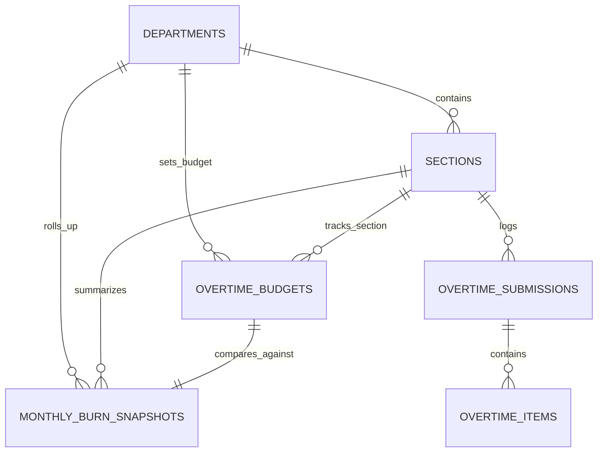

# Budget Management & Burn Index Dashboard

## Overview

The **Budget Management & Burn Index Dashboard** provides department managers, plant leaders, and finance controllers with an analytical command center to monitor monthly overtime hour burn across manufacturing sections. It tracks actual consumption against monthly allocated budgets via a standardized **Burn Index (%)**, evaluates sections against the 4-quadrant **Budget Control Matrix**, projects end-of-period burn trajectories, and renders high-density visual cards with CapEx/OpEx labor split indicators.

## Architecture Diagram

```mermaid
flowchart TD
    MGR[Manager / Admin / Team Leader] -->|View Dashboard| DBIC[DashboardBurnIndexController@index]
    DBIC -->|Query Snapshots & Scope| MSS[MonthlySnapshotService]
    MSS -->|Fast Indexed Read| MBS[(monthly_burn_snapshots)]
    MSS -->|Missing/Stale: On-Demand Calc| BICS[BurnIndexCalculatorService]
    BICS -->|Fetch Raw Sums| OTI[(overtime_items)]
    BICS -->|Fetch Quota| OTB[(overtime_budgets)]
    BICS -->|Upsert Rollup| MBS
    DBIC -->|Return Inertia Props| VUE[BurnIndex.vue Dashboard]

    subgraph VueComponents["Vue 3 Frontend Layer"]
        VUE --> CARDS[BurnIndexCard.vue - Section Grid]
        CARDS --> SPLIT[CapexOpexSplitBar.vue - CapEx/OpEx Split]
        VUE --> SUMMARY[Department KPI Macro Summary Bar]
    end

    subgraph AsyncSnapshotEngine["Background Recalculation Engine"]
        EVENT[Approval / Submission Trigger] --> RMBSJ[RecalculateMonthlyBurnSnapshotJob]
        RMBSJ --> MSS
    end
```

## Data Model



## Key Files & UI Mapping

| Layer               | File / Route / Menu                                       | Purpose                                                       |
| ------------------- | --------------------------------------------------------- | ------------------------------------------------------------- |
| Sidebar Menu        | `Burn Index` (`/dashboard/burn-index`)                    | Operational health dashboard for Managers and Admins          |
| Page Component      | `resources/js/pages/dashboard/BurnIndex.vue`              | Analytical hub with KPI summary, filters, and section grid    |
| Card Component      | `resources/js/components/dashboard/BurnIndexCard.vue`     | Section card with large burn %, zone badge, and velocity      |
| Bar Component       | `resources/js/components/dashboard/CapexOpexSplitBar.vue` | High-density horizontal bar displaying CapEx vs OpEx hours    |
| Controller          | `app/Http/Controllers/DashboardBurnIndexController.php`   | Controller querying snapshots and handling manual refresh     |
| Snapshot Service    | `app/Services/Analytics/MonthlySnapshotService.php`       | Read-layer service fetching or lazily calculating snapshots   |
| Calculation Service | `app/Services/Analytics/BurnIndexCalculatorService.php`   | Domain engine executing formulas `CALC-02` through `CALC-08`  |
| Queue Job           | `app/Jobs/RecalculateMonthlyBurnSnapshotJob.php`          | Async queue job recalculating section snapshots post-approval |
| Model               | `app/Models/MonthlyBurnSnapshot.php`                      | Denormalized snapshot entity for fast read performance        |

## Flow Explanation

1. **User triggers**: A manager or admin clicks **Burn Index** in the sidebar. The request is routed to `DashboardBurnIndexController@index`.
2. **Scoping & query resolution**:
    - `MonthlySnapshotService` resolves accessible departments (`Manager` locked to their assigned department, `Admin` selectable, `TeamLeader` scoped to their section).
    - Reads pre-calculated rollups from `monthly_burn_snapshots` table with sub-15ms response times.
    - If a section's snapshot is missing for the active period, `MonthlySnapshotService` lazily computes and creates it.
3. **Card rendering**: Each section renders an interactive card showing:
    - Planned budget vs actual approved hours with `font-mono tabular-nums`.
    - Remaining balance in hours.
    - Large color-coded **Burn Index %**:
        - Green (`< 85%`): Safe / Under Budget
        - Blue (`85–100%`): On Track / Caution
        - Orange (`101–115%`): Warning
        - Red (`> 115%`): Critical Deficit / Over Budget
    - 4-Quadrant Budget Control Matrix Zone badge (`ZONE_1_EXCELLENT`, `ZONE_2_GOOD`, `ZONE_3_WARNING`, `ZONE_4_POOR`).
    - Weekly Burn Velocity (`jam/minggu`) and Projected Period-End Total.
    - Trajectory badge: `→ Aman (On Pace)`, `↗ Waspada (Trending Over)`, `↑ Kritis (Will Overrun)`.
    - CapEx vs OpEx mini split bar.
    - "Last Recalculated" timestamp in WIB.
4. **Unconfigured budget handling**: If a section has no `overtime_budgets` record for the period, the card renders a friendly "Anggaran Belum Dikonfigurasi" empty state with a direct link to `/budgets/planning`, avoiding division-by-zero or NaN errors.
5. **Real-time freshness**: The dashboard auto-refreshes every 60 seconds via `router.reload({ only: ['snapshots', 'summary'], preserveScroll: true, preserveState: true })`.

## API Endpoints & Routes

| Method | URI                                 | Controller Action                          | Purpose                                    | Auth / Middleware                        |
| ------ | ----------------------------------- | ------------------------------------------ | ------------------------------------------ | ---------------------------------------- |
| GET    | `/dashboard/burn-index`             | `DashboardBurnIndexController@index`       | Main multi-section overview                | `auth`, `role:admin,manager,team_leader` |
| POST   | `/dashboard/burn-index/recalculate` | `DashboardBurnIndexController@recalculate` | Force on-demand refresh for current period | `auth`, `role:admin,manager`             |

## Decisions & Trade-offs

- **Denormalized Snapshot Architecture**: Sourcing dashboard reads from `monthly_burn_snapshots` prevents slow aggregation scans over hundreds of thousands of raw timesheet rows during morning standups (see [ADR-005](../decisions/005-denormalized-monthly-burn-snapshots.md)).
- **Unified Single-Page Analytical Command Center**: Section cards, consolidated department table, and CapEx vs OpEx distribution live on `/dashboard/burn-index` organized by tabs rather than fragmented routes.
- **Jakarta Elapsed Weeks Calculation**: Burn velocity calculates elapsed weeks using `Asia/Jakarta` timezone, clamping to a minimum of 1.0 week to eliminate skew during the first week of the month.

## Related

- [ADR-005: Denormalized Monthly Burn Snapshots](../decisions/005-denormalized-monthly-burn-snapshots.md)
- [Epic-05: Budget Management & Burn Index Dashboard](../../scrum/Epic-05.md)
- [Epic-05 UX Plan](../../scrum/Epic-05-ux-plan.md)
- [User Guide: Budget Management & Burn Index Dashboard](../../user-docs/guides/budget-burn-index.md)
