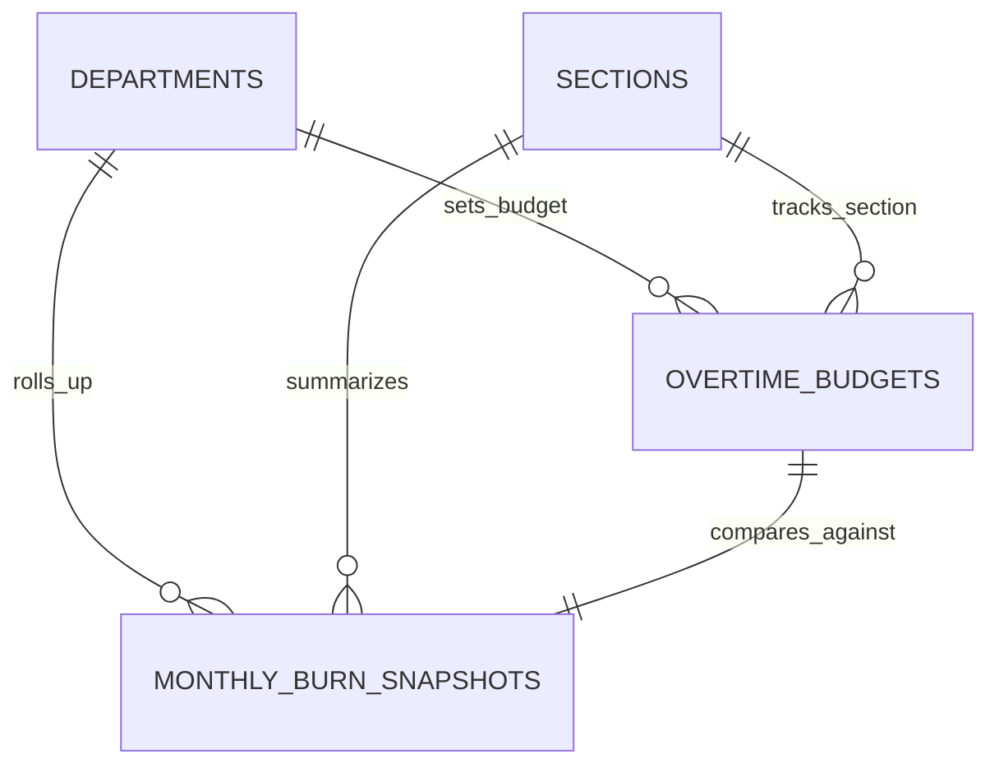

# Budget Management & Burn Index Dashboard

## Overview

The **Budget Management & Burn Index Dashboard** provides department managers, plant leaders, and finance controllers with an analytical cockpit to monitor monthly overtime hour burn across 35 manufacturing sections. It tracks actual consumption against monthly allocated budgets via a standardized **Burn Index (%)**, projects end-of-period burn trajectories, and renders dynamic visuals powered by **Chart.js**.

## Architecture Diagram

```mermaid
flowchart TD
    MGR[Manager / Finance Controller] -->|View Dashboard| DBIC[DashboardBurnIndexController@index]
    DBIC -->|Fast Indexed Read| MBS[(monthly_burn_snapshots)]
    DBIC -->|Return Inertia Props| VUE[BurnIndex.vue Dashboard]

    subgraph ChartJSVisuals["Chart.js Visualization Layer"]
        VUE --> GAUGE[BurnIndexGauge.vue - Doughnut Chart]
        VUE --> TRAJ[BurndownTrajectoryChart.vue - Line Chart]
        VUE --> SPLIT[CapexOpexSplitBar.vue - Stacked Horizontal Bar]
        VUE --> PARETO[RcaParetoChart.vue - Dual Axis Bar/Line]
    end

    subgraph AsyncSnapshotEngine["Background Recalculation Engine"]
        EVENT[Approval / Submission Trigger] --> RMBSJ[RecalculateMonthlyBurnSnapshotJob]
        RMBSJ --> BICS[BurnIndexCalculatorService]
        BICS -->|Fetch Raw Sums| OTI[(overtime_items)]
        BICS -->|Fetch Quota| OTB[(overtime_budgets)]
        BICS -->|Upsert Rollup| MBS
    end
```

## Data Model



## Key Files & UI Mapping

| Layer               | File / Route / Menu                                          | Purpose                                                      |
| ------------------- | ------------------------------------------------------------ | ------------------------------------------------------------ |
| Sidebar Menu        | `Dashboard Burn Index` (`/dashboard/burn-index`)             | Operational health dashboard for managers                    |
| Page Component      | `resources/js/pages/Dashboard/BurnIndex.vue`                 | Grid of section summary cards and department macro metrics   |
| Detail Page         | `resources/js/pages/Dashboard/SectionDetail.vue`             | Deep dive section burndown with 5-week trajectory line chart |
| Chart Component     | `resources/js/components/Charts/BurnIndexGauge.vue`          | Chart.js semi-circle gauge indicating Burn Index %           |
| Chart Component     | `resources/js/components/Charts/BurndownTrajectoryChart.vue` | Chart.js line chart showing Week 1–5 trajectory vs planned   |
| Chart Component     | `resources/js/components/Charts/CapexOpexSplitBar.vue`       | Chart.js stacked bar showing OpEx vs CapEx ratio             |
| Controller          | `app/Http/Controllers/DashboardBurnIndexController.php`      | Lean controller querying `monthly_burn_snapshots`            |
| Calculation Service | `app/Services/Analytics/BurnIndexCalculatorService.php`      | Implements formulas `CALC-01` through `CALC-08`              |
| Queue Job           | `app/Jobs/RecalculateMonthlyBurnSnapshotJob.php`             | Async job calculating metrics and updating snapshot records  |
| Model               | `App\Models\MonthlyBurnSnapshot`                             | Denormalized snapshot entity for fast read performance       |

## Flow Explanation

1. **User triggers**: A manager navigates to **Dashboard Burn Index**. The page reads user permissions and loads sections within the manager's department for the selected month and year.
2. **Fast query resolution**: The controller fetches pre-calculated records from `monthly_burn_snapshots`. Response times remain sub-15ms because no raw item aggregation runs during HTTP requests.
3. **Card rendering**: Each section is rendered as an interactive card displaying:
    - Planned budget vs. actual hours consumed.
    - Remaining balance in hours.
    - **Burn Index Gauge**: Rendered via Chart.js with dynamic arc colors matching operational zones (`ZONE_1_EXCELLENT`, `ZONE_2_GOOD`, `ZONE_3_WARNING`, `ZONE_4_POOR`).
    - Burn velocity (hours consumed per elapsed operational week).
    - Projected month-end total based on current velocity.
4. **Trajectory drill-down**: Clicking a section opens the section detail view featuring `BurndownTrajectoryChart.vue`, comparing weekly actuals against planned weekly milestones (Weeks 1 through 5).
5. **Asynchronous refresh**: When approvals or adjustments occur, `RecalculateMonthlyBurnSnapshotJob` executes in the background, updating snapshot values so subsequent visits reflect fresh numbers.

## API Endpoints & Routes

| Method | URI                                 | Controller Action                          | Purpose                                       | Auth / Middleware                        |
| ------ | ----------------------------------- | ------------------------------------------ | --------------------------------------------- | ---------------------------------------- |
| GET    | `/dashboard/burn-index`             | `DashboardBurnIndexController@index`       | Main multi-section overview                   | `auth`, `role:team_leader,manager,admin` |
| GET    | `/dashboard/burn-index/{sectionId}` | `DashboardBurnIndexController@show`        | Single section deep-dive with trajectory data | `auth`, `role:team_leader,manager,admin` |
| POST   | `/dashboard/burn-index/recalculate` | `DashboardBurnIndexController@recalculate` | Force on-demand refresh for current month     | `auth`, `role:admin`                     |

## Decisions & Trade-offs

- **Chart.js Standardization**: We selected Chart.js for all canvas rendering to achieve high performance on plant kiosks, smooth animations, and zero licensing fees (see [ADR-004](../decisions/004-chartjs-visualization-engine.md)).
- **Denormalized Snapshot Table**: Pre-aggregating data into `monthly_burn_snapshots` prevents slow database scans during peak morning review hours (see [ADR-005](../decisions/005-denormalized-monthly-burn-snapshots.md)).

## Related

- [ADR-004: Chart.js Visualization Engine](../decisions/004-chartjs-visualization-engine.md)
- [ADR-005: Denormalized Monthly Burn Snapshots](../decisions/005-denormalized-monthly-burn-snapshots.md)
- [Epic-05: Budget Management & Burn Index Dashboard](../../scrum/Epic-05.md)
