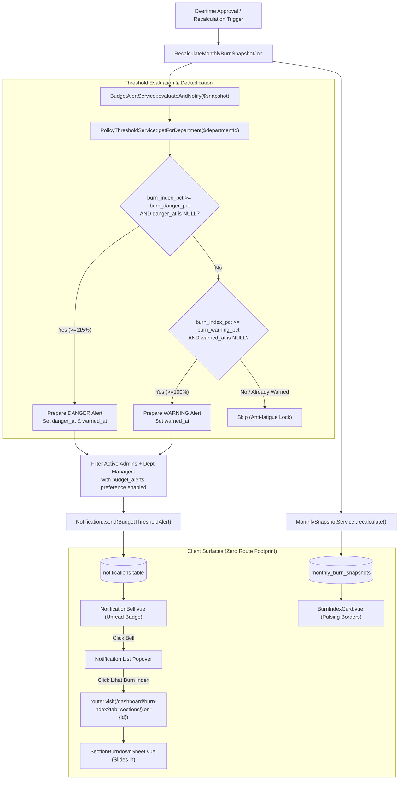
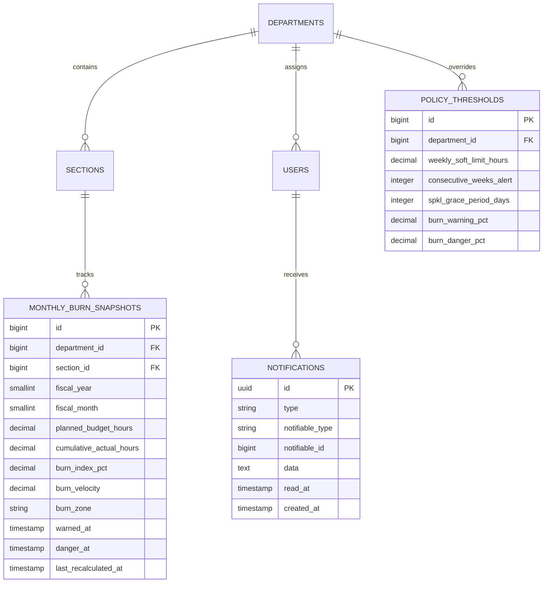

# Budget Threshold Alert System & In-App Warnings (E05-04)

## Overview

The **Policy Threshold Alert System (Budget Warnings)** continuously monitors monthly overtime consumption across factory production sections. When a section's cumulative overtime hours cross corporate threshold limits defined in `policy_thresholds` (Warning threshold, default 100%, and Danger threshold, default 115%), the system automatically dispatches in-app alerts to Department Managers and Plant Administrators.

To prevent alert fatigue and redundant notifications during high-frequency approval cycles, the system implements an anti-fatigue deduplication lock using `warned_at` and `danger_at` timestamp locks on `monthly_burn_snapshots`. In addition, high-risk cards on the Burn Index dashboard display an active pulsing border animation (`burn-card--warning` in amber and `burn-card--danger` in ISUZU Red) and provide direct 1-click deep-linking into the section burndown drawer.

## Architecture Diagram

## Data Model

## Key Files & UI Mapping

| Layer              | File / Route / Menu                                                                                     | Purpose                                                                                                      |
| ------------------ | ------------------------------------------------------------------------------------------------------- | ------------------------------------------------------------------------------------------------------------ |
| Database Migration | `database/migrations/2026_09_09_000001_add_warned_at_and_danger_at_to_monthly_burn_snapshots_table.php` | Adds `warned_at` and `danger_at` timestamp locks to `monthly_burn_snapshots`                                 |
| Eloquent Model     | `app/Models/MonthlyBurnSnapshot.php`                                                                    | Holds snapshot data, casts timestamps, and tracks trajectory                                                 |
| Domain Service     | `app/Services/BudgetAlertService.php`                                                                   | Evaluates threshold crossings, resolves recipients, checks user preferences, and applies deduplication locks |
| Background Job     | `app/Jobs/RecalculateMonthlyBurnSnapshotJob.php`                                                        | Automatically triggers `BudgetAlertService::evaluateAndNotify()` after snapshot upserts                      |
| Notification       | `app/Notifications/BudgetThresholdAlert.php`                                                            | Database notification carrying alert level, burn %, section, department, and deep-link payload               |
| Topbar Component   | `resources/js/components/NotificationBell.vue`                                                          | Renders unread count badge, alert popover cards, and handles 1-click deep-link navigation                    |
| Dashboard Page     | `resources/js/pages/dashboard/BurnIndex.vue`                                                            | Unified command center that watches URL for `?section={id}` to auto-open section drawer                      |
| Dashboard Card     | `resources/js/components/dashboard/BurnIndexCard.vue`                                                   | Displays animated pulsing borders (`burn-card--warning`, `burn-card--danger`)                                |
| CSS Animations     | `resources/css/app.css`                                                                                 | Keyframe definitions for `@keyframes pulse-border-danger` and `@keyframes pulse-border-warning`              |
| TypeScript Types   | `resources/js/types/ui.ts`                                                                              | Type definitions for `BudgetThresholdNotificationData` and notification payloads                             |

## Flow Explanation

1. **Triggering Event**: Overtime items are approved or rejected, or a manager triggers recalculation, dispatching `RecalculateMonthlyBurnSnapshotJob`.
2. **Snapshot Recalculation**: `MonthlySnapshotService::recalculate()` updates `monthly_burn_snapshots` with fresh planned hours, actual hours, burn index %, velocity, and zone.
3. **Threshold Evaluation**: `RecalculateMonthlyBurnSnapshotJob` passes the updated snapshot to `BudgetAlertService::evaluateAndNotify($snapshot)`.
4. **Policy Resolution**: The service queries `PolicyThresholdService::getForDepartment($departmentId)` which returns department-level overrides or falls back to plant defaults (`burn_warning_pct = 100.0%`, `burn_danger_pct = 115.0%`).
5. **Deduplication Check**:
    - If `burn_index_pct >= burn_danger_pct` and `danger_at === null`: dispatches Danger alert, marks `danger_at = now()` and `warned_at = now()`.
    - Else if `burn_index_pct >= burn_warning_pct` and `warned_at === null`: dispatches Warning alert, marks `warned_at = now()`.
    - Otherwise: suppresses duplicate notifications for the remainder of the fiscal month.
6. **Recipient Resolution & Preference Filtering**:
    - Gathers active Administrators (`role = admin`) and Department Managers (`role = manager` matching `department_id`).
    - Filters out users whose preferences have `budget_threshold_alert = false` (or `notifications.budget_alerts = false`).
7. **Delivery & UI Presentation**:
    - Writes notification to `notifications` table (`database` channel).
    - `HandleInertiaRequests` immediately shares `unread_notifications_count` to display the numeric badge on `NotificationBell.vue`.
    - On the Burn Index hub, section cards crossing thresholds show `.burn-card--warning` (amber pulse) or `.burn-card--danger` (red pulse).
8. **1-Click Deep Link (User Journey 4)**:
    - User clicks the alert item or "Lihat Burn Index" in the notification popover.
    - The app navigates to `/dashboard/burn-index?tab=sections&section={id}` using Wayfinder.
    - `BurnIndex.vue` detects the `section` query param and automatically slides open `SectionBurndownSheet.vue` for immediate root cause analysis.

## API Endpoints & Routes

| Method | URI                        | Controller Action                      | Purpose                                                              | Auth                   |
| ------ | -------------------------- | -------------------------------------- | -------------------------------------------------------------------- | ---------------------- |
| GET    | `/notifications`           | `NotificationController@index`         | List unread notifications and badge count                            | auth                   |
| PATCH  | `/notifications/{id}/read` | `NotificationController@markAsRead`    | Mark single notification as read                                     | auth                   |
| PATCH  | `/notifications/read-all`  | `NotificationController@markAllAsRead` | Clear all unread notifications                                       | auth                   |
| GET    | `/dashboard/burn-index`    | `DashboardBurnIndexController@index`   | Unified Burn Index Hub (deep-links via `?tab=sections&section={id}`) | auth, manager/admin/tl |

## Decisions & Trade-offs

- **Timestamp Locks vs In-Memory Cache**: Storing `warned_at` and `danger_at` directly in `monthly_burn_snapshots` guarantees persistent deduplication across worker restarts, Redis flushes, and database transactions without adding external caching overhead.
- **Single Hub Integration vs Standalone Alert View**: Adhering strictly to `Epic-05-ux-plan.md`, no dedicated routes or sidebar items were created. The alert flows naturally through the topbar bell and triggers the slide-in drawer.
- **Hierarchical Policy Fallback**: Thresholds are evaluated using `PolicyThresholdService`, preserving the plant-default inheritance mechanism while allowing individual departments to set stricter or looser limits.

## Related

- [Epic-05 Scrum Document](../../scrum/Epic-05.md)
- [Epic-05 UX Plan](../../scrum/Epic-05-ux-plan.md)
- [ADR-020: Budget Threshold Alert Timestamp Locking](../decisions/020-budget-threshold-alert-deduplication.md)
- [Budget Threshold Alerts User Guide](../../user-docs/guides/budget-threshold-alerts.md)
