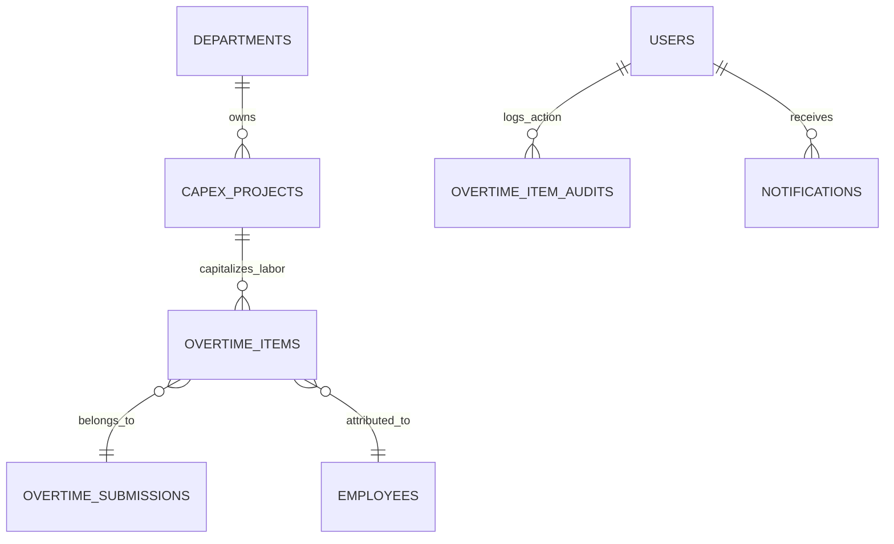

# CapEx Project Labor Management & Capitalization

## Overview

The **CapEx Project Labor Management & Capitalization** module governs overtime labor dedicated to fixed asset creation, machine fabrication, tooling construction, and major facility overhauls. It ensures that capitalized project labor is strictly isolated from standard operational expenses (OpEx), directly traceable to authoritative project codes (`CPX-YYYY-DEPT-NNN`), and compliant with corporate tax depreciation and statutory audit requirements.

Story **[E07-02]** expands this capability with an executive and managerial **CapEx Project Labor Burn Tracking Dashboard** featuring real-time burn index computations, weekly labor burndown timeline charts, shopfloor team contribution rosters, in-place physical progress editing, automated burn alert notifications, and completion milestone transitions.

Story **[E07-03]** adds the **Multi-Project Portfolio Overview**, providing consolidated portfolio monitoring with high-density tabular presentation, sortable columns, risk color-coding, at-risk flags (⚠️), date range filtering on target completion schedules, and department summary KPI metrics directly on Tab 1 of the CapEx Project Hub.

Story **[E07-04]** implements the **CapEx Project Labor Attribution Report & Excel Export**, providing an itemized financial audit schedule on Tab 2 of the CapEx Project Hub. It lists every approved overtime item with project allocation, immutable rate and cost snapshots, project group subtotals, grand totals, and native OpenXML (`.xlsx`) spreadsheet streaming for fixed asset capitalization compliance (PSAK 16 / IAS 16).

## Architecture Diagram

```mermaid
flowchart TD
    subgraph UI ["Vue 3 Cockpit Surface (Show.vue)"]
        KPI[CapexBurnIndexPanel: 4 Macro KPI Cards]
        Editor[InlineProgressEditor: In-Place 0-100% Slider & Input]
        Chart[CapexLaborTimelineChart: Weekly Cumulative Burndown]
        Team[CapexTeamContributionTable: Ranked NPK Roster]
        Banner[CompletionMilestonePrompt: 100% Milestone Banner]
    end

    subgraph Backend ["Laravel Backend Services & Controllers"]
        Ctrl[CapexProjectController]
        CAS[CapExAccountingService]
        CPS[CapexProjectService]
        Req[UpdateCapexProjectProgressRequest]
        Audit[OvertimeItemAudit]
        Notif[CapexBurnAlertNotification]
    end

    subgraph DB ["Database Storage"]
        CP[(capex_projects: physical_progress_pct)]
        OTI[(overtime_items: APPROVED, hours_project, total_cost_snapshot)]
        OTS[(overtime_submissions: operational_date)]
        NOTIFS[(notifications: capex_burn_alert)]
    end

    UI -->|GET /admin/capex-projects/{id}| Ctrl
    Ctrl --> CAS
    CAS -->|Query approved hours & snapshot costs| OTI
    CAS -->|Join operational dates for weekly intervals| OTS
    CAS --> CP

    Editor -->|PATCH /admin/capex-projects/{id}/progress| Ctrl
    Ctrl --> Req
    Ctrl --> CPS
    CPS -->|Update physical_progress_pct| CP
    CPS -->|Log action PROGRESS_UPDATE| Audit
    CPS -->|Check burn_index_pct > 80%| CAS
    CAS -->|Dispatch if not alerted this month| Notif
    Notif --> NOTIFS
```

## Data Model



## Key Files & UI Mapping

| Layer               | File / Route / Menu                                              | Purpose                                                                   |
| ------------------- | ---------------------------------------------------------------- | ------------------------------------------------------------------------- |
| Sidebar Menu        | `Proyek CapEx` (`/admin/capex-projects`)                         | Master list and capital tracking for managers and admins (`FolderKanban`) |
| Page Component      | `resources/js/pages/admin/CapexProjects/Index.vue`               | Unified hub: Tab 1 (Portfolio & Master Data) + Tab 2 (Financial Report)   |
| Portfolio Table     | `resources/js/components/capex/CapexPortfolioTable.vue`          | Sortable, color-coded multi-project portfolio table with milestone ratio  |
| Attribution Table   | `resources/js/components/capex/CapexLaborAttributionTable.vue`   | Grouped attribution audit table with subtotals, grand totals, and filters |
| Drawer Comp         | `resources/js/components/admin/CapexProjectDrawer.vue`           | Ergonomic slide-in sheet for creating and updating projects               |
| Modal Comp          | `resources/js/components/admin/ProjectStatusTransitionModal.vue` | State machine transition dialog with audit warnings & target preselection |
| Detail Cockpit Page | `resources/js/pages/admin/CapexProjects/Show.vue`                | Capital labor burn cockpit, macro KPI cards, timeline, team roster        |
| KPI Macro Cards     | `resources/js/components/capex/CapexBurnIndexPanel.vue`          | 4 executive KPI cards (Labor Hours, Cost, CapEx Burn Index, Milestone)    |
| In-Place Editor     | `resources/js/components/capex/InlineProgressEditor.vue`         | 0-100% slider + number input for instant in-place progress updates        |
| Timeline Chart      | `resources/js/components/capex/CapexLaborTimelineChart.vue`      | Weekly burndown curve (Target linear curve vs Approved actuals)           |
| Contribution Table  | `resources/js/components/capex/CapexTeamContributionTable.vue`   | Ranked list of technicians with approved hours and cost snapshot          |
| Notification Bell   | `resources/js/components/NotificationBell.vue`                   | Renders `capex_burn_alert` notification items with 1-click cockpit route  |
| Accounting Service  | `app/Services/CapExAccountingService.php`                        | Metric aggregations, timeline bucketing, burn alert, attribution report   |
| Export Service      | `app/Services/CapexLaborExportService.php`                       | Native OpenXML (.xlsx) streaming export with zero external packages       |
| Project Service     | `app/Services/CapexProjectService.php`                           | Project management, department scoping, audit logging (`PROGRESS_UPDATE`) |
| Controller          | `app/Http/Controllers/Admin/CapexProjectController.php`          | Resource CRUD management, progress updates, sorting, and attribution      |
| Notification        | `app/Notifications/CapexBurnAlertNotification.php`               | Queued database notification dispatched on >80% burn thresholds           |

## Metric Calculations & Business Logic

1. **Consumed Labor Hours**:
   $$\text{Consumed Hours} = \sum \text{overtime\_items.hours\_project} \quad (\text{where } \text{status} = \text{'APPROVED'})$$
2. **Consumed Capitalized Cost (IDR)**:
   $$\text{Consumed Cost} = \sum \text{overtime\_items.total\_cost\_snapshot} \quad (\text{where } \text{status} = \text{'APPROVED'})$$
3. **CapEx Burn Index (%)**:
   $$\text{CapEx Burn Index} = \frac{\text{Consumed Hours}}{\text{Allocated Labor Hours}} \times 100\%$$
    - **Thresholds**:
        - `< 85%`: Normal / Controlled (Emerald)
        - `85% - 100%`: Approaching Cap (Sky Blue)
        - `> 100%`: Overrun Warning (Amber)
        - `> 115%`: Deficit Overrun (ISUZU Red `#cc0000`)
4. **Milestone Burn Ratio**:
   $$\text{Milestone Burn Ratio} = \frac{\text{CapEx Burn Index}}{\text{Physical Progress \%}}$$
    - If `Milestone Burn Ratio > 1.20`, the cockpit renders a prominent warning badge:
      `⚠️ Pembakaran jam lebih cepat dibanding kemajuan fisik!`
5. **Burn Alert Notification & Monthly Deduplication**:
    - Triggers when `CapEx Burn Index > 80%`.
    - Checks the `notifications` table for prior dispatches for the same project in the current calendar month.
    - If unnotified, dispatches `CapexBurnAlertNotification` to the Department Manager and active Admins.
6. **In-Place Physical Progress Update & Audit Trail (E07-05)**:
    - Sends `PATCH /admin/capex-projects/{id}/progress` with `physical_progress_pct` (0.0 to 100.0).
    - Slider is constrained between `0.0` and `100.0` with `step="0.5"`, and manual numeric input auto-clamps on blur.
    - Updates in-place with `preserveScroll: true` without full-page browser reloads.
    - Validates boundaries and logs an audit trail in `overtime_item_audits` with action `PROGRESS_UPDATE`, recording `previous_pct`, `new_pct`, actor ID, timestamp, and notes.
    - Exposes `last_progress_update` in project cockpit metrics to render author attribution (`Diperbarui oleh :name, :time`).
    - When physical progress reaches 100%, reveals a celebratory prompt banner offering 1-click status transition to `COMPLETED` via `ProjectStatusTransitionModal` or temporary dismissal (`Nanti Saja`).
    - Recalculates `Milestone Burn Ratio` immediately upon save, updating warning badges reactively.
7. **Zero-Hours Graceful State**:
    - When `consumed_hours === 0`, displays the standard fallback:
      `Belum ada jam lembur tercatat — Proyek dalam tahap alokasi anggaran.`
8. **Multi-Project Portfolio Overview & Risk Highlighting (E07-03)**:
    - **Department KPI Summary Header**: Aggregates total active projects, consumed vs. allocated labor hours, overall portfolio burn rate %, and at-risk project count across department scope.
    - **Sortable Columns**: Supports server-side sorting across both database attributes (`project_code`, `name`, `status`, `allocated_labor_hours`, `physical_progress_pct`, `target_end_date`, `created_at`) and computed attributes (`consumed_hours`, `burn_index`, `milestone_burn_ratio`, `days_remaining`).
    - **Threshold Row Highlighting**:
        - _Critical / Deficit_: Red tint (`border-l-4 border-l-[#cc0000]`) when CapEx Burn Index > 100% or Burn Index > 90% with Milestone Ratio > 1.20.
        - _Caution / At Risk_: Amber tint (`border-l-4 border-l-amber-500`) when CapEx Burn Index >= 85% or project is flagged as at-risk.
        - _Safe_: Clean surface with subtle hover effect when Burn Index < 85%.
    - **Dedicated Milestone Burn Ratio Column**: Renders computed `Milestone Burn Ratio` with prominent amber highlighting if > 1.20, and gracefully falls back to `N/A` if physical progress is 0% to prevent division-by-zero artifacts.
    - **Dedicated Risk Flag Column**: Displays `⚠️` icon for projects where `Milestone Burn Ratio > 1.20` or `CapEx Burn Index > 90%`.
    - **Target Completion Date Range Filter**: Filters projects by `target_end_date` between `date_from` and `date_to`.
9. **Financial Labor Attribution Schedule & OpenXML Streaming (E07-04)**:
    - **Grouping & Subtotals**: All approved overtime items (`status = 'APPROVED'`) with `capex_project_id IS NOT NULL` are grouped by CapEx Project. Each project card displays subtotal hours and subtotal capitalized cost.
    - **Grand Totals**: The executive summary card aggregates grand total hours and grand total capitalized cost across all filtered projects.
    - **Audit Parity**: Costs and hourly rates strictly use immutable `total_cost_snapshot` and `hourly_rate_snapshot` stamped at submission time, guaranteeing complete consistency with accounting ledgers without recalculation.
    - **Native OpenXML Export**: `CapexLaborExportService` streams native OpenXML `.xlsx` using PHP's `ZipArchive` and `XMLWriter`, eliminating heavy dependencies (e.g. PhpSpreadsheet) and memory spikes while providing bold subtotals, grand totals, and true numeric values (`<c t="n">`).
    - **Department Scoping**: Department Managers can only view and export attribution records for their own department. Cross-department export requests by non-admins are rejected with 403 Forbidden.

## API Endpoints & Routes

| Method   | URI                                        | Controller Action                          | Purpose                                     | Auth / Middleware            |
| -------- | ------------------------------------------ | ------------------------------------------ | ------------------------------------------- | ---------------------------- |
| GET      | `/admin/capex-projects`                    | `CapexProjectController@index`             | Project portfolio list and burn status      | `auth`, `role:admin,manager` |
| POST     | `/admin/capex-projects`                    | `CapexProjectController@store`             | Create new CapEx project                    | `auth`, `role:admin,manager` |
| GET      | `/admin/capex-projects/export-attribution` | `CapexProjectController@exportAttribution` | Stream CapEx labor attribution (.xlsx/.csv) | `auth`, `role:admin,manager` |
| GET      | `/admin/capex-projects/{id}`               | `CapexProjectController@show`              | Project labor burn cockpit                  | `auth`, `role:admin,manager` |
| PUT      | `/admin/capex-projects/{id}`               | `CapexProjectController@update`            | Update project master attributes            | `auth`, `role:admin,manager` |
| DELETE   | `/admin/capex-projects/{id}`               | `CapexProjectController@destroy`           | Delete project (only if 0 overtime items)   | `auth`, `role:admin,manager` |
| PATCH    | `/admin/capex-projects/{id}/status`        | `CapexProjectController@updateStatus`      | Transition project lifecycle status         | `auth`, `role:admin,manager` |
| PATCH    | `/admin/capex-projects/{id}/progress`      | `CapexProjectController@updateProgress`    | Update physical progress in-place (E07-02)  | `auth`, `role:admin,manager` |
| REDIRECT | `/reports/capex-projects/portfolio`        | → `/admin/capex-projects?tab=portfolio`    | Legacy alias redirect to Portfolio Hub      | Public / Web                 |
| REDIRECT | `/reports/capex-labor`                     | → `/admin/capex-projects?tab=attribution`  | Legacy alias redirect to Attribution Tab    | Public / Web                 |
| GET      | `/reports/capex-labor/export`              | `CapexProjectController@exportAttribution` | Legacy alias route for attribution export   | `auth`, `role:admin,manager` |

## Decisions & Trade-offs

- **Single Cockpit Route Footprint**: All labor tracking, burndown visualization, team rosters, and in-place progress adjustments live exclusively on `/admin/capex-projects/{id}`, adhering strictly to the UX plan constraint against route bloat.
- **Unified Hub Surfaces via Tabs**: Story E07-04 lives entirely on Tab 2 of `/admin/capex-projects?tab=attribution`, avoiding redundant standalone reporting pages.
- **Native OpenXML Streaming (.xlsx)**: Avoiding third-party spreadsheet packages prevents memory exhaustion on large fiscal datasets and dependencies drift, utilizing native `ZipArchive` and `XMLWriter`.
- **Monthly Notification Deduplication**: Querying `notifications` table `data->project_id` and `created_at >= startOfMonth()` provides zero-DDL risk deduplication without altering table schemas.
- **Immutable Historical Snapshots**: Labor cost calculations strictly sum `total_cost_snapshot` from approved items, guaranteeing immutable financial figures that mirror official accounting ledger statements.

## Related

- [Epic-07: CapEx Project Labor Management](../../scrum/Epic-07.md)
- [Epic-07 UX Plan](../../scrum/Epic-07-ux-plan.md)
- [ADR-002: Immutable Rate Snapshotting](../decisions/002-immutable-labor-rate-snapshotting.md)
- [ADR-026: Financial Labor Attribution Schedule & Native OpenXML Streaming Export](../decisions/026-financial-labor-attribution-report-and-native-xlsx-streaming.md)
- [ADR-027: In-Place CapEx Physical Progress Update & Audit Trail](../decisions/027-in-place-capex-physical-progress-update-and-audit-trail.md)
