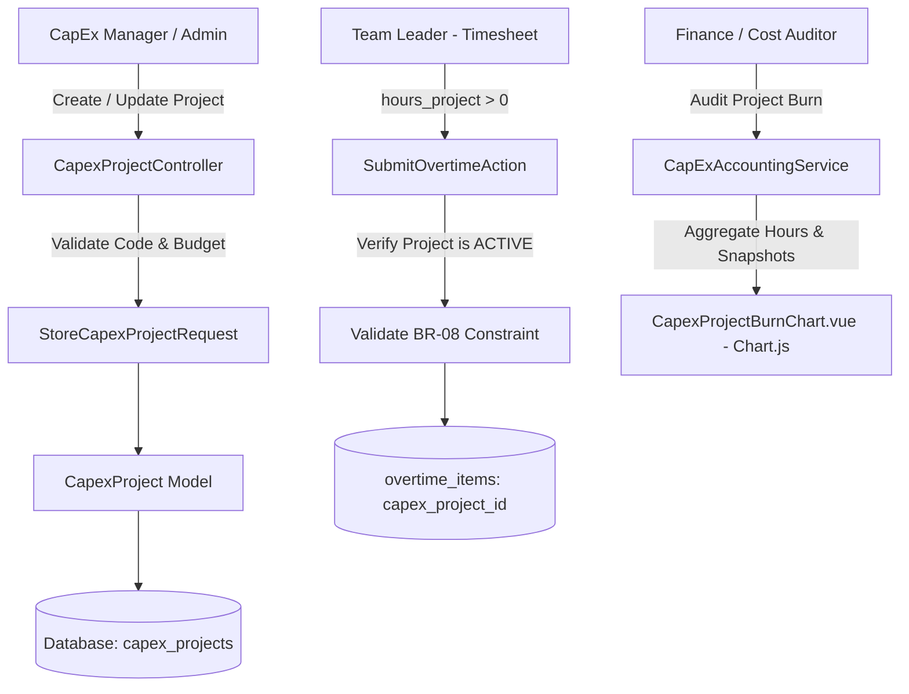
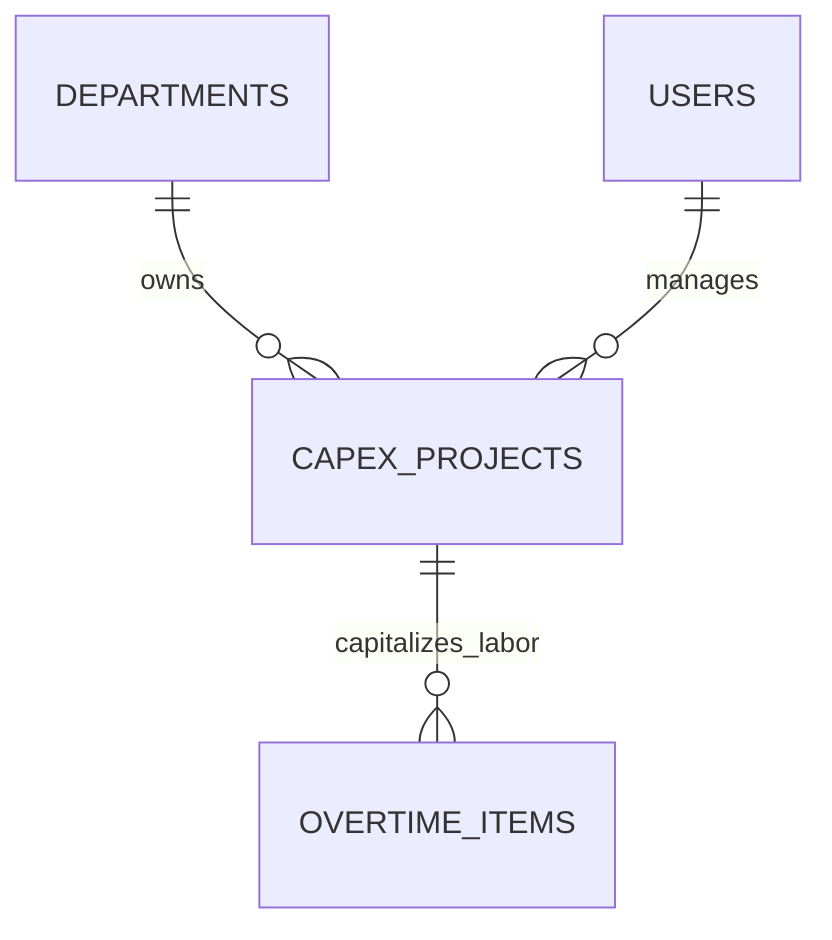

# CapEx Project Labor Management & Capitalization

## Overview

The **CapEx Project Labor Management & Capitalization** module governs overtime labor dedicated to fixed asset creation, machine fabrication, tooling construction, and major facility overhauls. It ensures that capitalized project labor is strictly isolated from standard operational expenses (OpEx), directly traceable to authoritative project codes (`CPX-YYYY-DEPT-NNN`), and compliant with corporate tax depreciation and statutory audit requirements.

## Architecture Diagram

## Data Model

## Key Files & UI Mapping

| Layer          | File / Route / Menu                                              | Purpose                                                                   |
| -------------- | ---------------------------------------------------------------- | ------------------------------------------------------------------------- |
| Sidebar Menu   | `Proyek CapEx` (`/admin/capex-projects`)                         | Master list and capital tracking for managers and admins (`FolderKanban`) |
| Page Component | `resources/js/pages/admin/CapexProjects/Index.vue`               | Unified hub: Tab 1 (Portfolio & Master Data) + Tab 2 (Financial Report)   |
| Drawer Comp    | `resources/js/components/admin/CapexProjectDrawer.vue`           | Ergonomic slide-in sheet for creating and updating projects               |
| Modal Comp     | `resources/js/components/admin/ProjectStatusTransitionModal.vue` | State machine transition dialog with audit warnings                       |
| Detail Page    | `resources/js/pages/admin/CapexProjects/Show.vue`                | Capital labor burn cockpit, macro KPI cards, and master audit params      |
| Controller     | `app/Http/Controllers/Admin/CapexProjectController.php`          | Resource CRUD management, status transitions, and redirects               |
| Service        | `app/Services/CapexProjectService.php`                           | Project scoping, burn calculation, CRUD, and state transitions            |
| Requests       | `app/Http/Requests/Admin/*CapexProject*.php`                     | Validation rules, regex CPX format, and project_code immutability guard   |
| Model          | `App\Models\CapexProject`                                        | Master project record with allocated hours and Rupiah budget              |

## Flow Explanation

1. **Project creation**: An Admin or CapEx Manager creates a project under **Proyek CapEx** specifying:
    - Unique, immutable `project_code` (e.g., `CPX-2026-ASSY-001`).
    - Fixed asset reference code (`asset_code`).
    - Allocated capitalized labor hours and budget in Rupiah (`allocated_labor_budget_idr`).
    - Target milestones and active date range.
2. **Shop-floor timesheet binding**:
    - When a Team Leader enters hours in the **Project** category, `hours_project > 0` triggers validation rule `BR-08`.
    - The user must select an `ACTIVE` project from the dropdown. Inactive or closed projects are rejected.
3. **Financial cost accumulation**:
    - As overtime items are approved, their `total_cost_snapshot` is linked to the CapEx project.
    - The system accumulates both total capitalized hours and total capitalized financial cost.
4. **Labor burn vs. physical progress tracking**:
    - `CapexProjectBurnChart.vue` (Chart.js) renders a comparative curve: cumulative labor burn percentage against reported physical project progress (`physical_progress_pct`).
    - If labor burn reaches 80% while physical progress is only 40%, the system flags a **Capital Overrun Risk**.
5. **Closure & audit locking**:
    - When the project reaches completion, its status transitions to `COMPLETED` and subsequently `CLOSED`.
    - Closed projects are permanently locked against any new overtime attributions.

## API Endpoints & Routes

| Method   | URI                                 | Controller Action                         | Purpose                                         | Auth / Middleware            |
| -------- | ----------------------------------- | ----------------------------------------- | ----------------------------------------------- | ---------------------------- |
| GET      | `/admin/capex-projects`             | `CapexProjectController@index`            | Project portfolio list and burn status          | `auth`, `role:admin,manager` |
| POST     | `/admin/capex-projects`             | `CapexProjectController@store`            | Create new CapEx project                        | `auth`, `role:admin,manager` |
| GET      | `/admin/capex-projects/{id}`        | `CapexProjectController@show`             | Project labor audit cockpit                     | `auth`, `role:admin,manager` |
| PUT      | `/admin/capex-projects/{id}`        | `CapexProjectController@update`           | Update project attributes (project_code locked) | `auth`, `role:admin,manager` |
| DELETE   | `/admin/capex-projects/{id}`        | `CapexProjectController@destroy`          | Delete project (only if 0 overtime items)       | `auth`, `role:admin,manager` |
| PATCH    | `/admin/capex-projects/{id}/status` | `CapexProjectController@updateStatus`     | Transition project lifecycle status             | `auth`, `role:admin,manager` |
| REDIRECT | `/reports/capex-projects/portfolio` | → `/admin/capex-projects?tab=portfolio`   | Legacy alias redirect to Portfolio Hub          | Public / Web                 |
| REDIRECT | `/reports/capex-labor`              | → `/admin/capex-projects?tab=attribution` | Legacy alias redirect to Attribution Tab        | Public / Web                 |

## Decisions & Trade-offs

- **Strict Database Integrity**: We enforce `chk_capex_attribution` at the database level (`hours_project = 0 OR capex_project_id IS NOT NULL`). This ensures no orphaned project labor exists, satisfying strict external financial audits.
- **Immutable Project Codes**: Similar to employee NPKs, project codes cannot be edited after creation to preserve financial ledger traceability.

## Related

- [Epic-07: CapEx Project Labor Management](../../scrum/Epic-07.md)
- [ADR-002: Immutable Rate Snapshotting](../decisions/002-immutable-labor-rate-snapshotting.md)
