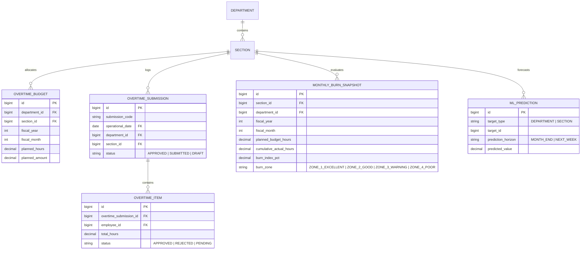

# Daily Burn Chart Index & Section Burn Comparison (E09-02 & E09-03)

## Overview

The Daily Burn Chart Index and Section Burn Comparison components provide executive-grade, operational visualization for manufacturing overtime management on the Executive Operational Dashboard (`/dashboard`).

- **Daily Burn Chart Index (`DailyBurnLineChart.vue`)**: Full-width hero line chart (~384px height) tracking cumulative approved overtime realization against the linear monthly planned budget curve, supplemented by an AI/ML month-end trajectory projection (`ml_predictions`), a 100% budget ceiling threshold line, and soft red warning shading for overrun zones.
- **Section Burn Comparison (`SectionBurnComparisonChart.vue`)**: Horizontal bar chart comparing current cumulative Burn Index (%) across all active sections within the supervisor's scoped department, ranked descending by consumption severity with ISUZU industrial zone colors and 1-click drill-down to each section's weekly burndown cockpit (`/dashboard/burn-index?section={id}`).

## Architecture Diagram

```mermaid
flowchart TD
    subgraph Client [Browser - Inertia & Vue 3]
        Dash[Dashboard.vue]
        HeroChart[DailyBurnLineChart.vue]
        BarChart[SectionBurnComparisonChart.vue]
        BaseLine[BaseLineChart.vue]
        BaseBar[BaseBarChart.vue]
        Plugins[Custom Chart.js Ceiling & Shading Plugin]
        Theme[useChartTheme.ts]

        Dash --> HeroChart
        Dash --> BarChart
        HeroChart --> BaseLine
        BarChart --> BaseBar
        HeroChart --> Plugins
        HeroChart --> Theme
        BarChart --> Theme
    end

    subgraph Backend [Laravel 12 Service Layer]
        Controller[DashboardController]
        KpiService[DashboardKpiService]
        SnapService[MonthlySnapshotService]
        CalcService[BurnIndexCalculatorService]

        Controller --> KpiService
        KpiService --> SnapService
        SnapService --> CalcService
    end

    subgraph Database [Database & Models]
        OvertimeBudgets[(overtime_budgets)]
        OvertimeItems[(overtime_items)]
        OvertimeSubmissions[(overtime_submissions)]
        MonthlyBurnSnapshots[(monthly_burn_snapshots)]
        MlPredictions[(ml_predictions)]
        Sections[(sections)]
    end

    HeroChart -.->|Inertia Visit or GET /dashboard/charts/daily-burn| Controller
    BarChart -.->|Inertia Visit or GET /dashboard/charts/section-burn| Controller
    BarChart -.->|Click Bar / Card: Router Visit| Cockpit[/dashboard/burn-index?section={id}]

    KpiService --> OvertimeBudgets
    KpiService --> OvertimeItems
    KpiService --> OvertimeSubmissions
    KpiService --> MonthlyBurnSnapshots
    KpiService --> MlPredictions
    KpiService --> Sections
```

## Data Model



## Key Files & UI Mapping

| Layer                     | File / Route / Menu                                                    | Purpose                                                                                      |
| ------------------------- | ---------------------------------------------------------------------- | -------------------------------------------------------------------------------------------- |
| **Sidebar Menu**          | `Dashboard` (`/dashboard`)                                             | Main operational landing page for supervisors and administrators                             |
| **Page Component**        | `resources/js/pages/Dashboard.vue`                                     | Master operational dashboard shell with 3 tabs; hosts Tab 1 (`?tab=pacing`)                  |
| **Daily Burn Line Chart** | `resources/js/components/dashboard/DailyBurnLineChart.vue`             | Hero line chart on Tab 1 with budget ceiling, zone shading, month nav, and section filtering |
| **Section Comparison**    | `resources/js/components/dashboard/SectionBurnComparisonChart.vue`     | Horizontal bar chart on Tab 1 ranked descending by Burn Index %, with click-to-cockpit link  |
| **Base Line Wrapper**     | `resources/js/components/charts/BaseLineChart.vue`                     | Reusable Chart.js line canvas supporting custom canvas plugins                               |
| **Base Bar Wrapper**      | `resources/js/components/charts/BaseBarChart.vue`                      | Reusable Chart.js horizontal/vertical bar canvas with click event handlers                   |
| **Backend Controller**    | `app/Http/Controllers/DashboardController.php`                         | Renders Inertia page and exposes JSON endpoints for chart reloads                            |
| **Analytics Service**     | `app/Services/Analytics/DashboardKpiService.php`                       | Computes daily cumulative overtime sums, budget baseline, ML forecasts, and section ranking  |
| **Feature Tests**         | `tests/Feature/DashboardChartsTest.php`                                | Validates data computation, scoping, budget ceilings, and JSON endpoints                     |
| **Browser Tests**         | `tests/Browser/Dashboard/DailyBurnAndSectionComparisonBrowserTest.php` | End-to-end Pest & Playwright browser test verifying chart rendering, widgets, and drill-down |

## Flow Explanation

1. **User Triggers**: A plant manager or administrator navigates to **Dashboard** in the application sidebar or visits `/dashboard`.
2. **Request Handling**: `DashboardController@index` intercepts the request, performs role-based authorization (operators are redirected to `my.dashboard`), and parses query parameters (`date`, `department_id`, `section_id`).
3. **Business Logic in `DashboardKpiService`**:
    - **Daily Cumulative Burn (`getDailyBurnChart`)**:
        - Resolves the target month days (1 to 28/29/30/31) and calculates the cutoff day (current day for active month, last day for past month, 0 for future month).
        - Fetches `planned_hours` from `overtime_budgets` (or falls back to `monthly_burn_snapshots`).
        - Groups approved `overtime_items` by `operational_date` and calculates a cumulative running sum up to the cutoff day.
        - Generates the linear planned budget curve: `($plannedHours / $daysInMonth) * $d`.
        - Checks `ml_predictions` for `MONTH_END` horizon (or calculates run-rate velocity) to project a smooth trajectory from the latest realization point to month-end.
        - Determines the active burn zone: Green (`<85%`), Blue (`85–100%`), Amber (`101–115%`), ISUZU Red (`>115%`).
    - **Section Comparison (`getSectionBurnComparison`)**:
        - Scopes active sections to the user's authorized department (or all departments for Admin).
        - Queries `monthly_burn_snapshots` (or recalculates via `MonthlySnapshotService`).
        - Sorts all sections in descending order of `burn_index_pct`.
4. **Response**: Inertia delivers `dailyBurnChart` and `sectionBurnComparison` props to `Dashboard.vue`. Chart.js renders the full-width line chart with custom beforeDraw ceiling plugin and horizontal bar chart with touch-friendly section chips.

## API Endpoints & Routes

| Method | URI                              | Controller Action                           | Purpose                                       | Auth / Role                                        |
| ------ | -------------------------------- | ------------------------------------------- | --------------------------------------------- | -------------------------------------------------- |
| `GET`  | `/dashboard`                     | `DashboardController@index`                 | Render main dashboard with charts & KPI props | auth, verified (`admin`, `manager`, `team_leader`) |
| `GET`  | `/dashboard/charts/daily-burn`   | `DashboardController@dailyBurnChart`        | JSON endpoint for daily burn data refresh     | auth, verified (`admin`, `manager`, `team_leader`) |
| `GET`  | `/dashboard/charts/section-burn` | `DashboardController@sectionBurnComparison` | JSON endpoint for section comparison data     | auth, verified (`admin`, `manager`, `team_leader`) |

### Query Parameters

| Parameter       | Type                  | Required | Default      | Description                                                 |
| --------------- | --------------------- | -------- | ------------ | ----------------------------------------------------------- |
| `date`          | `string` (YYYY-MM-DD) | No       | Today (WIB)  | Selected operational date / month context                   |
| `department_id` | `int`                 | No       | User's dept  | Department ID filter (Admin can select any; Manager scoped) |
| `section_id`    | `int`                 | No       | All sections | Specific section filter for daily burn line chart           |

## Decisions & Trade-offs

- **Single Surface Architecture Compliance**: Both new charts are placed on `/dashboard` rather than spawning new routes, honoring the strict 2-surface rule in `Epic-09-ux-plan.md`.
- **Canvas-Level Ceiling Plugin vs Annotation Library**: Custom Chart.js `beforeDraw` hook is implemented natively inside the component rather than adding heavy third-party plugins like `chartjs-plugin-annotation`. This keeps bundle size minimal and guarantees zero breaking changes across updates.
- **Descending Order for Section Comparison**: Sections are ranked from highest to lowest Burn Index percentage so managers instantly see critical/overrun sections at the very top of the chart without scrolling.
- **Dual Interaction Channels**: Both canvas bar clicks and discrete quick-access section cards are provided, ensuring ergonomic usability for shopfloor touchscreen tablet users where bar clicks may be imprecise.

## Related

- [Executive Dashboard & KPI Cards](executive-dashboard-kpi.md)
- [Budget Burn Index & Section Burndown](budget-burn-index.md)
- [ADR-028: Shared Vue Chart.js Infrastructure and Operational KPI Cards](../decisions/028-shared-vue-chartjs-infrastructure-and-operational-kpi-cards.md)
- [ADR-029: Daily Burn Line Chart and Section Burn Comparison](../decisions/029-daily-burn-chart-and-section-burn-comparison.md)
- [Daily Burn and Section Comparison User Guide](../../user-docs/guides/daily-burn-and-section-comparison.md)
