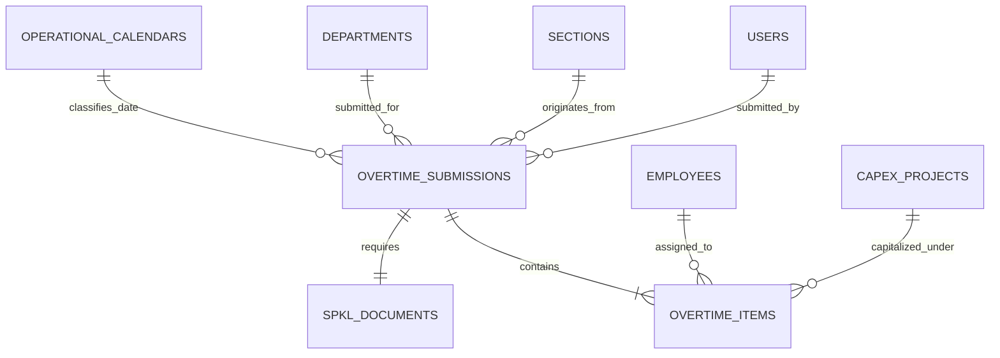

# Daily Overtime Entry & Flexible SPKL Workflow

## Overview

The **Daily Overtime Entry & Flexible SPKL Workflow** enables frontline shift supervisors (Team Leaders) to rapidly record overtime hours for their section crew at shift handover (07:00, 15:00, 23:00 WIB). The workflow guarantees non-blocking operation: hours are recorded immediately without waiting for physical paperwork, while formal _Surat Perintah Kerja Lembur_ (SPKL) documents are tracked asynchronously through an integrated grace period state machine.

## Architecture Diagram

```mermaid
flowchart TD
    TL[Team Leader UI: /overtime/create] -->|POST Form Data| OSC[OvertimeSubmissionController@store]
    OSC -->|Validate Nested Array| SVR[StoreOvertimeSubmissionRequest]
    SVR --> SOA[SubmitOvertimeAction]

    subgraph Transaction["DB Transaction (Atomic)"]
        SOA --> RC[Resolve Day Type HKN/HLR]
        SOA --> VAL[Lock & Validate Section Roster]
        SOA --> HDR[Create overtime_submissions Header]
        SOA --> SPKL[Create spkl_documents PENDING]
        SOA --> ITM[Insert overtime_items & Snapshot Rates]
    end

    SOA -->|Dispatch| RADJ[RunAnomalyDetectionJob]
    SOA -->|Dispatch| RMBSJ[RecalculateMonthlyBurnSnapshotJob]
    SOA --> OSC
    OSC -->|Inertia Redirect with Flash| UI[Timesheet Summary & Toast]
```

## Data Model



## Key Files & UI Mapping

| Layer              | File / Route / Menu                                                                   | Purpose                                                        |
| ------------------ | ------------------------------------------------------------------------------------- | -------------------------------------------------------------- |
| Sidebar Menu       | `Input Lembur` (`/overtime/submissions/create`)                                       | Frontline entry point for shift supervisors                    |
| Page Component     | `resources/js/pages/overtime/Create.vue`                                              | Reactive Vue 3 timesheet entry table                           |
| History Page       | `resources/js/pages/overtime/Index.vue`                                               | Overtime submission history & navigation tab                   |
| Form Sub-component | `resources/js/components/overtime/OvertimeItemRow.vue`                                | Row component handling 4 category inputs and live total        |
| Burn Indicator     | `resources/js/components/overtime/SectionBurnIndicator.vue`                           | Live section budget burn badge & progress bar                  |
| Success Card       | `resources/js/components/overtime/PostSubmissionSuccessCard.vue`                      | Celebratory confirmation card with SPKL status & stats         |
| Controller         | `app/Http/Controllers/Overtime/OvertimeSubmissionController.php`                      | Lean controller handling form rendering, submission, & roster  |
| Action             | `app/Actions/Overtime/SubmitOvertimeAction.php`                                       | Atomic transaction logic, rate snapshotting, queue dispatching |
| Form Request       | `app/Http/Requests/Overtime/StoreOvertimeSubmissionRequest.php`                       | Validates min hours (0.5), CapEx projects, & employee limits   |
| Models             | `App\Models\OvertimeSubmission`, `App\Models\OvertimeItem`, `App\Models\SpklDocument` | Eloquent entities enforcing schema constraints & immutability  |

## Flow Explanation

1. **User triggers**: The Team Leader clicks **Input Lembur** in the sidebar. The system pre-selects today's date and the supervisor's assigned Department and Section.
2. **Day classification**: The form reactively queries the calendar date via `useCalendarDayType`, displaying an automated badge: `📅 Hari Kerja Normal (HKN)` or `🔴 Hari Libur (HLR)`. The supervisor can toggle the classification if operating an exceptional shift.
3. **Roster loading**: Active employees belonging to that section populate the roster table via `useSectionRoster` with immutable NPK identifiers and 1-click **Pilih Semua (Add All)**.
4. **Hour entry & validation**: For each worker, hours are allocated into four decimal buckets: `Production`, `TPM`, `Project (CapEx)`, and `Others`.
    - If `CapEx > 0`, the `CapEx Project` dropdown progressively expands (mandatory per BR-08).
    - Live row total is computed client-side with currency estimation in Rupiah (`formatRupiah`).
5. **Atomic transaction**: `SubmitOvertimeAction` executes within a database transaction, generates a human-readable submission code (`OT-YYYYMMDD-SEC-0001`), creates a linked `SpklDocument` in `PENDING` status, permanently snapshots `hourly_rate_snapshot` and `total_cost_snapshot` using `bcmul`, and inserts all line items.
6. **Async dispatch**: `RunAnomalyDetectionJob` is dispatched asynchronously per line item.
7. **Response**: The application displays the celebratory `PostSubmissionSuccessCard` with the generated code, crew count, total hours, and `SPKL: Belum Dilampirkan (Non-blocking BR-05)` notice.

## API Endpoints & Routes

| Method | URI                                    | Controller Action                     | Purpose                                        | Auth / Middleware                        |
| ------ | -------------------------------------- | ------------------------------------- | ---------------------------------------------- | ---------------------------------------- |
| GET    | `/overtime/submissions/create`         | `OvertimeSubmissionController@create` | Render timesheet form with active roster       | `auth`, `role:admin,manager,team_leader` |
| POST   | `/overtime/submissions`                | `OvertimeSubmissionController@store`  | Atomic batch submission                        | `auth`, `role:admin,manager,team_leader` |
| GET    | `/overtime/submissions`                | `OvertimeSubmissionController@index`  | Submission history listing                     | `auth`, `role:admin,manager,team_leader` |
| GET    | `/overtime/submissions/roster/{secId}` | `OvertimeSubmissionController@roster` | JSON endpoint returning section workers & burn | `auth`, `role:admin,manager,team_leader` |

## Decisions & Trade-offs

- **Non-blocking SPKL vs. Strict Blocking**: A blocking workflow caused supervisors to delay entries for days. The non-blocking approach ensures immediate operational visibility while grace period automated notifications prevent abandoned documents (see [ADR-003](../decisions/003-non-blocking-spkl-document-workflow.md)).
- **Stored Generated Column**: `overtime_items.total_hours` is stored and generated at the database level (`GENERATED ALWAYS AS`), making arithmetic discrepancies mathematically impossible.
- **Wayfinder Route Integration**: Forms use Wayfinder generated actions (`import { store } from '@/actions/App/Http/Controllers/OvertimeSubmissionController'`) for strict type safety.

## Related

- [ADR-001: Wayfinder Routing](../decisions/001-wayfinder-routing-over-ziggy.md)
- [ADR-002: Immutable Rate Snapshotting](../decisions/002-immutable-labor-rate-snapshotting.md)
- [ADR-003: Non-Blocking SPKL Document Workflow](../decisions/003-non-blocking-spkl-document-workflow.md)
- [Epic-03: Daily Overtime Entry & SPKL Workflow](../../scrum/Epic-03.md)
