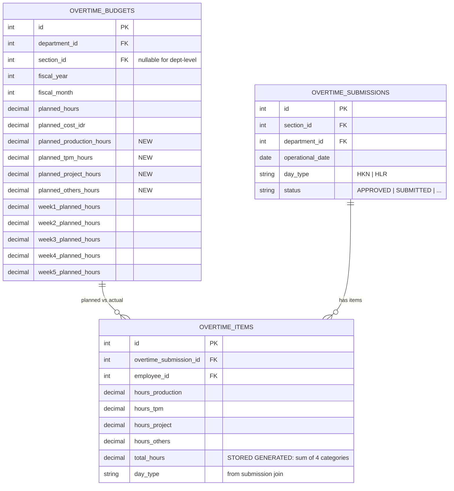

# Dashboard Overtime Index Charts (E09 Enhancement)

## Overview

This document covers the three new chart components added to the `/dashboard` Pacing tab to visually replicate the client's Excel reference (`docs/references/dashboard_ot.xlsx`). These charts expose **Index-weighted** overtime data — converting raw hours into labour-law-adjusted index values (HKN × 1.5, HLR × 2.0) — and introduce per-category plan-vs-actual comparison sourced from the extended `overtime_budgets` table.

The features span:

1. **BurnUpIndexChart.vue** — Daily cumulative plan-vs-actual grouped bar chart for the current month
2. **CategoryOvertimeChart.vue** (updated) — Grouped horizontal bars showing planned vs actual hours per category (Production, TPM, Project, Others)
3. **YtdOvertimeIndexChart.vue** — Full-year monthly trend bar chart with manpower overlay line

---

## Architecture Diagram

```mermaid
flowchart TD
    subgraph Browser [Dashboard.vue — Pacing Tab]
        BUI[BurnUpIndexChart.vue]
        COC[CategoryOvertimeChart.vue]
        YTD[YtdOvertimeIndexChart.vue]
    end

    subgraph DashboardController
        DC[DashboardController@index]
    end

    subgraph Service [DashboardKpiService]
        FBI[getDailyBurnUpIndex]
        GCD[getCategoryDistribution]
        GYI[getYtdOvertimeIndex]
    end

    subgraph Models
        OS[OvertimeSubmission]
        OI[OvertimeItem]
        OB[OvertimeBudget]
        OC[OperationalCalendar]
        EMP[Employee]
    end

    Browser -->|Inertia partial reload| DC
    DC --> FBI & GCD & GYI
    FBI --> OS & OI & OC & OB
    GCD --> OI & OB
    GYI --> OS & OI & OB & OC & EMP
    Service --> DC
```

---

## Data Model — New OvertimeBudget Columns



---

## Key Files & UI Mapping

| Layer         | File                                                                                  | Purpose                                                                                     |
| ------------- | ------------------------------------------------------------------------------------- | ------------------------------------------------------------------------------------------- |
| Route         | `GET /dashboard` → `DashboardController@index`                                        | Passes all chart props via Inertia                                                          |
| Controller    | `app/Http/Controllers/DashboardController.php`                                        | Orchestrates 3 new service calls                                                            |
| Service       | `app/Services/Analytics/DashboardKpiService.php`                                      | `getDailyBurnUpIndex`, `getCategoryDistribution` (updated), `getYtdOvertimeIndex`           |
| Migration     | `database/migrations/2026_09_22_*_add_category_planned_hours_to_overtime_budgets.php` | Adds 4 new decimal columns to `overtime_budgets`                                            |
| Model         | `app/Models/OvertimeBudget.php`                                                       | Exposes new planned category columns as fillable                                            |
| Factory       | `database/factories/OvertimeBudgetFactory.php`                                        | Generates realistic per-category planned hours (55/5/25/15% split)                          |
| Seeder        | `database/seeders/OvertimeBudgetSeeder.php`                                           | Seeds per-category planned hours for current month                                          |
| Seeder        | `database/seeders/Ytd2026DummyDataSeeder.php`                                         | Full-year 2026 staging data: 12 months of budgets + Jan–Aug transactions + Sep daily spread |
| Vue Page      | `resources/js/pages/Dashboard.vue`                                                    | Pacing tab layout with all 3 new charts                                                     |
| Vue Component | `resources/js/components/dashboard/BurnUpIndexChart.vue`                              | NEW: grouped bar chart — daily cumulative index                                             |
| Vue Component | `resources/js/components/dashboard/CategoryOvertimeChart.vue`                         | UPDATED: grouped horizontal bars plan vs actual                                             |
| Vue Component | `resources/js/components/dashboard/YtdOvertimeIndexChart.vue`                         | NEW: 12-month plan/actual bar + manpower line                                               |
| Tests         | `tests/Feature/DashboardOvertimeIndexTest.php`                                        | 16 feature tests covering all 3 service methods + page props                                |

---

## Overtime Index Calculation

The **Overtime Index** (inspired by client's Excel reference) converts raw hours into a labour-law-adjusted weight:

```
Index = hours × multiplier
  where multiplier = 1.5 for HKN (Hari Kerja Normal)
                     2.0 for HLR (Hari Libur Resmi)
```

Constants are defined in `DashboardKpiService`:

```php
private const HKN_MULTIPLIER = 1.5;
private const HLR_MULTIPLIER = 2.0;
```

### getDailyBurnUpIndex()

**Purpose:** Returns day-by-day cumulative index arrays for the current month.

**Signature:**

```php
public function getDailyBurnUpIndex(
    User $user,
    ?string $date = null,
    ?int $departmentId = null,
    ?int $sectionId = null
): array
```

**Return structure:**

```json
{
  "labels": ["01", "02", ..., "30"],
  "plan_index_cumulative": [590.5, 1181.0, ...],
  "actual_index_cumulative": [450.0, 920.5, ..., null, null],
  "total_plan_index": 17640.0,
  "total_actual_index": 1990.8,
  "burn_index_pct": 11.3,
  "cutoff_day": 22,
  "days_in_month": 30,
  "fiscal_year": 2026,
  "fiscal_month": 9,
  "month_name": "September (22 Days Elapsed)",
  "scope": { ... }
}
```

**Behaviour notes:**

- Days after `cutoff_day` (today's day of month) receive `null` in `actual_index_cumulative`
- Plan is distributed linearly across all days (total planned ÷ days_in_month per day)
- Actual uses per-day actual approved hours × day_type multiplier, then cumulates

### getCategoryDistribution() — Updated

The method now also fetches per-category planned hours from `OvertimeBudget`:

**New return keys per category item:**

```json
{
    "key": "production",
    "label": "Production",
    "hours": 816.0,
    "planned_hours": 5940.0,
    "percentage": 61.5,
    "percentage_of_plan": 13.7
}
```

**New top-level key:**

```json
{ "total_planned": 10800.0 }
```

### getYtdOvertimeIndex()

**Purpose:** Returns 12 monthly data points for the fiscal year (Jan–Dec).

**Return structure:**

```json
{
  "labels": ["Januari (20 Days)", ..., "Desember (21 Days)"],
  "plan_index": [18116.1, 17935.7, ...],
  "actual_index": [3247.5, 3159.0, ..., 0.0, 0.0, 0.0],
  "man_power": [120, 120, ...],
  "ytd_plan_total": 135345.2,
  "ytd_actual_total": 25759.8,
  "ytd_burn_pct": 19.0,
  "fiscal_year": 2026,
  "scope": { ... }
}
```

**Behaviour notes:**

- Future months (after current month) return `0.0` actual index
- Manpower = count of distinct `active` employees per month from `employees` table
- Average multiplier per month is derived from `OperationalCalendar` day-type counts

---

## Staging Data — Ytd2026DummyDataSeeder

`database/seeders/Ytd2026DummyDataSeeder.php` generates a full year of realistic 2026 data:

| Month        | Coverage                                        | Target Utilization      |
| ------------ | ----------------------------------------------- | ----------------------- |
| Jan 2026     | Budget + APPROVED transactions                  | 78%                     |
| Feb 2026     | Budget + APPROVED transactions                  | 88%                     |
| Mar 2026     | Budget + APPROVED transactions                  | 110% (surge)            |
| Apr 2026     | Budget + APPROVED transactions                  | 82%                     |
| May 2026     | Budget + APPROVED transactions                  | 70% (Lebaran)           |
| Jun 2026     | Budget + APPROVED transactions                  | 115% (catch-up)         |
| Jul 2026     | Budget + APPROVED transactions                  | 95%                     |
| Aug 2026     | Budget + APPROVED transactions                  | 103%                    |
| Sep 2026     | Budget + daily-spread APPROVED data (days 1–22) | Partial (current month) |
| Oct–Dec 2026 | Budgets only (no actual data)                   | Future                  |

**Category split per seeded OvertimeItem:**

- Production: 55% | TPM: 5% | Project: 25% | Others: 15%

**Constraint compliance:**

- `hours_project > 0` always linked to an existing `CapexProject` via `capex_project_id`
- `rca_category` cycles through valid enum values (MACHINE_BREAKDOWN → FACILITY_MAINTENANCE)

**Idempotency:** `OvertimeBudget` records use `updateOrCreate`. Sections already having ≥ 3 submissions for a month are skipped. `MonthlyBurnSnapshot` uses `updateOrCreate`.

---

## Flow Explanation

1. **User visits `/dashboard`** → `DashboardController@index` fires
2. **Controller resolves scope** — role-based dept/section scoping via `resolveDepartmentId()` and `resolveSectionId()` using query params or user's assigned section
3. **Three service calls run in sequence:**
    - `getDailyBurnUpIndex()` — joins `overtime_submissions` + `overtime_items` + `operational_calendars` to sum per-day HKN/HLR hours, applies multipliers, cumulates
    - `getCategoryDistribution()` — sums `hours_production`, `hours_tpm`, etc. from approved items; separately sums `planned_*_hours` from `overtime_budgets`
    - `getYtdOvertimeIndex()` — iterates Jan–Dec, summing actual from `overtime_items` and planned from `overtime_budgets`
4. **Inertia renders `Dashboard.vue`** with props `dailyBurnUpIndex`, `categoryDistribution`, `ytdOvertimeIndex`
5. **Partial reloads** on filter change use `only: ['dailyBurnUpIndex', 'categoryDistribution', 'ytdOvertimeIndex', ...]`

---

## Decisions & Trade-offs

- **Index over raw hours:** The client's Excel reference consistently used index values rather than raw hours in its KPI charts. We mirror this to align visual language with stakeholders' existing mental models.
- **Per-category planned columns on `overtime_budgets`:** Rather than a separate join table, four decimal columns were added directly to `overtime_budgets`. This keeps queries simple and matches the existing single-row-per-month-per-section budget model.
- **Linear plan distribution for daily burn-up:** Planned hours are distributed evenly across calendar days (not working days) for simplicity. A future improvement could weight by working-day density from `OperationalCalendar`.
- **SQLite/MySQL portability for seeder:** The `Ytd2026DummyDataSeeder` uses `strftime()` in Tinker verification queries only — all application runtime queries use Eloquent/MariaDB-compatible syntax.

---

## Related

- [Executive Dashboard KPI Cards](./executive-dashboard-kpi.md)
- [Daily Burn and Section Comparison Chart](./daily-burn-and-section-comparison.md)
- [Executive Dashboard Multi-Chart Grid](./executive-dashboard-multi-chart-grid.md)
- [Database Seeding & Demo Data](./database-seeding-demo-data.md)
- [ADR-005: Denormalized Monthly Burn Snapshots](../decisions/005-denormalized-monthly-burn-snapshots.md)
- Epic source: `docs/scrum/Epic-09.md` (E09-02 / E09-04)
- UX reference: `docs/scrum/Epic-09-ux-plan.md`
