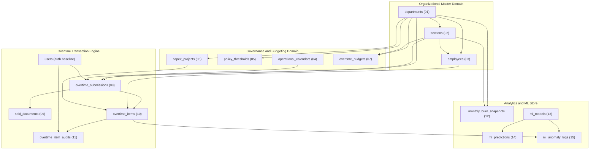
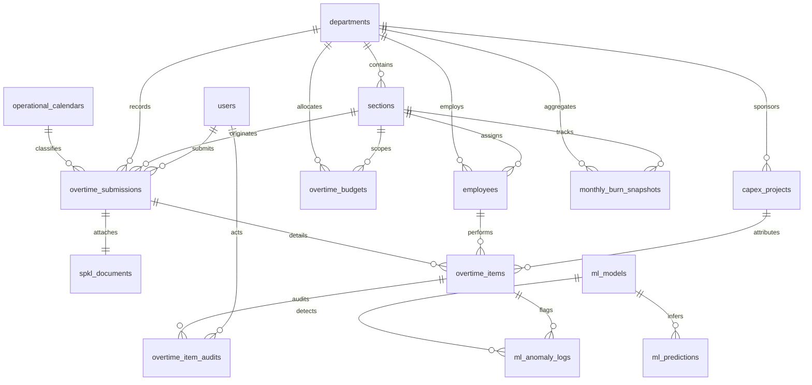

# Database Schema Migrations (Full DDL)

## Overview

The Database Schema Migrations provide the version-controlled, production-grade relational database foundation for the Overtime & CapEx Labor Management System (OT-CapEx). The schema spans 15 modular Laravel migration files establishing 15 tables across four core business domains: Organizational Master Data, Policy & Budgeting Governance, Overtime Transaction Engine, and Pragmatic Analytics & ML Store.

Integrity is guaranteed at the database engine layer using strict foreign key delete constraints (`ON DELETE RESTRICT` for parent references, `ON DELETE CASCADE` for tightly coupled child aggregates), a database-computed stored generated column (`overtime_items.total_hours`), composite unique indexes, partial performance indexes, and database-level CHECK constraints.

## Architecture Diagram

## Data Model (ERD)

## Key Files & Migration Mapping

| Order | Migration File                                              | Table Created            | Primary Purpose & Key Constraints                                                         |
| ----- | ----------------------------------------------------------- | ------------------------ | ----------------------------------------------------------------------------------------- |
| 01    | `2026_01_01_000001_create_departments_table.php`            | `departments`            | Cost center master, unique `code`, default hourly rates.                                  |
| 02    | `2026_01_01_000002_create_sections_table.php`               | `sections`               | Shop-floor lines, unique `code`, FK to `departments` (`RESTRICT`).                        |
| 03    | `2026_01_01_000003_create_employees_table.php`              | `employees`              | Unique corporate `npk`, hourly rate, partial index `idx_employees_dept_sec`.              |
| 04    | `2026_01_01_000004_create_operational_calendars_table.php`  | `operational_calendars`  | Plant calendar dates as primary key, `HKN`/`HLR` day classification.                      |
| 05    | `2026_01_01_000005_create_policy_thresholds_table.php`      | `policy_thresholds`      | Soft limit hours, SPKL grace days, burn warning/danger percentages.                       |
| 06    | `2026_01_01_000006_create_capex_projects_table.php`         | `capex_projects`         | Capital expenditure projects, asset tags, status lifecycle.                               |
| 07    | `2026_01_01_000007_create_overtime_budgets_table.php`       | `overtime_budgets`       | Planned monthly/weekly quota, unique `uq_budget_period`.                                  |
| 08    | `2026_01_01_000008_create_overtime_submissions_table.php`   | `overtime_submissions`   | Shift batch timesheets, submission code, FK to calendar date.                             |
| 09    | `2026_01_01_000009_create_spkl_documents_table.php`         | `spkl_documents`         | 1:1 SPKL attachment, due date tracking, partial index on `PENDING`.                       |
| 10    | `2026_01_01_000010_create_overtime_items_table.php`         | `overtime_items`         | Stored generated column `total_hours`, rate snapshots, optimistic locking `lock_version`. |
| 11    | `2026_01_01_000011_create_overtime_item_audits_table.php`   | `overtime_item_audits`   | Immutable audit log of item state transitions with JSON payloads.                         |
| 12    | `2026_01_01_000012_create_monthly_burn_snapshots_table.php` | `monthly_burn_snapshots` | Pre-aggregated monthly burn metrics, burn zone enum, unique `uq_monthly_section_burn`.    |
| 13    | `2026_01_01_000013_create_ml_models_table.php`              | `ml_models`              | Machine learning model registry, hyperparameters and metrics JSON.                        |
| 14    | `2026_01_01_000014_create_ml_predictions_table.php`         | `ml_predictions`         | Forecasted hours, confidence intervals, risk scores and level.                            |
| 15    | `2026_01_01_000015_create_ml_anomaly_logs_table.php`        | `ml_anomaly_logs`        | Anomaly inference logs, dismissal workflow, partial index on non-dismissed items.         |

## Flow & Integrity Explanation

1. **Foreign Key Protection (`ON DELETE RESTRICT`)**:
   Financial and compliance records prohibit cascading deletes. Attempting to delete a `department` with active `sections`, or an `employee` with logged overtime items triggers a database-level restriction error.
2. **Stored Generated Column (`total_hours`)**:
   `overtime_items.total_hours` is defined as a stored generated column:
   `hours_production + hours_tpm + hours_project + hours_others`.
   This guarantees mathematical consistency at the database engine level across all insert and update vectors without relying solely on application-level recalculation.
3. **Optimistic Concurrency Control (`lock_version`)**:
   `overtime_items` includes an integer `lock_version` default 1, eliminating race conditions during bulk or simultaneous line supervisor and manager reviews.
4. **Conditional Partial Indexes**:
   Targeted indexes on high-frequency queries (`idx_employees_dept_sec` where `is_active = TRUE`, `idx_spkl_pending_due` where `status = 'PENDING'`, `idx_anomaly_item` where `is_dismissed = FALSE`) are applied natively on PostgreSQL and SQLite, while falling back gracefully to standard composite indexes on MySQL.

## Decisions & Trade-offs

- **Why Stored Generated Columns over Triggers or Virtual Columns?**
  Stored columns are persisted to disk upon row write and can be directly indexed, queried, and aggregated with standard B-Tree indexing speed, eliminating calculation overhead during analytical dashboard scans.
- **Why Multi-Driver Migration DDL?**
  Local development and CI environments utilize SQLite in memory for sub-second test execution, whereas staging and production deploy to PostgreSQL or MySQL InnoDB. The migration files conditionally apply driver-specific DDL (such as partial index `WHERE` clauses and `ALTER TABLE ADD CONSTRAINT CHECK`) to provide maximum engine optimization without breaking SQLite test compatibility.

## Related

- [ADR-006: Multi-Database Stored Generated Columns and Partial Indexes](../decisions/006-multi-database-stored-generated-columns-and-partial-indexes.md)
- [ADR-002: Immutable Labor Rate Snapshotting](../decisions/002-immutable-labor-rate-snapshotting.md)
- [ADR-003: Non-Blocking SPKL Document Workflow](../decisions/003-non-blocking-spkl-document-workflow.md)
- [ADR-005: Denormalized Monthly Burn Snapshots](../decisions/005-denormalized-monthly-burn-snapshots.md)
- [Data Architecture & Relational Design Blueprint](../../scrum/data-architect-analyst.md)
- [Epic-01 Foundation & Infrastructure Setup](../../scrum/Epic-01.md)
