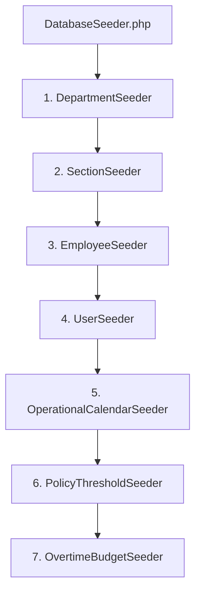
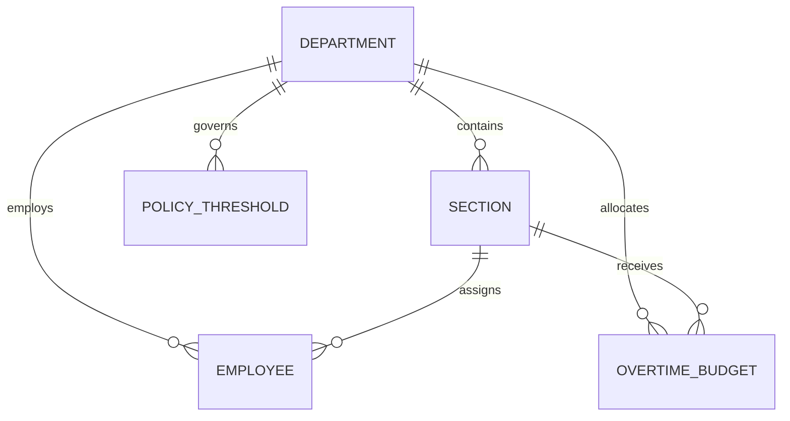

# Database Seeding & Manufacturing Floor Demo Data

## Overview

The Database Seeding infrastructure generates comprehensive, realistic master data and operational records for an Indonesian automotive assembly plant. It allows developers, automated test suites, and product stakeholders to exercise authentication, organizational scoping, shift calendars, overtime policies, and budgets immediately without manual data entry.

## Architecture Diagram

## Data Model

## Key Files & Seeded Entities

| Seeder                          | Target Model          | Seeded Volume & Scope                                                                                                                     |
| ------------------------------- | --------------------- | ----------------------------------------------------------------------------------------------------------------------------------------- |
| `DepartmentSeeder.php`          | `Department`          | 6 Automotive departments (`DEPT_STP`, `DEPT_WLD`, `DEPT_PNT`, `DEPT_ASY`, `DEPT_QAC`, `DEPT_MNT`) with cost center codes and hourly rates |
| `SectionSeeder.php`             | `Section`             | 15 Specialized plant sections linked to parent departments                                                                                |
| `EmployeeSeeder.php`            | `Employee`            | 120 Shopfloor employees with unique NPKs (`EMP-01001`+), realistic Indonesian names, and positions                                        |
| `UserSeeder.php`                | `User`                | 28 System accounts: 1 Admin, 2 Managers, 5 Team Leaders, 20 Operators with verified passwords                                             |
| `OperationalCalendarSeeder.php` | `OperationalCalendar` | 365 Days for 2026 classified into HKN (normal workdays) and HLR (holidays/weekends)                                                       |
| `PolicyThresholdSeeder.php`     | `PolicyThreshold`     | 1 Plant default threshold (20.0 hrs/week, 2 days grace) plus departmental policy overrides                                                |
| `OvertimeBudgetSeeder.php`      | `OvertimeBudget`      | Departmental and section budgets for current fiscal period with 5-week planned allocations                                                |

## Flow Explanation

1. **Dependency Order Execution**: `DatabaseSeeder` calls each child seeder sequentially to guarantee that foreign key references exist before dependent rows are inserted.
2. **Batch Upsert Performance**: Heavy seeders (such as `EmployeeSeeder` and `OperationalCalendarSeeder`) utilize `upsert()` with chunked arrays to execute the entire seeding process in less than 2 seconds, well below the 30-second requirement.
3. **Idempotence**: All seeders employ `updateOrCreate` or `upsert`, allowing re-execution (`php artisan db:seed`) without duplicate key collisions.

## Decisions & Trade-offs

- **Realistic Automotive Archetypes**: Rather than generic lorem ipsum, departments and sections reflect actual manufacturing lines (e.g. Blanking, Underbody Welding, Topcoat Painting, Trim Installation) to make demo dashboards immediately relatable to plant managers.
- **Synchronized NPK Identifiers**: Employee records and User records share identical NPK numbers, enabling the `user->employee` relationship to function seamlessly out of the box.

## Related

- [Database Schema Migrations (Full DDL)](database-schema-migrations.md)
- [Eloquent Models & Domain Relationships](eloquent-models-relationships.md)
- [Authentication & Role-Based Access Control](authentication-rbac.md)
