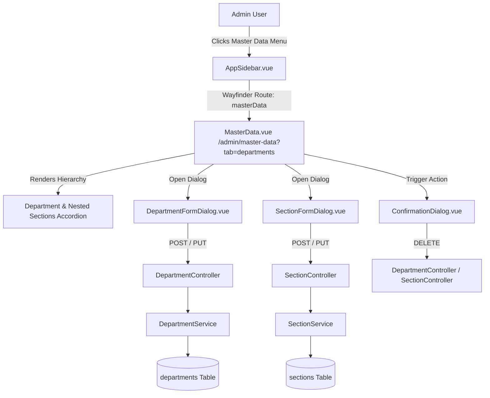
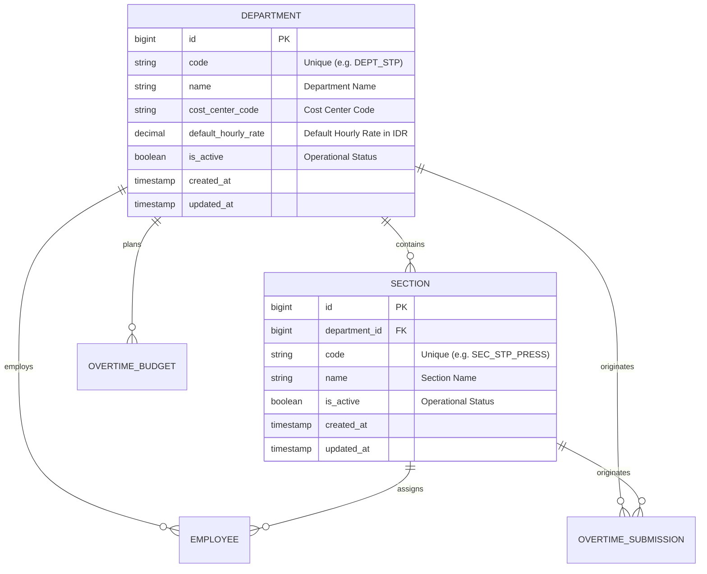

# Department & Section Hierarchy Management

## Overview

The Department & Section Hierarchy Management module (Story E02-01) establishes the foundational organizational structure for the OT-CapEx system. In an automotive manufacturing plant, timesheets, cost center accounting, labor rates, and supervisor approvals all route through specific departments and production sections. This module provides administrators with a consolidated interface within the Master Data Hub to create, update, deactivate, and monitor departments and nested child sections while enforcing strict business rules: immutable code identifiers, Indonesian Rupiah formatting standards, and zero raw SQL database crashes upon deletion attempts.

## Architecture Diagram

## Data Model

## Key Files & UI Mapping

| Layer              | File / Route / Menu                                      | Purpose                                                                                               |
| ------------------ | -------------------------------------------------------- | ----------------------------------------------------------------------------------------------------- |
| Sidebar Navigation | `Master Data`                                            | Administrative entry point visible only to Admin role (`AppSidebar.vue`)                              |
| Page Component     | `resources/js/pages/admin/MasterData.vue`                | Consolidated Master Data Hub with tabbed interface (`departments`, `employees`, `calendar`)           |
| Dialog Component   | `resources/js/components/admin/DepartmentFormDialog.vue` | Centered modal for department creation and editing with locked code indicator                         |
| Dialog Component   | `resources/js/components/admin/SectionFormDialog.vue`    | Centered modal for section creation and editing nested under a department                             |
| Dialog Component   | `resources/js/components/admin/ConfirmationDialog.vue`   | Reusable modal dialog for deactivation and delete warnings                                            |
| Controller         | `app/Http/Controllers/Admin/MasterDataController.php`    | Renders Master Data Hub page with eager-loaded hierarchy and metrics counts                           |
| Controller         | `app/Http/Controllers/Admin/DepartmentController.php`    | Handles department store, update, and destroy actions                                                 |
| Controller         | `app/Http/Controllers/Admin/SectionController.php`       | Handles section store, update, and destroy actions                                                    |
| Service            | `app/Services/DepartmentService.php`                     | Domain validation, normalization, deactivation checks, and deletion integrity rules                   |
| Service            | `app/Services/SectionService.php`                        | Section domain operations and referential integrity protection                                        |
| Form Requests      | `app/Http/Requests/Admin/*`                              | Form request validations ensuring unique uppercase codes, non-negative rates, and admin authorization |
| Formatter Utility  | `resources/js/lib/formatters.ts`                         | Currency formatting utility (`formatRupiah`) adhering to Indonesian standards                         |

## Flow Explanation

1. **User triggers**: An administrator clicks the **Master Data** item in the sidebar. The page loads `/admin/master-data?tab=departments`.
2. **Request handling**: `MasterDataController::index` queries all departments with their nested child sections, computing relational counts (`employees_count`, `sections_count`, `overtime_submissions_count`).
3. **Business logic & creation**:
    - When adding a department, `DepartmentFormDialog` submits to `DepartmentController::store`.
    - `StoreDepartmentRequest` validates that `code` is unique and matches alphanumeric formatting.
    - `DepartmentService` capitalizes `code` and `cost_center_code`, and creates the record.
    - For edits, `UpdateDepartmentRequest` excludes `code` from mutable fields, enforcing Business Rule BR-03 immutability.
4. **Integrity protection (Zero raw SQL crashes)**:
    - When an admin attempts to deactivate a department, `DepartmentService::canDeactivate` verifies whether active child sections exist. If so, a validation error is returned and a friendly alert modal instructs the admin to deactivate child sections first.
    - When an admin attempts to delete a department or section, `canDelete` checks for associated sections, employees, overtime submissions, budgets, or user accounts. If any dependencies exist, the action is blocked with a descriptive validation error rather than triggering a foreign key exception.

## API Endpoints & Routes

| Method | URI                               | Controller Action                    | Purpose                         | Auth                       |
| ------ | --------------------------------- | ------------------------------------ | ------------------------------- | -------------------------- |
| GET    | `/admin/master-data`              | `Admin\MasterDataController@index`   | Display Master Data Hub         | auth, verified, role:admin |
| POST   | `/admin/departments`              | `Admin\DepartmentController@store`   | Create new department           | auth, verified, role:admin |
| PUT    | `/admin/departments/{department}` | `Admin\DepartmentController@update`  | Update existing department      | auth, verified, role:admin |
| DELETE | `/admin/departments/{department}` | `Admin\DepartmentController@destroy` | Delete department (if unlinked) | auth, verified, role:admin |
| POST   | `/admin/sections`                 | `Admin\SectionController@store`      | Create new section              | auth, verified, role:admin |
| PUT    | `/admin/sections/{section}`       | `Admin\SectionController@update`     | Update existing section         | auth, verified, role:admin |
| DELETE | `/admin/sections/{section}`       | `Admin\SectionController@destroy`    | Delete section (if unlinked)    | auth, verified, role:admin |

## Decisions & Trade-offs

- **Single Hub Surface over Fragmented Pages**: Per the UX Plan for Epic E02, we avoided creating `/admin/departments` and `/admin/sections` as separate routes. Instead, both live together in `/admin/master-data?tab=departments`, preventing navigation fatigue for plant personnel.
- **Dialogs over Inline Row Editing**: Centered dialogs (`Dialog`) allow clear focus on 4–5 fields with validation error summaries, avoiding horizontal scrolling or misaligned table rows on compact industrial monitor displays.
- **Service Layer Integrity Guards**: Rather than relying on database foreign key constraint violations (`SQLSTATE 23000`), `DepartmentService` and `SectionService` pre-check linked entities and return human-friendly Indonesian and English validation messages.
- **Client-Side Real-Time Currency Formatting**: `formatRupiah` updates a live preview under the hourly rate field as the user types, eliminating confusion about currency magnitude.

## Related

- [Epic-02 Scrum Plan](../../scrum/Epic-02.md)
- [Epic-02 UX Plan](../../scrum/Epic-02-ux-plan.md)
- [ADR-001: Wayfinder Routing over Ziggy](../decisions/001-wayfinder-routing-over-ziggy.md)
- [Authentication & Role-Based Access Control](./authentication-rbac.md)
- [Database Schema Migrations](./database-schema-migrations.md)
