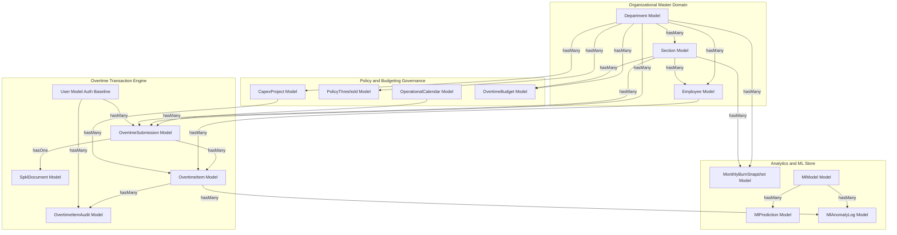
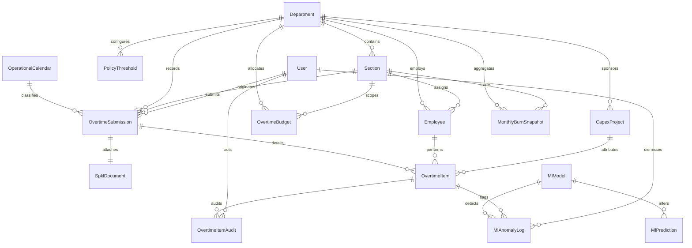

# Eloquent Models & Domain Relationships

## Overview

The Eloquent Models & Domain Relationships layer implements type-safe Object-Relational Mapping (ORM) across all 15 relational tables in the Overtime & CapEx Labor Management System (OT-CapEx). Built for Laravel 11/12+ with PHP 8.3+, the models enforce strict mass-assignment boundaries via explicit `$fillable` arrays, native attribute casting (`decimal:2` for financial and hour allocations, `boolean` for operational flags, `array` for JSON payloads, and Carbon dates/datetimes), rich bidirectional relationships, and domain-specific query scopes.

This layer serves as the single source of truth for business logic transactions, enabling clean action services to query and persist organizational master data, operational calendars, overtime timesheets, SPKL compliance documents, immutable audit trails, and machine learning inferences.

## Architecture Diagram

## Data Model (ERD)

## Key Files & Domain Mapping

| Model Class                      | Database Table           | Primary Keys & Key Features                                                                          | Core Scopes                                                                              |
| -------------------------------- | ------------------------ | ---------------------------------------------------------------------------------------------------- | ---------------------------------------------------------------------------------------- |
| `App\Models\Department`          | `departments`            | `id` (int), unique `code`, default hourly rates.                                                     | `scopeActive`                                                                            |
| `App\Models\Section`             | `sections`               | `id` (int), unique `code`, `department_id` FK.                                                       | `scopeActive`, `scopeForDepartment`                                                      |
| `App\Models\Employee`            | `employees`              | `id` (int), unique `npk`, individual `hourly_rate`.                                                  | `scopeActive`, `scopeForSection`, `scopeForDepartment`, `scopeActiveInSection`           |
| `App\Models\OperationalCalendar` | `operational_calendars`  | `calendar_date` (string/date PK), non-incrementing.                                                  | `scopeWorkday`, `scopeHoliday`, `scopeForDate`                                           |
| `App\Models\PolicyThreshold`     | `policy_thresholds`      | `id` (int), nullable `department_id` (plant default).                                                | `scopePlantDefault`, `scopeForDepartment`                                                |
| `App\Models\CapexProject`        | `capex_projects`         | `id` (int), unique `project_code`, status enum.                                                      | `scopeActive`, `scopeForDepartment`                                                      |
| `App\Models\OvertimeBudget`      | `overtime_budgets`       | `id` (int), composite unique `uq_budget_period`.                                                     | `scopeForPeriod`, `scopeForDepartment`, `scopeForSection`                                |
| `App\Models\OvertimeSubmission`  | `overtime_submissions`   | `id` (int), unique `submission_code`, status lifecycle.                                              | `scopePending`, `scopeApproved`, `scopeForSection`, `scopeForDepartment`, `scopeForDate` |
| `App\Models\SpklDocument`        | `spkl_documents`         | `id` (int), unique `overtime_submission_id` (1:1).                                                   | `scopePending`, `scopeAttached`, `scopeVerified`, `scopeOverdue`                         |
| `App\Models\OvertimeItem`        | `overtime_items`         | `id` (int), stored generated `total_hours`, `lock_version`.                                          | `scopeApproved`, `scopePending`, `scopeRejected`, `scopeByEmployee`, `scopeCapex`        |
| `App\Models\OvertimeItemAudit`   | `overtime_item_audits`   | `id` (int), immutable ledger, JSON before/after states.                                              | `scopeForAction`, `scopeForActor`                                                        |
| `App\Models\MonthlyBurnSnapshot` | `monthly_burn_snapshots` | `id` (int), burn zone enum, `uq_monthly_section_burn`.                                               | `scopeForPeriod`, `scopeWarningOrDanger`, `scopeForSection`, `scopeForDepartment`        |
| `App\Models\MlModel`             | `ml_models`              | `id` (int), unique `model_key`, model type enum.                                                     | `scopeActive`, `scopeForType`                                                            |
| `App\Models\MlPrediction`        | `ml_predictions`         | `id` (int), target polymorphic reference, risk scores.                                               | `scopeForTarget`, `scopeHighRisk`, `scopeRecent`                                         |
| `App\Models\MlAnomalyLog`        | `ml_anomaly_logs`        | `id` (int), score and JSON reasons, dismissal tracking.                                              | `scopePending`, `scopeDismissed`, `scopeHighAnomaly`                                     |
| `App\Models\User`                | `users`                  | Auth baseline, updated with reverse relations to submissions, reviews, audits, SPKLs, and anomalies. | -                                                                                        |

## Flow & Relationship Traversal Explanation

1. **Organizational Hierarchy Navigation**:
   Starting from `Department`, applications can eagerly load child structures without N+1 query penalties via nested relations:
   `Department::with(['sections.employees', 'capexProjects'])->get()`.
2. **Timesheet Submission & Verification Traversal**:
   An `OvertimeSubmission` aggregates granular work records:
   `$submission->load(['department', 'section', 'spklDocument', 'items.employee', 'items.capexProject'])`.
   Item reviews can verify individual allocations and trace immutable event history via `$item->audits()->latest()->get()`.
3. **Calendar Integration**:
   `OvertimeSubmission` joins to `OperationalCalendar` via `operational_date` linking to `calendar_date`. Scopes allow instantaneous filtering:
   `OvertimeSubmission::forDate('2026-09-06')->pending()->get()`.
4. **Machine Learning & Anomaly Flagging**:
   When background jobs run anomaly detection, results link `OvertimeItem` to `MlModel` via `MlAnomalyLog`. Plant managers can review pending anomalies:
   `MlAnomalyLog::pending()->highAnomaly(0.85)->with(['overtimeItem.employee', 'mlModel'])->get()`.

## Decisions & Trade-offs

- **Strict Explicit Fillable Guards over Unguarded Models**:
  To protect financial rates, approval states, and compliance integrity, every model explicitly declares protected `$fillable` attributes. No wildcard `$guarded = []` is permitted on transactional or financial models.
- **Native Modern `casts(): array` Method**:
  All models use Laravel's modern `protected function casts(): array` method instead of the legacy `$casts` property. This provides full support for custom cast expressions, type safety, and IDE autocompletion.
- **Explicit Decimal String Casting (`decimal:2`, `decimal:1`, `decimal:4`)**:
  Floating-point binary representation errors are unacceptable in manufacturing payroll and statutory labor audits. Numeric columns are cast to `decimal:2` (or `decimal:1` for policy hours, `decimal:4` for probabilistic risk/anomaly scores) ensuring precision is retained as deterministic decimal strings.
- **Selective Timestamp Management**:
  Models representing immutable event streams (`OvertimeItemAudit`, `MlAnomalyLog`, `MlPrediction`, `MonthlyBurnSnapshot`, `MlModel`, `OperationalCalendar`) disable `$timestamps = false` because their database migrations define single-point event timestamps (`created_at`, `trained_at`, `last_recalculated_at`) rather than standard dual `created_at`/`updated_at` timestamps.

## Related

- [Database Schema Migrations (Full DDL)](./database-schema-migrations.md)
- [ADR-002: Immutable Labor Rate Snapshotting](../decisions/002-immutable-labor-rate-snapshotting.md)
- [ADR-003: Non-Blocking SPKL Document Workflow](../decisions/003-non-blocking-spkl-document-workflow.md)
- [ADR-005: Denormalized Monthly Burn Snapshots](../decisions/005-denormalized-monthly-burn-snapshots.md)
- [ADR-006: Multi-Database Stored Generated Columns and Partial Indexes](../decisions/006-multi-database-stored-generated-columns-and-partial-indexes.md)
- [System Architecture Blueprint](../../architecture.md)
- [Epic-01 Foundation & Infrastructure Setup](../../scrum/Epic-01.md)
