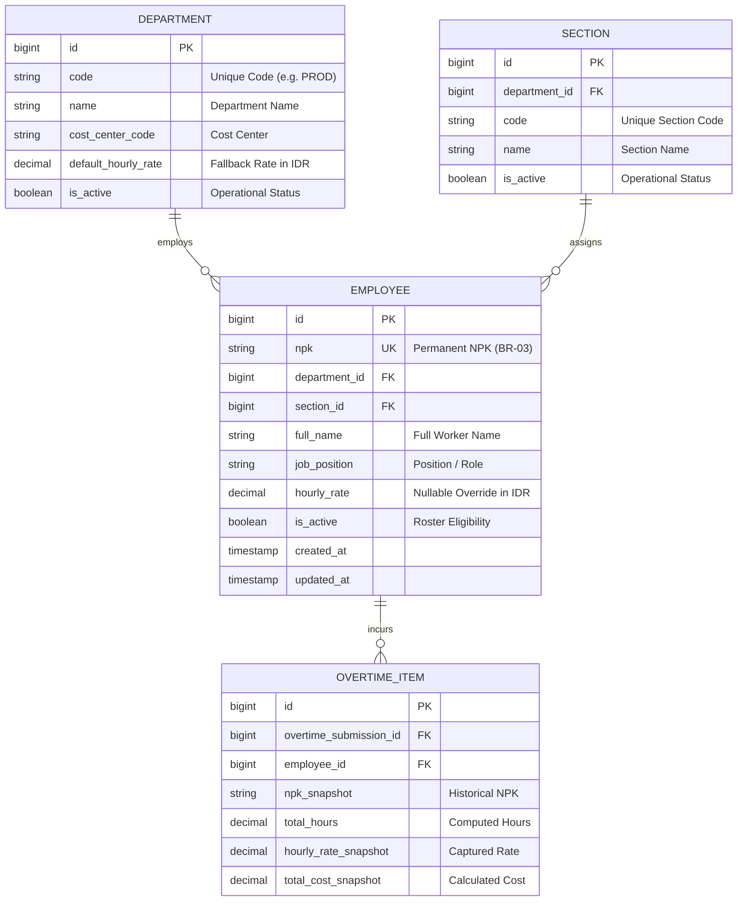

# Employee Roster Management & CSV Import

## Overview

The Employee Roster Management and CSV Import module (Story [E02-02]) provides factory administrators with centralized control over active plant shop-floor personnel and labor rate tiering. Operating strictly within the unified **Master Data Hub** (`/admin/master-data?tab=employees`) as mandated by the Epic-02 UX Plan, this module manages worker profiles across plant departments and sections, enforces permanent NPK immutability (Business Rule BR-03), provides dynamic cascading department-to-section relationships, supports nullable custom hourly rates with department fallback, and features a two-stage in-memory CSV pre-commit audit engine with live error reporting.

## Architecture Diagram

```mermaid
flowchart TD
    Admin[Admin User] -->|Opens Master Data Hub| Hub[MasterData.vue with tab=employees]
    Hub -->|Search, Filter & Paginate| MasterCtrl[MasterDataController@index]
    MasterCtrl -->|Eager Load Dept & Section| EmpModel[Employee Eloquent Query]

    Hub -->|Click + Tambah Karyawan / Edit| FormSheet[EmployeeFormSheet.vue]
    FormSheet -->|Reactive Dept Change| SectionCascade[Dynamic Filter Child Sections]
    FormSheet -->|POST /admin/employees| EmpStore[EmployeeController@store]
    FormSheet -->|PUT /admin/employees/:id| EmpUpdate[EmployeeController@update - NPK Locked BR-03]
    EmpStore --> EmpSvc[EmployeeService]
    EmpUpdate --> EmpSvc

    Hub -->|Click Import CSV| ImportSheet[EmployeeImportSheet.vue]
    ImportSheet -->|Upload / Drag CSV| CsvPreview[EmployeeImportController@preview]
    CsvPreview -->|In-Memory Dry Run| CsvAudit[Two-Stage Pre-Commit Validation]
    CsvAudit -->|Return Audit Summary & Badges| ImportSheet
    ImportSheet -->|Click Konfirmasi & Import| CsvCommit[EmployeeImportController@import]
    CsvCommit --> EmpSvc
    CsvCommit --> DB[(employees Table)]

    Hub -->|Toggle Status / Delete| ConfirmDialog[ConfirmationDialog.vue]
    ConfirmDialog -->|DELETE /admin/employees/:id| EmpDelete[EmployeeController@destroy]
    EmpDelete -->|Guard Overtime Submissions| EmpSvc
```

## Data Model



## Key Files & UI Mapping

| Layer                | File / Route / Component                                                                                                                                                                                                       | Purpose                                                                        |
| -------------------- | ------------------------------------------------------------------------------------------------------------------------------------------------------------------------------------------------------------------------------ | ------------------------------------------------------------------------------ |
| **Sidebar Menu**     | `Master Data` (`/admin/master-data?tab=employees`)                                                                                                                                                                             | Entry point for plant administrator                                            |
| **Page View**        | `resources/js/pages/admin/MasterData.vue`                                                                                                                                                                                      | Master Data Hub host view with tab switching & paginated roster table          |
| **Drawer Component** | `resources/js/components/admin/EmployeeFormSheet.vue`                                                                                                                                                                          | Slide-in right drawer for employee creation & editing with locked NPK          |
| **Drawer Component** | `resources/js/components/admin/EmployeeImportSheet.vue`                                                                                                                                                                        | Slide-in right drawer for bulk CSV dropzone, audit table, & commit             |
| **Confirmation**     | `resources/js/components/admin/ConfirmationDialog.vue`                                                                                                                                                                         | Plant-safe confirmation dialog for deactivation & deletion                     |
| **Controller**       | `app/Http/Controllers/Admin/MasterDataController.php`                                                                                                                                                                          | Queries 25-row paginated roster, search terms, and metrics                     |
| **Controller**       | `app/Http/Controllers/Admin/EmployeeController.php`                                                                                                                                                                            | Handles store, update, and delete actions                                      |
| **Controller**       | `app/Http/Controllers/Admin/EmployeeImportController.php`                                                                                                                                                                      | Handles CSV pre-commit audit, batch commit, and template export                |
| **Service**          | `app/Services/EmployeeService.php`                                                                                                                                                                                             | Business logic, NPK uniqueness, deletion guards, and CSV auditing              |
| **Job**              | `app/Jobs/ImportEmployeesFromCsvJob.php`                                                                                                                                                                                       | Asynchronous queued batch import execution for large rosters                   |
| **Form Requests**    | `app/Http/Requests/Admin/StoreEmployeeRequest.php`<br>`app/Http/Requests/Admin/UpdateEmployeeRequest.php`<br>`app/Http/Requests/Admin/PreviewEmployeeCsvRequest.php`<br>`app/Http/Requests/Admin/ImportEmployeeCsvRequest.php` | Strict request validation rules and integrity validations                      |
| **Model**            | `app/Models/Employee.php`                                                                                                                                                                                                      | Eloquent model with `HasFactory`, scopes, and `effective_hourly_rate` accessor |
| **Migration**        | `database/migrations/2026_01_02_000001_make_hourly_rate_nullable_on_employees_table.php`                                                                                                                                       | Modifies `hourly_rate` column to nullable                                      |

## Flow Explanation

### 1. Roster Navigation & Server-Side Filtering

1. Administrator opens the **Master Data** page from the sidebar and selects the **Employees** tab.
2. The view queries `MasterDataController@index` with query parameters `search`, `department_id`, and `status`.
3. The server filters across `npk`, `full_name`, `job_position`, parent `department.name`, and child `section.name`.
4. Returns paginated data (25 records per page) with eager-loaded `department` and `section` relations alongside summary metrics (`total`, `active`, `inactive`).

### 2. Employee Creation & Modification (BR-03)

1. Clicking **+ Tambah Karyawan** opens `EmployeeFormSheet.vue`.
2. Selecting a Department immediately filters available child Sections.
3. On creation, `npk` is formatted to uppercase and validated for uniqueness across the factory.
4. On editing, `npk` is rendered disabled with a lock badge and cannot be modified (BR-03).
5. If `hourly_rate` is left blank, the system automatically uses the parent department's `default_hourly_rate` at runtime via the `effective_hourly_rate` model accessor.

### 3. Two-Stage Pre-Commit CSV Import Audit

1. Clicking **Import CSV** opens `EmployeeImportSheet.vue`.
2. User drops or browses a CSV file.
3. The client submits the CSV payload to `POST /admin/employees/import/preview`.
4. `EmployeeService@parseAndValidateCsv` performs an in-memory dry run:
    - Validates CSV header: `npk`, `full_name`, `department_code`, `section_code`, `job_position`, `hourly_rate`.
    - Pre-loads all existing NPKs, departments, and sections into memory for O(1) audit checks.
    - Flags duplicate NPKs in the database as well as duplicate occurrences within the CSV itself.
    - Verifies that section codes belong to the respective department code.
5. Returns audit metrics (`total`, `valid_count`, `error_count`) and row-by-row validation state with specific error messages.
6. The user inspects the live audit table. Clicking **Konfirmasi & Import** submits only valid rows to `POST /admin/employees/import`, where `EmployeeService@importRows` commits them in batch inside a database transaction.

### 4. Integrity-Guarded Deactivation & Deletion

1. To disable an employee, the admin toggles status, opening a confirmation modal detailing that existing overtime items remain safe while new submissions are blocked.
2. If an admin attempts to delete an employee, `EmployeeService@canDelete` checks if `$employee->overtimeItems()->exists()`. If records exist, deletion is intercepted and blocked with an informative message. Clean employees can be safely deleted.

## API & Web Endpoints

| Method   | URI                                | Controller Action                   | Purpose                        | Authorization                |
| -------- | ---------------------------------- | ----------------------------------- | ------------------------------ | ---------------------------- |
| `GET`    | `/admin/master-data?tab=employees` | `MasterDataController@index`        | View paginated employee roster | `auth, verified, role:admin` |
| `POST`   | `/admin/employees`                 | `EmployeeController@store`          | Create new employee record     | `auth, verified, role:admin` |
| `PUT`    | `/admin/employees/{employee}`      | `EmployeeController@update`         | Update employee (NPK locked)   | `auth, verified, role:admin` |
| `DELETE` | `/admin/employees/{employee}`      | `EmployeeController@destroy`        | Delete clean employee          | `auth, verified, role:admin` |
| `POST`   | `/admin/employees/import/preview`  | `EmployeeImportController@preview`  | Two-stage in-memory CSV audit  | `auth, verified, role:admin` |
| `POST`   | `/admin/employees/import`          | `EmployeeImportController@import`   | Commit validated CSV rows      | `auth, verified, role:admin` |
| `GET`    | `/admin/employees/template`        | `EmployeeImportController@template` | Download sample CSV format     | `auth, verified, role:admin` |

## Decisions & Trade-offs

- **Two-Stage Pre-Commit Preview over Blind Upload**: Factory payroll and timesheet errors are costly to unwind. By dry-running CSV parsing in memory without database persistence and rendering an interactive audit preview with red/green status badges, administrators can catch duplicate NPKs or misspelled section codes before saving.
- **In-Memory O(1) Preloading**: The CSV validator pre-loads all existing departments, sections, and NPK keys before processing lines, eliminating N+1 database queries during CSV import.
- **Drawer (`Sheet`) over Full-Page Navigation**: Preserves context and scroll position of the 25-row roster table, complying with the minimal navigation footprint mandate of the Epic-02 UX Plan.

## Related Documentation

- [Epic-02 Scrum Plan](../../../docs/scrum/Epic-02.md)
- [Epic-02 UX Plan](../../../docs/scrum/Epic-02-ux-plan.md)
- [Department & Section Management](department-section-management.md)
- [ADR-009: Two-Stage Pre-Commit CSV Roster Import](../decisions/009-two-stage-pre-commit-csv-roster-import.md)
