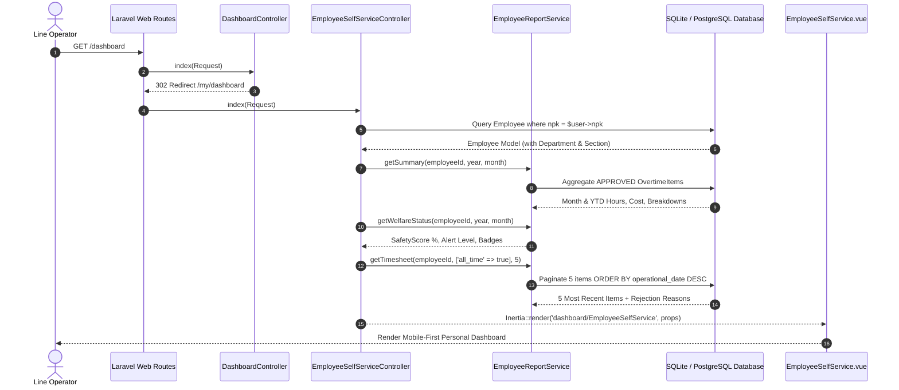

# Employee Self-Service Personal Dashboard

## Overview

The **Employee Self-Service Personal Dashboard** (Story **E06-06**) delivers a mobile-first, zero-confusion personal overview for line operators and factory floor workers assigned the `User` role.

Rather than confronting complex plant-wide operational dashboards or dense ERP grids, line operators logging into the application automatically land on `/my/dashboard`. The self-service portal surfaces:

1. **Personal Identity & Live Operational Context**: Name, NPK badge, job position, section/department assignment, and live plant shift indicator (`07:00–15:00`, `15:00–23:00`, `23:00–07:00 WIB`) with real-time clock.
2. **3 Compact KPI Metric Cards**: Current month approved overtime hours + estimated gross overtime earnings in Indonesian Rupiah (`Rp`), year-to-date (YTD) cumulative approved hours, and proactive Welfare & Fatigue Safety Status (`Aman`, `Perlu Rotasi`, `Risiko Kelelahan`).
3. **Visual Category & Workday Breakdown**: Proportional progress bar showing Production vs TPM vs CapEx Project vs Others, alongside Normal Workday (`HKN`) vs Rest/Holiday Day (`HLR`) ratio.
4. **Recent Overtime Submissions (Last 5 Entries)**: Real-time chronological status of recent submissions (`Disetujui`, `Menunggu`, `Ditolak`) with inline callouts displaying the supervisor's rejection feedback for rejected line items.
5. **Quick-Action Ergonomic Touch Links**: Direct shortcuts to the full chronological timesheet ledger (`/reports/employees/{npk}?tab=timesheet`) and the welfare overview (`/reports/employees/{npk}?tab=overview`).

## Architecture Diagram

```mermaid
flowchart TD
    User([Line Operator - User Role]) -->|Login via /login| Fortify[Fortify Login Action]
    Fortify -->|Redirect to /dashboard| DashboardCtrl[DashboardController@index]
    DashboardCtrl -->|Check Role: $user->isUser| RedirectBranch{isUser?}
    RedirectBranch -->|True| RedirectMy[Redirect 302 -> /my/dashboard]
    RedirectBranch -->|False (Admin/Manager/TL)| RenderOps[Render Dashboard.vue]

    RedirectMy --> SelfServiceCtrl[EmployeeSelfServiceController@index]
    SelfServiceCtrl --> FindEmployee[Find Employee by $user->npk]
    FindEmployee --> Service[EmployeeReportService]

    Service -->|getSummary| Metrics[Monthly & YTD Hours, Cost, Breakdowns]
    Service -->|getWelfareStatus| Welfare[Safety Score %, Alert Level, Badges]
    Service -->|getTimesheet limit: 5| RecentItems[5 Most Recent Overtime Items]

    SelfServiceCtrl -->|Render Inertia Props| VuePage[dashboard/EmployeeSelfService.vue]

    VuePage --> QuickTimesheet[Link: View Full Timesheet -> reports.employees.show?tab=timesheet]
    VuePage --> QuickOverview[Link: View Welfare Chart -> reports.employees.show?tab=overview]
```

## Data Model & Flow



## Key Files & UI Mapping

| Layer                 | File / Route / Component                                 | Purpose                                                                                                        |
| :-------------------- | :------------------------------------------------------- | :------------------------------------------------------------------------------------------------------------- |
| **Sidebar Menu**      | `resources/js/components/AppSidebar.vue`                 | Resolves `Dashboard` href dynamically: `/my/dashboard` for `User` role, `/dashboard` for others.               |
| **Routing**           | `routes/web.php`                                         | Maps `/dashboard` to `DashboardController@index` and `/my/dashboard` to `EmployeeSelfServiceController@index`. |
| **Branch Controller** | `app/Http/Controllers/DashboardController.php`           | Intercepts `/dashboard` visits and dispatches operators to self-service.                                       |
| **Portal Controller** | `app/Http/Controllers/EmployeeSelfServiceController.php` | Fetches personal metrics, welfare status, and latest 5 overtime items for authenticated operator.              |
| **Service Layer**     | `app/Services/EmployeeReportService.php`                 | Computes approved month hours, YTD hours, Rupiah cost snapshot, and recent timesheet queries.                  |
| **Welfare Engine**    | `app/Services/Policy/OvertimePolicyEvaluator.php`        | Evaluates 4-week rolling fatigue, consecutive threshold breaches, and safety scores.                           |
| **Shared Props**      | `app/Http/Middleware/HandleInertiaRequests.php`          | Eager-loads `'employee:id,npk'` so `auth.user.employee_id` is always available.                                |
| **User Model**        | `app/Models/User.php`                                    | Appends `employee_id` attribute referencing linked employee.                                                   |
| **Frontend Page**     | `resources/js/pages/dashboard/EmployeeSelfService.vue`   | Single root element mobile-first dashboard with 3 KPI cards, visual breakdown, and recent items.               |
| **Type Definitions**  | `resources/js/types/auth.ts`                             | Extends `User` with `employee_id?: number \| null` and `employee?: UserEmployee \| null`.                      |
| **Localization**      | `lang/id.json` & `lang/en.json`                          | Bilingual translation keys for greeting, KPI titles, badges, and action buttons.                               |

## Role-Based Access Control & Privacy Enforcement

1. **Strict Data Scoping**: Line operators visiting `/my/dashboard` only access metrics calculated from their own `employee_id` (derived from `$request->user()->npk`).
2. **Co-Worker Confidentiality**: No peer comparison names or other employees' figures are queried or passed into this view.
3. **No Unlink Deadlocks**: In the edge case where a user account is created without a corresponding employee record, the controller handles it gracefully without throwing an exception, rendering an advisory alert instructing them to contact HR/IT Admin.
4. **Wayfinder Navigation**: Frontend buttons use typed Wayfinder route generators (`showEmployeeDossier.url({ npk: employee.npk }, { query: { tab: 'timesheet' } })`).

## Verification & Testing

### Feature Tests

File: `tests/Feature/Dashboard/EmployeeSelfServiceTest.php`

- Operator redirection from `/dashboard` to `/my/dashboard`.
- Supervisory access to plant `Dashboard.vue`.
- Payload verification: 3-card metrics, YTD hours, cost snapshot, welfare status.
- Recent submissions: max 5 items, latest first, rejection reasons preserved.
- Unlinked account graceful empty state.

Run command:

```bash
php artisan test --compact tests/Feature/Dashboard/EmployeeSelfServiceTest.php
```

### Browser Tests (Playwright / Pest)

File: `tests/Browser/Dashboard/EmployeeSelfServiceBrowserTest.php`

- Operator login lands directly on `/my/dashboard`.
- Verification of 3 KPI cards, NPK badge, live shift pill, and status badges.
- Inspection of pending and rejected items with inline supervisor feedback callouts.
- Touch navigation shortcuts navigating to full timesheet tab and welfare overview tab.

Run command:

```bash
php artisan test tests/Browser/Dashboard/EmployeeSelfServiceBrowserTest.php
```
