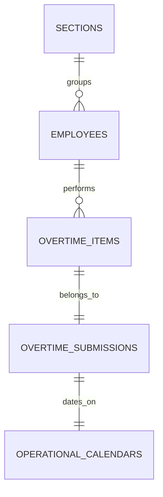

# Individual Employee Reporting & Welfare Tracking

## Overview

The **Individual Employee Reporting & Welfare Tracking** module provides deep visibility into personal overtime history, cumulative hours, fatigue risk indicators, and peer variance benchmarking across plant sections. It serves both individual contributors (tracking their own shifts and compensation baselines) and supervisory personnel (identifying workload distribution imbalances and preventing fatigue safety risks).

## Architecture Diagram

```mermaid
flowchart TD
    USR[User / Team Leader / Manager] -->|Lookup by NPK or Name| ERC[EmployeeReportController@show]
    ERC -->|Scope by Auth Role| DB[(Database)]
    ERC -->|Aggregate History & Peers| BICS[BurnIndexCalculatorService]
    ERC -->|Return Inertia Props| VUE[EmployeeDossier.vue]

    subgraph ChartLayer["Chart.js Reporting Visuals"]
        VUE --> CATDONUT[HoursBreakdownDonut.vue]
        VUE --> PEERCHART[PeerVarianceChart.vue]
        VUE --> DAYBAR[DayTypeDistributionBar.vue]
    end
```

## Data Model



## Key Files & UI Mapping

| Layer            | File / Route / Menu                                          | Purpose                                                         |
| ---------------- | ------------------------------------------------------------ | --------------------------------------------------------------- |
| Sidebar Menu     | `Laporan Individu` (`/reports/employees`)                    | Navigation entry point for timesheet dossiers                   |
| Page Component   | `resources/js/pages/Reports/EmployeeDossier.vue`             | Master dossier page featuring KPIs, timesheet, and charts       |
| Search Component | `resources/js/components/Reports/EmployeeSearch.vue`         | Debounced search-as-you-type input with recent lookup history   |
| Chart Component  | `resources/js/components/Charts/HoursBreakdownDonut.vue`     | Chart.js doughnut chart of hours by work category               |
| Chart Component  | `resources/js/components/Charts/PeerVarianceChart.vue`       | Chart.js bar chart comparing worker hours to section average    |
| Timesheet Table  | `resources/js/components/Reports/EmployeeTimesheetTable.vue` | Filterable chronological history of approved shifts             |
| Controller       | `app/Http/Controllers/EmployeeReportController.php`          | Controller resolving dossier data and peer distribution stats   |
| Service          | `app/Services/Policy/OvertimePolicyEvaluator.php`            | Evaluates soft fatigue limits (e.g., > 20 hrs/week for 3 weeks) |

## Flow Explanation

1. **User triggers**: A user or supervisor navigates to **Laporan Individu**.
    - Line operators automatically see their personal dossier.
    - Team Leaders and Managers see a search bar scoped to their authorized section or department.
2. **Search & lookup**: Typing an NPK or employee name performs a debounced search (300ms). Recent lookups are stored in browser `localStorage` for rapid switching.
3. **Dossier rendering**: The page presents key metrics:
    - Current Month Hours and Year-to-Date cumulative hours.
    - Estimated Overtime Cost Snapshot in Rupiah (`Rp`).
    - Category distribution doughnut chart (Production, TPM, CapEx, Others) rendered via Chart.js.
    - Day-type split bar comparing normal workdays (`HKN`) against rest days/holidays (`HLR`).
4. **Peer variance & welfare alerts**:
    - `PeerVarianceChart.vue` maps the employee's hours against the section average (`CALC-06`).
    - If an employee exceeds weekly threshold limits (> 20 hours/week) for 3 consecutive weeks, a yellow/red **Fatigue Alert Badge** is displayed to prompt supervisor schedule rebalancing.
5. **Detailed audit timesheet**: A chronological table itemizes each shift, showing submission codes, categories, tasks, RCA tags, and approval states with direct links to approved SPKL files.

## API Endpoints & Routes

| Method | URI                               | Controller Action                    | Purpose                                                | Auth / Middleware                        |
| ------ | --------------------------------- | ------------------------------------ | ------------------------------------------------------ | ---------------------------------------- |
| GET    | `/reports/employees`              | `EmployeeReportController@index`     | Self dossier (operator) or search portal (supervisors) | `auth`                                   |
| GET    | `/reports/employees/search`       | `EmployeeReportController@search`    | Scoped search query by name/NPK                        | `auth`, `role:team_leader,manager,admin` |
| GET    | `/reports/employees/{npk}`        | `EmployeeReportController@show`      | Complete dossier for specified NPK                     | `auth`                                   |
| GET    | `/reports/employees/{npk}/export` | `EmployeeReportController@exportCsv` | Export individual timesheet history to CSV             | `auth`                                   |

## Decisions & Trade-offs

- **Client-Side Recent History**: Recent lookups are retained in client `localStorage` rather than the database, saving unnecessary server writes while accelerating navigation for supervisors monitoring multiple workers.
- **Soft Fatigue Indicators**: Policy alerts function as soft advisory flags rather than hard system blockers, ensuring shift managers maintain operational flexibility during unexpected manufacturing emergencies.

## Related

- [Epic-06: Individual Employee Reporting & Welfare Tracking](../../scrum/Epic-06.md)
- [ADR-004: Chart.js Visualization Engine](../decisions/004-chartjs-visualization-engine.md)
