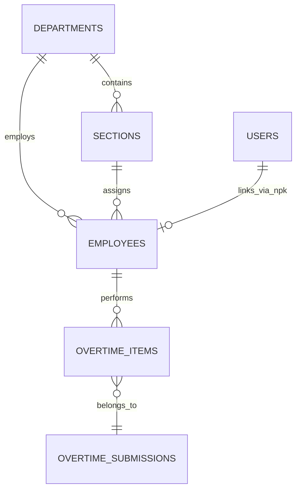

# Individual Employee Reporting & Welfare Tracking

## Overview

The **Individual Employee Reporting & Welfare Tracking** module modernizes the legacy `ReportIndividu` screen. It provides deep visibility into personal overtime history, cumulative hours, fatigue risk indicators, and peer variance benchmarking across manufacturing plant sections. It serves both individual contributors (tracking their own shifts and compensation baselines) and supervisory personnel (identifying workload distribution imbalances and preventing fatigue safety risks).

Sub-epic **E06-01** delivers the foundational **Individual Employee Dossier Lookup & Hub**: a unified, single-surface search and dossier screen with debounced search-as-you-type, role-scoped roster views, client-side zero-latency recent lookup history via `localStorage`, and an industrial header card.

Sub-epic **E06-02** delivers the **Employee Personal Overtime Dashboard**: 4 KPI cards (Current Month Hours, YTD Hours, Individual Burn Index, Section Workload Rank), an overtime category donut chart, a normal workday vs rest day breakdown bar (HKN vs HLR), and total estimated overtime cost snapshot.

Sub-epic **E06-03** delivers **Peer Benchmarking & Workload Distribution Analysis**: section average comparison, CALC-06 individual variance calculation, a section distribution histogram chart highlighting the active employee in ISUZU Red, Top 5 and Bottom 5 workload lists, and role-based server-side co-worker anonymization.

## Architecture Diagram

```mermaid
flowchart TD
    User([Manager / Team Leader / Admin]) -->|Click Sidebar 'Laporan Karyawan'| Nav[AppSidebar Navigation]
    Nav -->|GET /reports/employees| ControllerIndex[EmployeeReportController@index]
    ControllerIndex -->|Scope by Role/Dept/Section| Service[EmployeeReportService@getRoster]
    Service -->|Query Database| DB[(Database)]
    ControllerIndex -->|Render Inertia Page| Page[reports/EmployeeDossier.vue]

    Page --> SearchComp[EmployeeSearch.vue]
    SearchComp -->|300ms Debounced Query q >= 3| SearchApi[GET /reports/employees/search?q=...]
    SearchApi --> ControllerSearch[EmployeeReportController@search]
    ControllerSearch -->|Scoped Query, Limit 10| SearchService[EmployeeReportService@search]
    SearchService -->|Return JSON| SearchComp

    SearchComp -->|Select Employee| DossierRoute[GET /reports/employees/{npk}]
    Page -->|Click Roster Card| DossierRoute
    DossierRoute --> ControllerShow[EmployeeReportController@show]
    ControllerShow -->|Authorize & Retrieve| DossierService[EmployeeReportService@getEmployeeDossier]
    ControllerShow -->|Render Inertia Props| DossierView[EmployeeDossier.vue with Header]
    DossierView -->|Save Viewed Employee| RecentLookupsComp[RecentLookups.vue via localStorage]
```

## Data Model



## Key Files & UI Mapping

| Layer            | File / Route / Menu                                             | Purpose                                                                                    |
| ---------------- | --------------------------------------------------------------- | ------------------------------------------------------------------------------------------ |
| Sidebar Menu     | `Laporan Karyawan` (`/reports/employees`)                       | Navigation entry point for Managers, Team Leaders, and Admins                              |
| Page Component   | `resources/js/pages/reports/EmployeeDossier.vue`                | Master dossier page featuring search hub, quick-pick roster, header card, and tab skeleton |
| KPI Summary      | `resources/js/components/reports/KpiSummaryCards.vue`           | 4 KPI cards (Month Hours, YTD Hours, Burn Index, Section Rank) + financial cost banner     |
| Category Donut   | `resources/js/components/reports/CategoryDonutChart.vue`        | Chart.js Doughnut showing Production, TPM, CapEx Project, and Others hours distribution    |
| Day-Type Bar     | `resources/js/components/reports/DayTypeBreakdownBar.vue`       | Horizontal progress split comparing HKN vs HLR hours with recovery cycle guidance          |
| Peer Benchmark   | `resources/js/components/reports/PeerComparisonPanel.vue`       | Overview tab panel showing section average, CALC-06 variance, and Top 5 / Bottom 5 lists   |
| Distribution Bar | `resources/js/components/reports/SectionDistributionChart.vue`  | Chart.js Bar chart displaying section member hours with ISUZU Red highlight and average    |
| Search Component | `resources/js/components/reports/EmployeeSearch.vue`            | Debounced search-as-you-type input with loading spinner, clear button, and dropdown        |
| Recent Lookups   | `resources/js/components/reports/RecentLookups.vue`             | Horizontal scrollable pills displaying the last 5 viewed workers from `localStorage`       |
| Composable       | `resources/js/composables/useRecentLookups.ts`                  | Reactive composable to read, write, and clear recent employee lookups                      |
| Controller       | `app/Http/Controllers/Reports/EmployeeReportController.php`     | Controller handling index roster, search JSON API, and dossier show with summary & peers   |
| Service          | `app/Services/EmployeeReportService.php`                        | Pragmatic domain service handling role scoping, search matching, summary, and peer metrics |
| Feature Test     | `tests/Feature/Reports/EmployeeReportTest.php`                  | 19 automated tests verifying scoping, security, getSummary, getPeerComparison, and props   |
| Browser Test     | `tests/Browser/Reports/EmployeeDossierLookupBrowserTest.php`    | Playwright end-to-end browser tests verifying search, navigation, and local storage        |
| Browser Test     | `tests/Browser/Reports/EmployeeDossierOverviewBrowserTest.php`  | Playwright end-to-end browser tests verifying KPI cards, category donut, and day-type bar  |
| Browser Test     | `tests/Browser/Reports/EmployeePeerBenchmarkingBrowserTest.php` | Playwright end-to-end browser tests verifying peer comparison, variance, and privacy mode  |

## Flow Explanation

1. **User triggers**: A supervisor clicks **Laporan Karyawan** in the sidebar.
    - Team Leaders see only employees from their assigned section.
    - Managers see all employees from their assigned department.
    - Administrators see plant-wide employees with optional department/section dropdown filters.
    - Standard operators (`User` role) accessing `/reports/employees` are automatically redirected to their own dossier.
2. **Search & lookup**: Typing 3+ characters into `EmployeeSearch.vue` triggers a debounced (300ms) request to `GET /reports/employees/search?q=...`. The backend filters by partial NPK or full name, enforces hierarchical boundaries, and limits matches to 10 records.
3. **Dossier rendering & metrics computation**: Clicking a search result or roster card transitions to `/reports/employees/{npk}`.
    - The persistent header displays the employee's full name, NPK in monospace tabular figures (`font-mono tabular-nums`), department, section, job position, and active status badge.
    - The employee is automatically saved to the client's `localStorage` recent lookup history.
    - The header includes a WIB Month/Year period selector and tab switcher (`Ringkasan & Kesejahteraan` vs `Buku Jam Lembur`).
    - `EmployeeReportService@getSummary` calculates approved hours for the selected period, year-to-date accumulation, section workload rank, individual burn index against section budget allocation, overtime category breakdown (Production/TPM/CapEx/Others), day-type split (HKN vs HLR), and total cost snapshot in IDR.
    - `EmployeeReportService@getPeerComparison` aggregates all section members' approved overtime, calculates the section per-capita average and CALC-06 individual variance (`Individual Hours - Section Average Hours`), generates the sorted distribution array with rank, and extracts the Top 5 most hours and Bottom 5 least hours.
4. **Role-Based Anonymization**:
    - When accessed by an operator (`User` role), `EmployeeReportService@getPeerComparison` masks co-worker names and NPKs to `Karyawan #<rank>` and `••••`. The operator only sees their own name, rank, and relative numerical distribution.
    - When accessed by supervisors (`Team Leader`, `Manager`, `Admin`), unmasked names and NPKs are supplied for operational scheduling and shift balancing.
5. **Security & authorization gates**:
    - Operator snooping protection: Operators trying to access another employee's dossier receive HTTP 403.
    - Cross-section/department protection: Team Leaders and Managers attempting to access out-of-scope employee dossiers receive HTTP 403.

## API Endpoints & Routes

| Method | URI                         | Controller Action                 | Purpose                                                                      | Auth / Middleware                             |
| ------ | --------------------------- | --------------------------------- | ---------------------------------------------------------------------------- | --------------------------------------------- |
| GET    | `/reports/employees`        | `EmployeeReportController@index`  | Employee search hub & quick-pick roster (supervisors) or redirect (operator) | `auth`, `role:admin,manager,team_leader,user` |
| GET    | `/reports/employees/search` | `EmployeeReportController@search` | Live debounced employee lookup by partial NPK or name                        | `auth`, `role:admin,manager,team_leader,user` |
| GET    | `/reports/employees/{npk}`  | `EmployeeReportController@show`   | Complete dossier header and tab view for specified employee                  | `auth`, `role:admin,manager,team_leader,user` |

## Decisions & Trade-offs

- **Single Responsive Surface (Anti-Splitting Constraint)**: Both the search hub (`/reports/employees`) and the individual employee dossier (`/reports/employees/{npk}`) share the same Vue page component `EmployeeDossier.vue`. This eliminates unnecessary routing complexity and simplifies navigation.
- **Client-Side Recent History**: Recent lookups are stored in browser `localStorage` rather than the database. This provides instantaneous zero-latency rendering, works offline, and avoids excessive database writes during high-frequency shift handovers.
- **Strict Role-Based Scoping at Service Layer**: Role filtering is centralized in `EmployeeReportService@applyRoleScope` and `EmployeeReportService@authorizeDossierAccess` rather than scattered across controller endpoints, preventing accidental cross-department data exposure.
- **CALC-06 Peer Variance & Anonymization (Anti-Envy Guardrail)**: Workload comparison computes individual variance from section average. Co-worker identities are strictly anonymized on the server side for the operator role while keeping supervisor views named for operational shift dispatch.

## Related

- [Epic-06: Individual Employee Reporting & Welfare Tracking](../../scrum/Epic-06.md)
- [Epic-06 UX Plan](../../scrum/Epic-06-ux-plan.md)
- [ADR-022: Unified Single-Surface Employee Dossier Hub and Client-Side Cached Lookups](../decisions/022-unified-employee-dossier-hub-and-client-cached-lookups.md)
- [ADR-023: Peer Benchmarking Workload Distribution (CALC-06) and Server-Side Operator Anonymization](../decisions/023-peer-benchmarking-calc-06-and-operator-role-anonymization.md)
- [User Guide: Individual Employee Dossier & Welfare Tracking](../../user-docs/guides/individual-employee-dossier.md)
