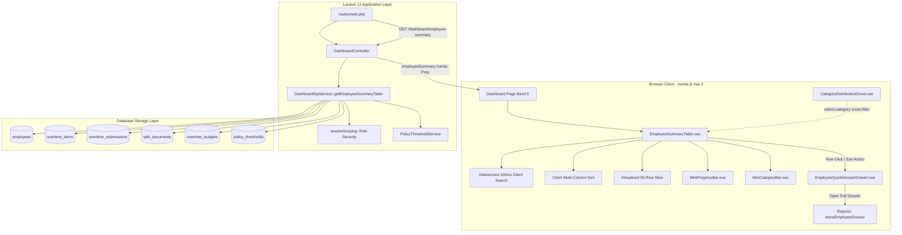
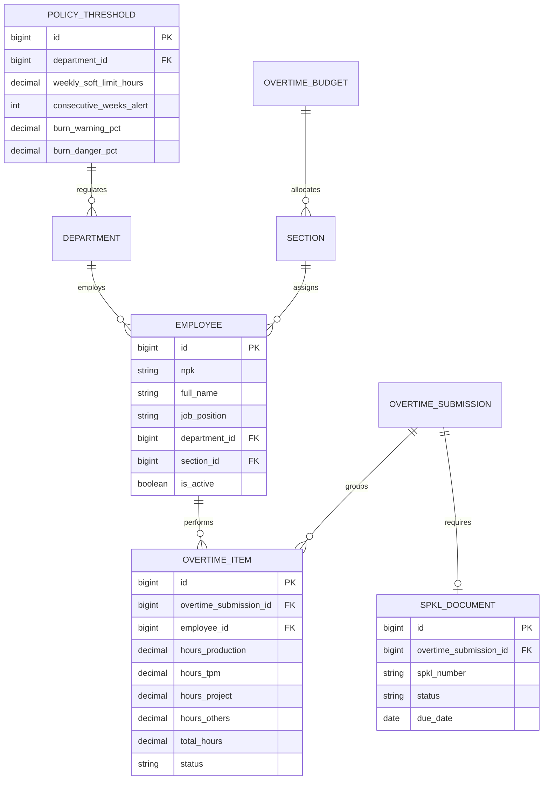

# Executive Dashboard: Summary Employee Overtime Table (E09-05)

## Overview

The Summary Employee Overtime Table delivers an interactive, high-density, searchable data surface located at Band 5 of the Executive Operational Dashboard (`/dashboard`). It consolidates individual employee monthly overtime hours, calculated Burn Index percentages with 4-zone progress bars, 4-category proportional distribution bars (Production, TPM, CapEx, Others), and SPKL document compliance badges. Clicking any employee row opens a slide-in right sheet drawer (`EmployeeQuickDossierDrawer.vue`) that presents current month analytics, CapEx vs OpEx segregation, weekly fatigue compliance alerts, recent shift history, and direct navigation to the full employee dossier (`/reports/employees/{npk}`).

## Architecture Diagram



## Data Model



## Key Files & UI Mapping

| Layer             | File / Route / Component                                           | Purpose                                                                                     |
| ----------------- | ------------------------------------------------------------------ | ------------------------------------------------------------------------------------------- |
| Page Container    | `resources/js/pages/Dashboard.vue`                                 | Master operational dashboard shell hosting Tab 3 (`?tab=employees`): Daftar Karyawan        |
| Summary Table     | `resources/js/components/dashboard/EmployeeSummaryTable.vue`       | High-density searchable, sortable table with virtualized client pagination                  |
| Quick Drawer      | `resources/js/components/dashboard/EmployeeQuickDossierDrawer.vue` | Slide-in right sheet displaying individual metrics, fatigue alerts, and recent shifts       |
| Mini Progress Bar | `resources/js/components/dashboard/MiniProgressBar.vue`            | 4-color coded individual Burn Index progress bar (`font-mono tabular-nums`)                 |
| Mini Category Bar | `resources/js/components/dashboard/MiniCategoryBar.vue`            | 4-segment proportional horizontal stacked bar with tooltip breakdown                        |
| Controller        | `app/Http/Controllers/DashboardController.php`                     | Injects `employeeSummary` into `index()` and exposes `GET /dashboard/employee-summary`      |
| Analytics Service | `app/Services/Analytics/DashboardKpiService.php`                   | Implements `getEmployeeSummaryTable()` with role-based scoping and zero-N+1 queries         |
| Web Route         | `routes/web.php`                                                   | Defines `dashboard.employee-summary` JSON endpoint                                          |
| Navigation Route  | `resources/js/routes/reports/employees/index.ts`                   | Wayfinder route `showEmployeeDossier({ npk })` linking drawer to `/reports/employees/{npk}` |

## Flow Explanation

1. **Page Load & Prop Delivery**:
    - Navigating to `/dashboard` triggers `DashboardController@index`.
    - `DashboardKpiService::getEmployeeSummaryTable` queries active employees within the authenticated user's role scope (Plant-wide for Admin, Assigned Department for Manager, Assigned Section for Team Leader).
    - In a single vectorized query batch, approved monthly overtime items, linked SPKL documents, and section budgets are aggregated.
    - The computed `employeeSummary` payload is injected into Inertia page props.

2. **Client-Side Live Filtering & Sorting**:
    - The user enters text into the search input. A 150ms debounce mechanism filters records across name, NPK, and section code with $<50$ms response time.
    - Column headers (`Karyawan`, `Indeks Burn`, `Total Jam`) toggle between ascending and descending client-side sorting without server round-trips.
    - Virtualized pagination presents the first 50 matching records with a "Muat Lebih Banyak" button.

3. **Cross-Filtering from Category Donut**:
    - Clicking a segment in `CategoryDistributionDonut.vue` emits `select-category`.
    - `Dashboard.vue` sets `selectedCategoryFilter`, immediately constraining table rows to employees who contributed hours to that category.
    - An active category filter pill appears above the table with a quick reset button.

4. **Inspection via Slide-in Drawer**:
    - Clicking an employee row opens `EmployeeQuickDossierDrawer.vue`.
    - The drawer displays the employee's current month approved hours, individual Burn Index gauge, CapEx vs OpEx horizontal split bar, 4-category hour summary, consecutive high-overtime weeks compliance status, and the 5 most recent overtime shifts.
    - The "Buka Dossier Lengkap" button directs the user to `/reports/employees/{npk}`.

## API Endpoints & Routes

| Method | URI                           | Controller Action                          | Purpose                                               | Auth & Access                                            |
| ------ | ----------------------------- | ------------------------------------------ | ----------------------------------------------------- | -------------------------------------------------------- |
| GET    | `/dashboard`                  | `DashboardController@index`                | Main dashboard view delivering `employeeSummary` prop | auth, verified, supervisor (admin, manager, team_leader) |
| GET    | `/dashboard/employee-summary` | `DashboardController@employeeSummaryTable` | JSON endpoint for async refresh or partial updates    | auth, verified, supervisor (403 for line operators)      |

### Query Parameters

| Param           | Type                | Required | Default        | Description                                                              |
| --------------- | ------------------- | -------- | -------------- | ------------------------------------------------------------------------ |
| `date`          | string (YYYY-MM-DD) | No       | Current Date   | Evaluation operational date for month scope                              |
| `department_id` | int or 'all'        | No       | User's Dept    | Filter by department (Admin only; Managers/TLs are locked to assignment) |
| `section_id`    | int                 | No       | User's Section | Filter by section (Admin/Manager; TLs locked to assigned section)        |

### JSON Response Schema (`200 OK`)

```json
{
    "items": [
        {
            "id": 101,
            "employee_id": 101,
            "npk": "EMP-ASM-101",
            "name": "Bambang Sudirman",
            "full_name": "Bambang Sudirman",
            "job_position": "Chassis Specialist",
            "department_id": 1,
            "department_name": "Assembly Plant Dept",
            "section_id": 4,
            "section_code": "SEC_AS1",
            "section_name": "Chassis Assembly",
            "total_hours": 12.0,
            "hours_production": 6.0,
            "hours_tpm": 2.0,
            "hours_project": 4.0,
            "hours_others": 0.0,
            "capex_hours": 4.0,
            "opex_hours": 8.0,
            "categories": [
                {
                    "key": "production",
                    "label": "Produksi",
                    "hours": 6.0,
                    "percentage": 50.0,
                    "color": "#3b82f6"
                },
                {
                    "key": "tpm",
                    "label": "TPM",
                    "hours": 2.0,
                    "percentage": 16.7,
                    "color": "#10b981"
                },
                {
                    "key": "project",
                    "label": "CapEx",
                    "hours": 4.0,
                    "percentage": 33.3,
                    "color": "#7c3aed"
                },
                {
                    "key": "others",
                    "label": "Others",
                    "hours": 0.0,
                    "percentage": 0.0,
                    "color": "#94a3b8"
                }
            ],
            "planned_hours": 40.0,
            "burn_index": 30.0,
            "burn_zone": "safe",
            "burn_zone_label": "Aman (<85%)",
            "burn_zone_color": "#16a34a",
            "spkl_status": "approved",
            "spkl_status_label": "Disetujui",
            "recent_shifts": [
                {
                    "submission_id": 55,
                    "submission_code": "SPKL-ASM-001",
                    "operational_date": "2026-09-03",
                    "formatted_date": "03 Sep 2026",
                    "day_type": "HKN",
                    "hours": 12.0,
                    "spkl_number": "SPKL/ASM/2026/001",
                    "spkl_status": "ATTACHED"
                }
            ],
            "consecutive_alert": false,
            "consecutive_weeks": 0,
            "weekly_hours": 12.0,
            "weekly_limit_hours": 20.0
        }
    ],
    "total_count": 1,
    "fiscal_year": 2026,
    "fiscal_month": 9,
    "month_name": "September 2026",
    "soft_limit_hours": 80.0,
    "scope": {
        "department_id": 1,
        "section_id": null
    }
}
```

## Decisions & Trade-offs

1. **Slide-in Drawer instead of Nested Modal**:
    - _Decision_: Adopted `@/components/ui/sheet` (`EmployeeQuickDossierDrawer.vue`) rather than a modal dialog.
    - _Rationale_: Preserves dashboard scroll position, active filter bar selections, and search queries while reviewing employee specifics, maintaining the single-surface operational workflow.

2. **Client-Side Live Filtering vs Server Querying**:
    - _Decision_: Carried out real-time text search and multi-column sorting entirely on the client, with debounced input and 50-item pagination slices.
    - _Rationale_: Shopfloor rosters rarely exceed 150 employees per department. Rendering 50 rows at a time with client filtering provides $<50$ms instantaneous responsiveness with zero backend request latency.

3. **Vectorized Zero-N+1 Query Architecture**:
    - _Decision_: In `DashboardKpiService`, queried all monthly overtime items, weekly streak history, and section budgets using grouped batch queries.
    - _Rationale_: Avoided per-employee queries for Burn Index and consecutive weeks calculations, resulting in execution times under 60ms.

## Related

- Feature Doc: [Executive Dashboard KPI Cards](./executive-dashboard-kpi.md)
- Feature Doc: [Multi-Chart Analytics Grid](./executive-dashboard-multi-chart-grid.md)
- User Guide: [Summary Employee Overtime Table Guide](../../user-docs/guides/executive-dashboard-employee-summary-table.md)
- Scrum Spec: [Epic-09 Decision Intelligence](../../scrum/Epic-09.md)
- UX Plan: [Epic-09 UX Architecture Plan](../../scrum/Epic-09-ux-plan.md)
