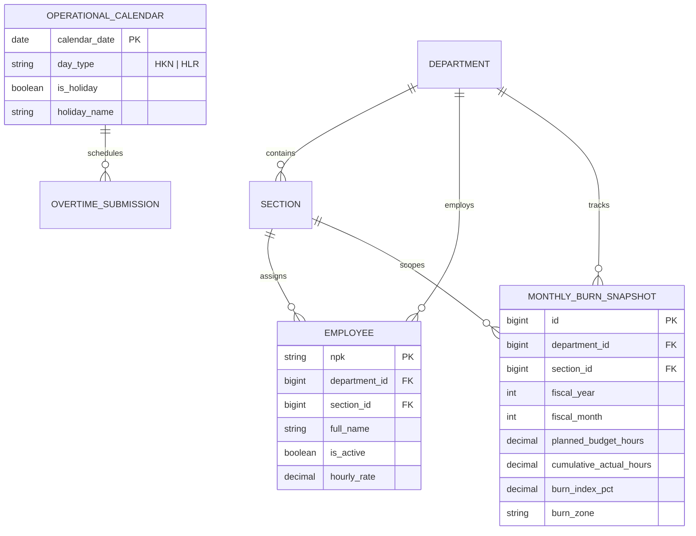

# Executive Operational Dashboard & KPI Cards (E09-00 - E09-01)

## Overview

The Executive Operational Dashboard lives exclusively on the `/dashboard` route and serves as the primary operational command center for manufacturing plant supervisors, managers, and administrators. It features four live KPI cards with mini sparklines covering Daily Production Volume, Working Days (HKN), Active Manpower, and Budget Burn Index (BBI). All visualizations are powered by a unified, tree-shakeable Vue Chart.js component library (`resources/js/components/charts/`) configured with ISUZU plant ergonomics, monospace tabular figures, and defensive ERP integration fallbacks.

## Architecture Diagram

```mermaid
flowchart TD
    subgraph Client [Browser - Vue 3 & Inertia v3]
        Page[Dashboard.vue]
        FilterBar[Toolbar: Date & Department Selector]
        Clock[Live WIB Clock & Shift Pill]

        subgraph KpiRow [Header KPI Cards]
            C1[KpiCardProduction]
            C2[KpiCardWorkingDays]
            C3[KpiCardManPower]
            C4[KpiCardBurnIndex]
        end

        Sparklines[BaseMiniSparkline / Chart.js]
        Skeleton[ChartSkeleton]

        Page --> FilterBar
        Page --> Clock
        Page --> KpiRow
        C1 --> Sparklines
        C2 --> Sparklines
        C3 --> Sparklines
        KpiRow --> Skeleton
    end

    subgraph Server [Laravel 12 Backend]
        Controller[DashboardController@index / @kpiCards]
        Service[DashboardKpiService]
        Guard[ERP Degradation Guard]
    end

    subgraph Data [Plant Database]
        CalendarTable[(operational_calendars)]
        EmployeeTable[(employees)]
        SnapshotTable[(monthly_burn_snapshots)]
        DeptTable[(departments)]
    end

    FilterBar -.->|Inertia reload or GET /dashboard/kpi-cards| Controller
    Controller --> Service
    Service --> Guard
    Service --> CalendarTable
    Service --> EmployeeTable
    Service --> SnapshotTable
    Service --> DeptTable
```

## Data Model



## Key Files & UI Mapping

| Layer            | File / Route / Menu                              | Purpose                                                                                                                        |
| ---------------- | ------------------------------------------------ | ------------------------------------------------------------------------------------------------------------------------------ |
| Sidebar Menu     | `Dashboard` (`/dashboard`)                       | Main operational screen for supervisory staff                                                                                  |
| Page Component   | `resources/js/pages/Dashboard.vue`               | Executive dashboard layout with live header and KPI row                                                                        |
| Chart Library    | `resources/js/components/charts/`                | Reusable wrappers: `BaseLineChart`, `BaseBarChart`, `BaseDonutChart`, `BaseScatterChart`, `BaseMiniSparkline`, `ChartSkeleton` |
| Chart Plugin     | `resources/js/plugins/chartjs.ts`                | Tree-shakeable Chart.js registration & global typography                                                                       |
| Theme Composable | `resources/js/composables/useChartTheme.ts`      | Plant color tokens (Primary, Success, Warning, ISUZU Red, CapEx, OpEx, HKN, HLR)                                               |
| KPI Components   | `resources/js/components/dashboard/KpiCard*.vue` | Four dedicated KPI cards: Production, Working Days, Manpower, Burn Index                                                       |
| Controller       | `app/Http/Controllers/DashboardController.php`   | Renders `Dashboard` page and JSON endpoint `kpiCards()`                                                                        |
| Service          | `app/Services/Analytics/DashboardKpiService.php` | Calculates KPI datasets, role scoping, and ERP degradation fallback                                                            |
| Web Route        | `routes/web.php`                                 | `GET /dashboard` and `GET /dashboard/kpi-cards` (`dashboard.kpi-cards`)                                                        |

## Flow Explanation

1. **User Access & Scoping**:
    - An authenticated supervisory user (Admin, Manager, or Team Leader) visits `/dashboard`.
    - Line operators (`user` role) are automatically redirected to `/my/dashboard` (Self-Service).
2. **Data Aggregation**:
    - `DashboardController@index` invokes `DashboardKpiService@getKpiCards()`.
    - **Card 1 (Production Volume)**: Evaluates ERP connection state via `config('services.erp.connected')`. If disconnected, returns friendly fallback status banner `"N/A — Integrasi data produksi ERP belum terhubung"` with daily plant target (1,450 units) without failing. If connected, returns 14-day production progression.
    - **Card 2 (Working Days)**: Queries `operational_calendars` table using `whereDate` boundaries. Computes total HKN days, completed HKN up to the selected date, and remaining HKN days, alongside weekly bar distribution.
    - **Card 3 (Active Manpower)**: Queries active `employees` scoped by department/section and groups headcount by production sections for mini bar distribution.
    - **Card 4 (Burn Index Plan vs Actual)**: Aggregates `planned_budget_hours` and `cumulative_actual_hours` from `monthly_burn_snapshots`. Computes Burn Index percentage and maps into four standard operational zones (Safe, On Track, Warning, Danger/ISUZU Red).
3. **Rendering & Interactive Filtering**:
    - `Dashboard.vue` renders the four cards with monospace tabular numbers (`font-mono tabular-nums`).
    - Changing the Date input or Department dropdown triggers an Inertia partial reload (`only: ['kpiCards', 'selectedDepartmentId', 'selectedDate']`) preserving scroll position.
    - During reload, `ChartSkeleton` displays an animated pulse placeholder.

## API Endpoints & Routes

| Method | URI                    | Controller Action              | Purpose                         | Auth / Middleware                |
| ------ | ---------------------- | ------------------------------ | ------------------------------- | -------------------------------- |
| GET    | `/dashboard`           | `DashboardController@index`    | Render executive dashboard page | `auth`, `verified`               |
| GET    | `/dashboard/kpi-cards` | `DashboardController@kpiCards` | Fetch JSON KPI cards payload    | `auth`, `verified` (supervisory) |

## Decisions & Trade-offs

- **Strict Two-Surface Architecture**: Per `docs/scrum/Epic-09-ux-plan.md`, operational health and KPI cards live on `/dashboard`, while multi-dimensional analytics live on `/analytics` (`/dashboard/burn-index`). Zero sidebar menu proliferation.
- **Tree-shakeable Chart.js Infrastructure**: Registered globally via `resources/js/plugins/chartjs.ts` to eliminate duplicate Chart.js registrations across individual components while keeping bundle size lean.
- **Defensive ERP Degradation**: Plant ERP telemetry connections can experience latency or outages. The service guarantees a 0% failure rate by returning structured fallback states rather than throwing HTTP 500 exceptions.
- **Monospace Tabular Figures**: Strict enforcement of `font-mono tabular-nums` for all quantitative figures prevents layout jitter during periodic updates.

## Related

- [ADR-028: Shared Vue Chart.js Infrastructure and Operational KPI Cards](../decisions/028-shared-vue-chartjs-infrastructure-and-operational-kpi-cards.md)
- [ADR-004: Chart.js Visualization Engine](../decisions/004-chartjs-visualization-engine.md)
- [ADR-005: Denormalized Monthly Burn Snapshots](../decisions/005-denormalized-monthly-burn-snapshots.md)
- [Executive Operational Dashboard User Guide](../../user-docs/guides/executive-dashboard-kpi.md)
