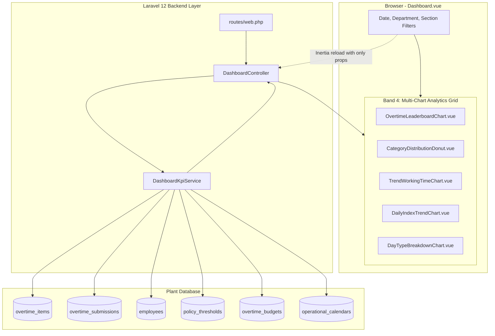
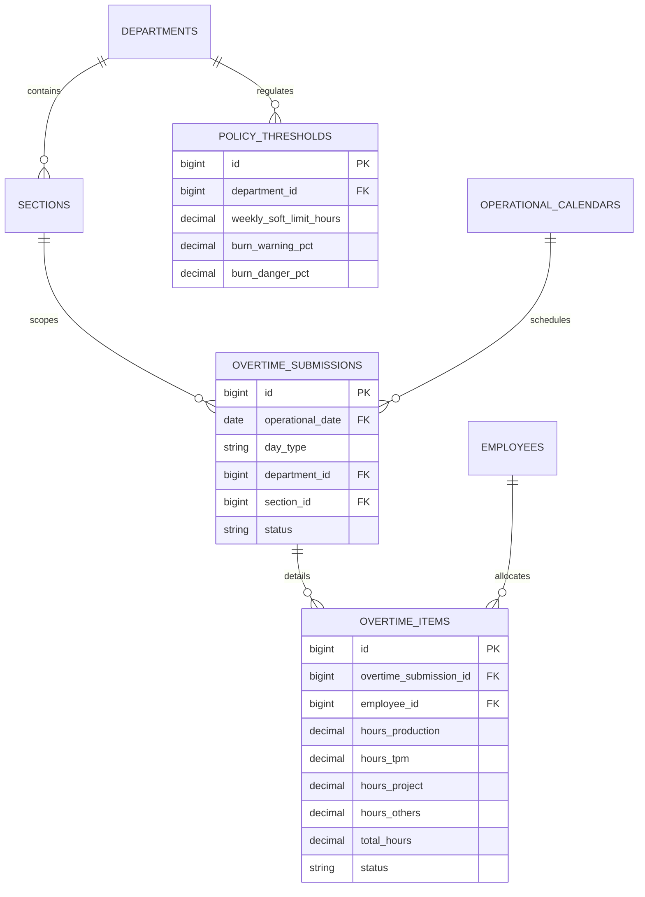

# Executive Dashboard Multi-Chart Analytics Grid (E09-04)

## Overview

The Multi-Chart Analytics Grid lives on `/dashboard` directly beneath the Daily Burn Line Chart and Section Burn Comparison. It provides supervisors, plant managers, and department heads with operational analytics across 5 key dimensions:

1. **Employee Overtime Leaderboard (Top 10)**: Identifies high-risk individuals approaching or exceeding monthly soft policy thresholds.
2. **Category Distribution Donut**: Visualizes proportional allocation across Production, TPM, CapEx Projects, and Others with clickable legend pills for table filtering.
3. **12-Month Working Time Trend**: Chronological dual-line historical trajectory comparing Normal Working Days (HKN) vs Official Holidays (HLR).
4. **Daily Burn Index Contribution Trend**: Granular pacing line chart measuring day-by-day burn intensity against the 100% pacing policy baseline.
5. **Overtime Day Type Breakdown**: Weekly side-by-side grouped bar chart (M1–M5) highlighting holiday overtime expansion or containment.

All 5 charts adhere to the strict single-surface `/dashboard` architecture defined in `docs/scrum/Epic-09-ux-plan.md`, using ISUZU industrial design tokens, monospace tabular numbers, and graceful empty states.

---

## Architecture Diagram

---

## Data Model

---

## Key Files & UI Mapping

| Layer              | File / Route / Component                                          | Purpose                                                                        |
| :----------------- | :---------------------------------------------------------------- | :----------------------------------------------------------------------------- |
| **Route**          | `/dashboard`                                                      | Executive Operational Dashboard surface                                        |
| **Page Component** | `resources/js/pages/Dashboard.vue`                                | Hosts Tab 2 (`?tab=distribution`): Distribusi & Tren                           |
| **Controller**     | `app/Http/Controllers/DashboardController.php`                    | Serves initial Inertia props and 5 JSON endpoints                              |
| **Service Layer**  | `app/Services/Analytics/DashboardKpiService.php`                  | Aggregates leaderboard, donut, 12M trend, daily pacing, and day-type data      |
| **Policy Service** | `app/Services/PolicyThresholdService.php`                         | Resolves department-specific vs plant-wide threshold limits                    |
| **Component 1**    | `resources/js/components/dashboard/OvertimeLeaderboardChart.vue`  | Top 10 horizontal bar chart with soft threshold indicators                     |
| **Component 2**    | `resources/js/components/dashboard/CategoryDistributionDonut.vue` | Work distribution donut with external clickable legend pills                   |
| **Component 3**    | `resources/js/components/dashboard/TrendWorkingTimeChart.vue`     | 12-month rolling dual-line trend (HKN vs HLR)                                  |
| **Component 4**    | `resources/js/components/dashboard/DailyIndexTrendChart.vue`      | Daily contribution pacing line with 100% threshold overlay                     |
| **Component 5**    | `resources/js/components/dashboard/DayTypeBreakdownChart.vue`     | Weekly grouped bar chart (M1–M5) comparing HKN and HLR hours                   |
| **Base Charts**    | `resources/js/components/charts/`                                 | Reusable Chart.js wrappers (`BaseBarChart`, `BaseDonutChart`, `BaseLineChart`) |

---

## Flow Explanation

1. **User Navigation & Filter Selection**:
    - Supervisor loads `/dashboard`.
    - Changing the Month or Department selector triggers `applyFilters()` via Inertia partial reload requesting only `['leaderboard', 'categoryDistribution', 'trendWorkingTime', 'dailyIndexTrend', 'dayTypeBreakdown', ...]`.
2. **Scoping & Authorization**:
    - `DashboardKpiService::resolveScoping` automatically scopes queries:
        - **Admin**: Views plant-wide aggregate or scopes to selected Department/Section.
        - **Manager**: Strictly bound to their assigned department.
        - **Team Leader**: Strictly bound to their assigned section.
        - **Operator**: Prevented from accessing supervisor dashboard (redirected to `/my/dashboard` or receives HTTP 403 on API routes).
3. **Data Aggregation**:
    - Queries approved records from `overtime_items` joined to `overtime_submissions`.
    - Aggregates category hours (`hours_production`, `hours_tpm`, `hours_project`, `hours_others`).
    - Normalizes 12 rolling months in application code to guarantee cross-database compatibility (MySQL and SQLite).
    - Computes daily pacing index: `(actual_daily_hours / (planned_hours / days_in_month)) * 100%`.
4. **Rendering & Interactivity**:
    - Components render responsive charts via Chart.js with single-root Vue structure.
    - Fallback empty states ("Belum ada data") appear gracefully when no approved overtime records exist for the filtered period.

---

## API Endpoints & Routes

All routes require `auth` and `verified` middleware, with 403 Forbidden enforcement for operator roles:

| Method | URI                               | Controller Action                          | Route Name                       | Purpose                                                   |
| :----- | :-------------------------------- | :----------------------------------------- | :------------------------------- | :-------------------------------------------------------- |
| `GET`  | `/dashboard`                      | `DashboardController@index`                | `dashboard`                      | Renders dashboard Inertia page with all 5 chart props     |
| `GET`  | `/dashboard/charts/leaderboard`   | `DashboardController@leaderboard`          | `dashboard.charts.leaderboard`   | Asynchronous JSON feed for Top 10 leaderboard             |
| `GET`  | `/dashboard/charts/category`      | `DashboardController@categoryDistribution` | `dashboard.charts.category`      | Asynchronous JSON feed for category distribution donut    |
| `GET`  | `/dashboard/charts/trend-working` | `DashboardController@trendWorkingTime`     | `dashboard.charts.trend-working` | Asynchronous JSON feed for 12-month rolling trend         |
| `GET`  | `/dashboard/charts/daily-index`   | `DashboardController@dailyIndexTrend`      | `dashboard.charts.daily-index`   | Asynchronous JSON feed for daily contribution index trend |
| `GET`  | `/dashboard/charts/day-type`      | `DashboardController@dayTypeBreakdown`     | `dashboard.charts.day-type`      | Asynchronous JSON feed for weekly HKN vs HLR breakdown    |

---

## Decisions & Trade-offs

1. **Two-Tier Grid Layout**:
    - _Decision_: Arranged top row as 3 columns on large screens (Leaderboard, Donut, 12M Trend) and bottom row as 2 columns (Daily Index Trend, Day Type Breakdown).
    - _Rationale_: Respects vertical visual hierarchy. Dense charts (daily line with 31 points and 5-week grouped bars) receive wider width to avoid crowded horizontal axes.
2. **External Clickable Legend for Category Donut**:
    - _Decision_: Built dedicated legend buttons below the donut canvas displaying category color pill, title, absolute hours, and percentage.
    - _Rationale_: Addresses UX Plan section 4.4 ergonomic constraint where tiny slices (e.g. 1% CapEx) are difficult to tap on mobile/tablet shop-floor screens.
3. **Database-Agnostic Date Aggregations**:
    - _Decision_: Parsed operational dates and grouped rolling months in PHP with Carbon rather than vendor-specific SQL functions like `YEAR()` or `strftime()`.
    - _Rationale_: Guarantees identical execution and numerical correctness across both SQLite in-memory test suites and production MySQL engines.
4. **Defensive Future Day Clamping**:
    - _Decision_: Future days in `dailyIndexTrend` are clamped to `null` past the current day cutoff.
    - _Rationale_: Prevents line charts from dropping to zero for unelapsed calendar dates in the active month.

---

## Verification & Testing

- **Feature Tests**: `tests/Feature/DashboardMultiChartGridTest.php` (10 tests, 146 assertions) covering auth boundaries, role scoping, empty state handling, and aggregation arithmetic.
- **Browser Tests**: `tests/Browser/Dashboard/DashboardMultiChartGridBrowserTest.php` (2 tests, 15 assertions) verifying full Playwright rendering of the cards, legend interactions, and DOM element visibility.
- **Code Standards**: 100% formatted via `vendor/bin/pint --format agent` and linted with `pnpm lint` (`vp check`).
