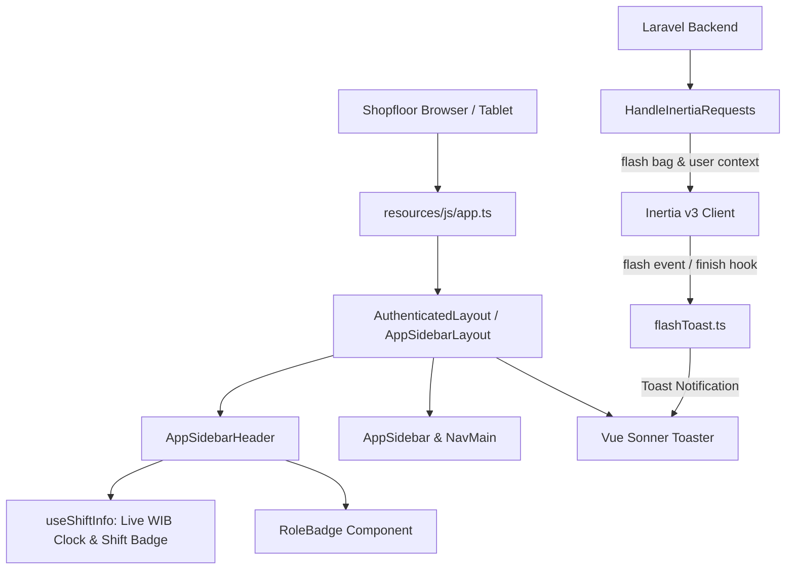
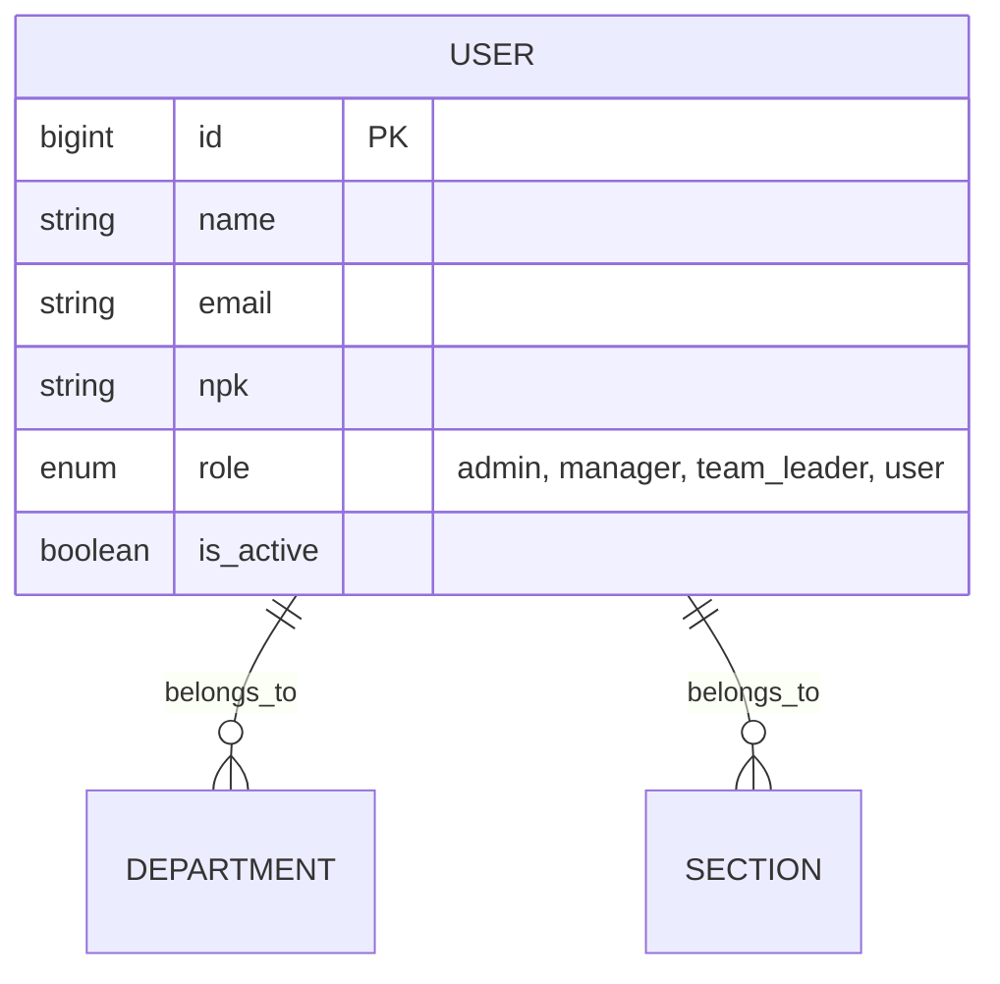

# Foundation Layout & Wayfinder Navigation

## Overview

The Foundation Layout and Wayfinder Navigation infrastructure provides the primary shell for the OT-CapEx system. It combines responsive sidebar navigation, factory operational indicators (live WIB clock and active three-shift schedule), role-specific badges, Wayfinder TypeScript route generation, and an automated flash toast notification pipeline powered by Inertia.js v3 and Vue Sonner.

## Architecture Diagram

## Data Model

## Key Files & UI Mapping

| Layer              | File / Route / Menu                             | Purpose                                                                |
| ------------------ | ----------------------------------------------- | ---------------------------------------------------------------------- |
| Sidebar Menu       | `Dashboard`                                     | Single active navigation entry for Sprint 1                            |
| Layout Shell       | `resources/js/layouts/AuthenticatedLayout.vue`  | Base authenticated layout wrapper                                      |
| Guest Layout       | `resources/js/layouts/GuestLayout.vue`          | Standalone layout wrapper for guest and auth pages                     |
| Topbar Component   | `resources/js/components/AppSidebarHeader.vue`  | Displays breadcrumbs, live WIB clock, shift badge, and role badge      |
| Sidebar Component  | `resources/js/components/AppSidebar.vue`        | Single-entry sidebar with build version and user session popover       |
| Toast Handler      | `resources/js/lib/flashToast.ts`                | Reactive listener for server flash events and Inertia props            |
| Inertia Middleware | `app/Http/Middleware/HandleInertiaRequests.php` | Shares user auth state, roles, translations, and flash bags            |
| Wayfinder Config   | `vite.config.ts`                                | Configures `@laravel/vite-plugin-wayfinder` for automated route typing |

## Flow Explanation

1. **User triggers navigation**: The user clicks a menu link generated by Wayfinder (e.g. `dashboard()`), initiating a client-side Inertia visit.
2. **Request handling**: Laravel routes the request through the `web`, `auth`, and `HandleInertiaRequests` middleware pipeline.
3. **Context sharing**: `HandleInertiaRequests` injects authenticated user details (`name`, `npk`, `role`, `department`, `section`), locale translations, and active session flash data (`success`, `error`, `warning`, `info`, `toast`).
4. **Layout rendering & Toasts**: The Vue client mounts the page within `AppSidebarLayout`. `initializeFlashToast` receives the flash payload and renders an auto-dismissing toast notification via Vue Sonner without page reloading.

## API Endpoints & Routes (if applicable)

| Method | URI          | Controller Action / View                 | Purpose                      | Auth           |
| ------ | ------------ | ---------------------------------------- | ---------------------------- | -------------- |
| GET    | `/login`     | `Inertia: auth/Login`                    | Dual-identifier login screen | guest          |
| GET    | `/dashboard` | `Inertia: Dashboard`                     | Operational dashboard        | auth, verified |
| POST   | `/logout`    | `AuthenticatedSessionController@destroy` | Safe session termination     | auth           |

## Decisions & Trade-offs

- **Wayfinder over Ziggy**: Strict reliance on `@laravel/vite-plugin-wayfinder` generates statically typed route helper functions, eliminating runtime string typos and avoiding legacy global `route()` function pollution in Vue.
- **Single Active Item in Sprint 1**: The UX Plan forbids exposing unbuilt future modules (e.g. Overtime Entry, Approvals) to prevent shopfloor supervisor confusion during shift handovers.
- **Dual Flash Delivery**: `flashToast.ts` listens to both Inertia v3 `flash` events and shared page prop bags on navigation finish to ensure toasts display consistently across full page reloads, programmatic redirects, and SPA visits.

## Related

- [ADR-001: Wayfinder Routing over Ziggy](../decisions/001-wayfinder-routing-over-ziggy.md)
- [ADR-007: Role-Based Access Control and Scoping](../decisions/007-role-based-access-control-and-scoping.md)
- [Authentication & Role-Based Access Control](authentication-rbac.md)
