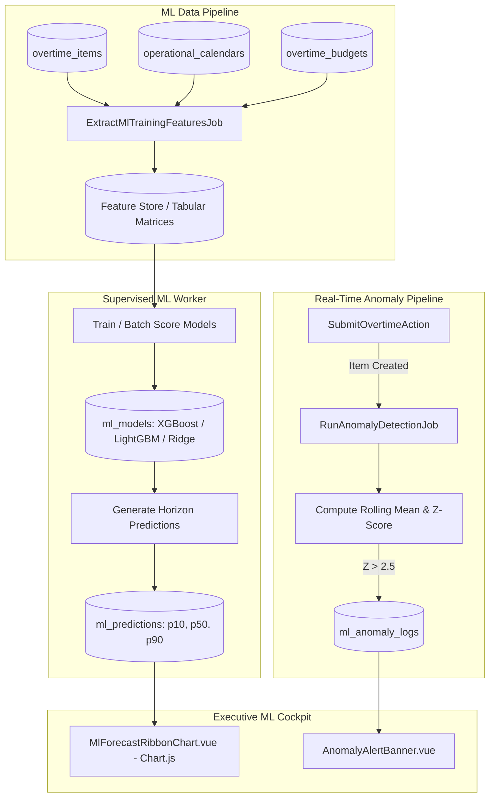
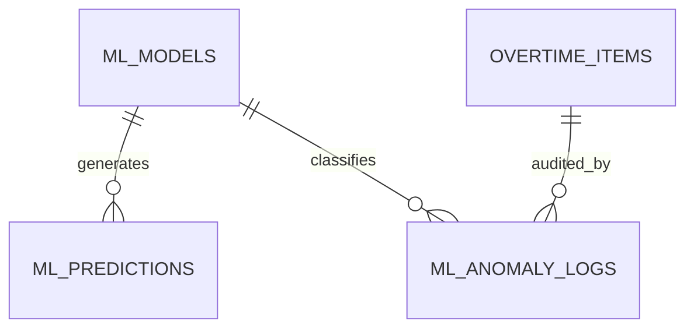

# Supervised Machine Learning Analytics & Predictive Intelligence

## Overview

The **Supervised Machine Learning Analytics & Predictive Intelligence** module replaces static rules of thumb with supervised data-driven forecasting. The engine predicts section-level overtime demand for upcoming shifts, projects month-end Burn Index trajectories with confidence intervals, forecasts CapEx project labor requirements, and screens submitted timesheets in near real-time for operational anomalies.

## Architecture Diagram

## Data Model

## Key Files & UI Mapping

| Layer             | File / Route / Menu                                                        | Purpose                                                                   |
| ----------------- | -------------------------------------------------------------------------- | ------------------------------------------------------------------------- |
| Sidebar Menu      | `Prediksi & Anomali ML` (`/analytics/ml-radar`)                            | Management predictive radar and anomaly center                            |
| Page Component    | `resources/js/pages/Analytics/MlRadar.vue`                                 | Dashboard displaying demand forecasts and anomaly feeds                   |
| Chart Component   | `resources/js/components/Charts/MlForecastRibbonChart.vue`                 | Chart.js line chart with confidence ribbon ($P_{10}$, $P_{50}$, $P_{90}$) |
| Chart Component   | `resources/js/components/Charts/BurnTrajectoryBandChart.vue`               | Chart.js trajectory projection towards month-end deficit                  |
| Controller        | `app/Http/Controllers/MlPredictionController.php`                          | Serves forecast endpoints and anomaly resolution triggers                 |
| Scheduled Command | `app/Console/Commands/ExtractMlFeaturesCommand.php`                        | Command compiling multi-month training features                           |
| Queue Job         | `app/Jobs/RunAnomalyDetectionJob.php`                                      | Real-time Z-score evaluation against section baseline                     |
| Service           | `app/Services/ML/AnomalyDetectionDispatcher.php`                           | Flags suspicious items (excessive hours, unlinked downtime)               |
| Models            | `App\Models\MlModel`, `App\Models\MlPrediction`, `App\Models\MlAnomalyLog` | Database entities tracking models, horizons, and anomalies                |

## Flow Explanation

1. **Feature extraction pipeline**:
    - Weekly batch jobs extract tabular matrices per section per month: 4-month lagged consumption, HLR holiday ratios, machine breakdown hours (`RCA_MACHINE_BREAKDOWN`), active shift days, and moving averages.
2. **Cold-start circuit breaker**:
    - If a section possesses fewer than 30 historical shifts, the system bypasses complex ML inference and automatically defaults to a 4-week moving average labeled with a visible UI badge: `Perhitungan: Rata-Rata Bergerak (Data ML Belum Mencukupi)`.
3. **Forecasting & horizon generation**:
    - Models generate point forecasts ($P_{50}$) accompanied by optimistic ($P_{10}$) and pessimistic ($P_{90}$) boundary intervals.
    - Predictions are stored in `ml_predictions` with `target_type` ('SECTION', 'DEPARTMENT', 'CAPEX_PROJECT').
4. **Interactive visualization**:
    - `MlForecastRibbonChart.vue` renders an interactive Chart.js line chart. The translucent filled ribbon between $P_{10}$ and $P_{90}$ visually informs managers of forecast uncertainty.
5. **Real-time anomaly screening**:
    - When timesheets are submitted, `RunAnomalyDetectionJob` checks line items for unusual patterns (e.g., worker logging 10 hours of TPM with zero breakdown tags, or an employee exceeding 3 standard deviations from their 60-day historical mean).
    - Suspect items appear in the manager's review queue highlighted with an **Audit Recommendation Tag**.
6. **Human-in-the-loop guarantee**:
    - ML predictions and anomaly scores are strictly advisory. System decisions (approvals, rejections, budget modifications) remain solely with authorized human managers.

## API Endpoints & Routes

| Method | URI                                          | Controller Action                       | Purpose                                             | Auth / Middleware            |
| ------ | -------------------------------------------- | --------------------------------------- | --------------------------------------------------- | ---------------------------- |
| GET    | `/analytics/ml-radar`                        | `MlPredictionController@index`          | Main predictive dashboard                           | `auth`, `role:manager,admin` |
| GET    | `/analytics/ml-radar/{sectionId}/forecast`   | `MlPredictionController@getForecast`    | Detailed forecast series ($P_{10}, P_{50}, P_{90}$) | `auth`, `role:manager,admin` |
| GET    | `/analytics/ml-radar/anomalies`              | `MlPredictionController@getAnomalies`   | Active queue of unreviewed anomaly flags            | `auth`, `role:manager,admin` |
| POST   | `/analytics/ml-radar/anomalies/{id}/resolve` | `MlPredictionController@resolveAnomaly` | Acknowledge or dismiss an anomaly flag              | `auth`, `role:manager,admin` |

## Decisions & Trade-offs

- **Cold-Start Resilience**: Factory lines undergo reorganizations where historical data is temporarily wiped. The cold-start fallback guarantees the UI never displays broken states or zeroes.
- **Explainability Over Black-Box Models**: Forecasts display their top 3 contributing factors (e.g., _+14 hrs due to 2 consecutive holiday shifts_, _+8 hrs due to recurring press line breakdown_), building supervisor trust in machine predictions.

## Related

- [Epic-08: Supervised ML Analytics & Predictive Intelligence](../../scrum/Epic-08.md)
- [ADR-004: Chart.js Visualization Engine](../decisions/004-chartjs-visualization-engine.md)
