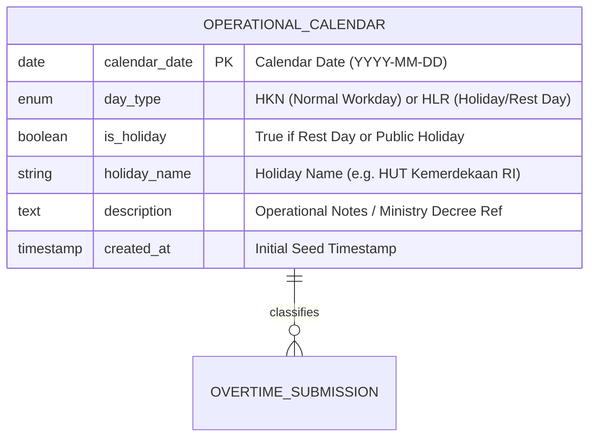

# Operational Calendar Management & API

## Overview

The Operational Calendar Management and Classification API module (Story **[E02-03]**) provides factory administrators with centralized control over factory operating days, holiday schedules, and workday classifications. Operating strictly within the unified **Master Data Hub** (`/admin/master-data?tab=calendar`) as governed by the Epic-02 UX Plan, this module automatically seeds the operational calendar for current and upcoming fiscal years (defaulting Saturdays and Sundays to `HLR` rest days and weekdays to `HKN` normal workdays). It provides a full monthly 7-column grid view (Senin–Minggu), an interactive slide-in sheet for day-level overrides, a two-stage dry-run CSV modal for national holiday batch imports, and a high-performance authenticated endpoint (`GET /api/calendar/{date}`) utilized by overtime forms to automatically classify dates.

## Architecture Diagram

```mermaid
flowchart TD
    Admin[Admin User] -->|Opens Master Data Hub| Hub[MasterData.vue with tab=calendar]
    Hub -->|Select Month/Year| MasterCtrl[MasterDataController@index]
    MasterCtrl -->|Get Month Days & Stats| CalService[OperationalCalendarService]

    Hub -->|Click Date Cell| DaySheet[CalendarDaySheet.vue]
    DaySheet -->|PUT /admin/calendar/:date| CalUpdate[OperationalCalendarController@update]
    CalUpdate -->|Update Type, Holiday, Notes| CalService

    Hub -->|Click Import CSV| ImportModal[CalendarHolidayImportDialog.vue]
    ImportModal -->|Upload CSV| CsvPreview[OperationalCalendarController@preview]
    CsvPreview -->|In-Memory Dry Run| CalService
    CsvPreview -->|Return Audit Summary Table| ImportModal
    ImportModal -->|Confirm Valid Rows| CsvCommit[OperationalCalendarController@import]
    CsvCommit --> CalService
    CalService --> DB[(operational_calendars Table)]

    Worker[Worker / TL Form] -->|GET /api/calendar/:date| ApiCtrl[Api/CalendarController@show]
    ApiCtrl -->|Auto-Classify Date| CalService
    ApiCtrl -->|Return JSON| Worker

    CLI[Artisan CLI] -->|php artisan app:seed-calendar| SeedCmd[SeedOperationalCalendarCommand]
    SeedCmd --> CalService
```

## Data Model



## Key Files & UI Mapping

| Layer                | File / Route / Menu                                             | Purpose                                                                |
| -------------------- | --------------------------------------------------------------- | ---------------------------------------------------------------------- |
| **Sidebar Menu**     | `Master Data` -> `Tab: Operational Calendar`                    | Entry point in plant management UI (`/admin/master-data?tab=calendar`) |
| **Page Component**   | `resources/js/pages/admin/MasterData.vue`                       | Master Data Hub with 7-column calendar grid and summary cards          |
| **Slide-in Sheet**   | `resources/js/components/admin/CalendarDaySheet.vue`            | Right drawer for editing day classification, holiday name, and notes   |
| **Modal Dialog**     | `resources/js/components/admin/CalendarHolidayImportDialog.vue` | Modal dialog for two-stage CSV national holiday import                 |
| **Admin Controller** | `app/Http/Controllers/Admin/OperationalCalendarController.php`  | Handles day updates, CSV dry-run preview, and batch commits            |
| **API Controller**   | `app/Http/Controllers/Api/CalendarController.php`               | Authenticated `GET /api/calendar/{date}` classification endpoint       |
| **Service Class**    | `app/Services/OperationalCalendarService.php`                   | Core business logic for auto-seeding, parsing, and day updates         |
| **Console Command**  | `app/Console/Commands/SeedOperationalCalendarCommand.php`       | CLI tool `php artisan app:seed-calendar {year?}`                       |
| **Model**            | `app/Models/OperationalCalendar.php`                            | Eloquent model for `operational_calendars` table                       |
| **Requests**         | `app/Http/Requests/Admin/UpdateCalendarDayRequest.php`          | Validation for day classification changes                              |
|                      | `app/Http/Requests/Admin/PreviewCalendarCsvRequest.php`         | Validation for uploaded CSV file                                       |
|                      | `app/Http/Requests/Admin/ImportCalendarCsvRequest.php`          | Validation for committed batch rows                                    |

## Flow Explanation

### 1. Auto-Generation & Navigation

1. When opening the calendar tab or querying an unseeded year/month, `OperationalCalendarService::getMonthCalendar()` automatically verifies that the target year has 365/366 records.
2. If missing, `generateForYear($year)` seeds all dates: Saturday and Sunday are marked `HLR` (`is_holiday = true`), weekdays are set to `HKN`, and known statutory Indonesian public holidays are applied.
3. The frontend renders a 7-column grid (Senin to Minggu) with leading and trailing padding cells to match the month's calendar layout.

### 2. Manual Date Override via Slide-in Sheet

1. The administrator clicks any date cell in the grid.
2. `CalendarDaySheet.vue` slides in from the right with the formatted date, segmented control (`HKN` vs `HLR`), and an explicit non-retroactive regulatory notice:
   _"Perubahan status kalender hanya berlaku untuk pengajuan baru. Data lembur terdahulu tidak akan diubah secara retroaktif."_
3. When toggling to `HLR`, the holiday name input is revealed and required.
4. On save, `PUT /admin/calendar/{date}` executes without full page reload via Wayfinder typed routes.

### 3. Two-Stage CSV Import for National Holidays

1. Administrator clicks **Import Hari Libur Nasional (CSV)** to open `CalendarHolidayImportDialog.vue`.
2. Administrator uploads or drops a `.csv` file (columns: `date`, `holiday_name`, optional `description`).
3. The file is sent to `POST /admin/calendar/import-holidays/preview` for in-memory dry-run validation (verifying date formatting `YYYY-MM-DD`, uniqueness within CSV, required holiday names).
4. An audit summary displays Total, Valid, and Error rows with error pills and filter toggles (`Semua`, `Valid`, `Bermasalah`).
5. Clicking **Konfirmasi & Import** posts only valid rows to `POST /admin/calendar/import-holidays`, which executes an upsert transaction.

### 4. Overtime Form Auto-Classification API

- The frontend overtime submission form queries `GET /api/calendar/{date}` when a user selects a date.
- The endpoint responds with `{ date, day_type, is_holiday, holiday_name, description }`.
- If the date is `HLR`, overtime calculations automatically utilize holiday multi-tier rate multipliers as governed by PP 35/2021.

## Non-Retroactive Integrity Rule

Per plant policy and Scrum acceptance criteria, calendar modifications only apply to subsequent overtime submissions. Already-submitted SPKL records preserve their snapshot `day_type` in `overtime_submissions` to guarantee audit trail immutability.
