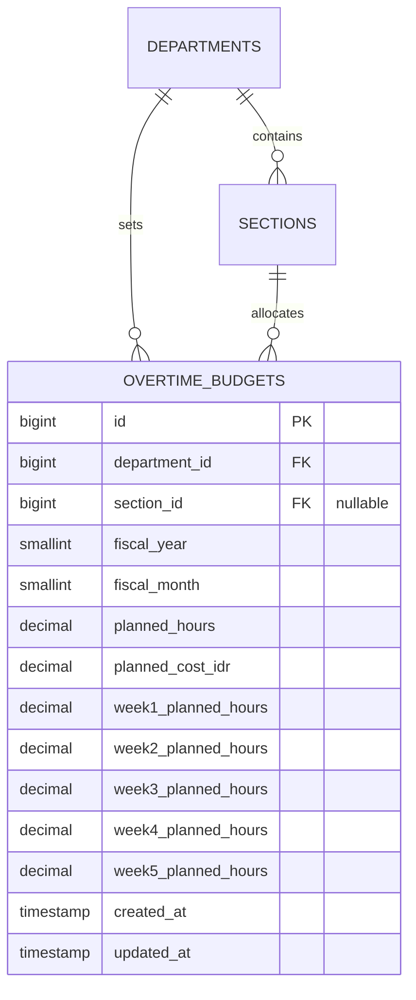

# Overtime Budget Planning (E02-07)

## Overview

Overtime Budget Planning provides manufacturing department managers and plant administrators with a centralized hub for configuring section-level monthly overtime hour quotas, reviewing 5-week operational allocations, estimating labor expenditures in Rupiah (IDR) using department standard hourly rates, and performing bulk imports with a two-stage pre-commit safety audit.

## Architecture Diagram

```mermaid
flowchart TD
    subgraph UI_Surface [User Interface Surfaces]
        Nav[Sidebar: Budget Planning] --> Hub[Planning.vue Hub]
        Hub --> FormSheet[BudgetFormSheet.vue]
        Hub --> ImportSheet[BudgetImportSheet.vue]
    end

    subgraph Service_Domain [OvertimeBudgetService Domain Layer]
        Hub --> Controller[OvertimeBudgetController@index]
        Controller --> MatrixMethod[getPlanningMatrix]
        FormSheet --> StoreMethod[upsertBudget]
        ImportSheet --> Stage1[parseAndValidateCsv]
        ImportSheet --> Stage2[importRows]
    end

    subgraph Persistence [Database Records]
        StoreMethod --> BudgetTable[(overtime_budgets)]
        Stage2 --> BudgetTable
        MatrixMethod --> DeptRate[departments.default_hourly_rate]
    end
```

## Data Model



## Key Files & UI Mapping

| Layer             | File / Route / Menu                                               | Purpose                                        |
| ----------------- | ----------------------------------------------------------------- | ---------------------------------------------- |
| Sidebar Menu      | `Budget Planning`                                                 | Visible to `admin` and `manager`               |
| Page Component    | `resources/js/pages/budgets/Planning.vue`                         | Main matrix grid & KPI cards                   |
| Slide-in Sheet    | `resources/js/components/budgets/BudgetFormSheet.vue`             | Section allocation & 5-week breakdown drawer   |
| Slide-in Sheet    | `resources/js/components/budgets/BudgetImportSheet.vue`           | Two-stage pre-commit CSV audit drawer          |
| Controller        | `app/Http/Controllers/Budgets/OvertimeBudgetController.php`       | Handles planning index & upsert store          |
| Import Controller | `app/Http/Controllers/Budgets/OvertimeBudgetImportController.php` | Handles CSV preview, commit, and template      |
| Domain Service    | `app/Services/OvertimeBudgetService.php`                          | Matrix retrieval, cost calculations, CSV audit |
| Model             | `app/Models/OvertimeBudget.php`                                   | Eloquent model for budget allocations          |
| Factory           | `database/factories/OvertimeBudgetFactory.php`                    | Factory for tests and seeders                  |

## Flow Explanation

1. **Access & Scoping:**
    - Administrators see all departments and can filter across any active manufacturing department.
    - Department Managers are strictly scoped to their assigned department (`user.department_id`).
2. **Matrix Rendering:**
    - The hub presents 3 KPI cards: Total Planned Hours, Estimated Overtime Cost (hours * department hourly rate), and Section Coverage count/percentage.
    - The table renders each section with its monthly target, 5-week badges, status (`Ditetapkan` / `Belum Ditetapkan`), and action buttons.
3. **Drawer-Based Configuration (`BudgetFormSheet`):**
    - Opening the drawer calculates estimated cost in real-time.
    - When weekly breakdown is enabled, weekly inputs default to `planned_hours / 4.3`.
    - If weekly sum diverges from monthly target, an amber non-blocking advisory pill is shown.
4. **Two-Stage CSV Import (`BudgetImportSheet`):**
    - **Stage 1 (Dry-Run Audit):** The file is parsed in-memory, checking section codes, active status, department ownership, and positive hour limits. An audit table displays valid/invalid status and row errors.
    - **Stage 2 (Commit):** The user clicks "Import Valid Records" to persist records within a database transaction.

## API Endpoints & Routes

| Method | URI                                | Controller Action                         | Purpose                  | Auth & Middleware    |
| ------ | ---------------------------------- | ----------------------------------------- | ------------------------ | -------------------- |
| GET    | `/budgets/planning`                | `OvertimeBudgetController@index`          | View planning matrix     | `role:admin,manager` |
| POST   | `/budgets/planning`                | `OvertimeBudgetController@store`          | Upsert section budget    | `role:admin,manager` |
| POST   | `/budgets/planning/import/preview` | `OvertimeBudgetImportController@preview`  | In-memory CSV validation | `role:admin,manager` |
| POST   | `/budgets/planning/import`         | `OvertimeBudgetImportController@import`   | Commit valid CSV rows    | `role:admin,manager` |
| GET    | `/budgets/planning/template`       | `OvertimeBudgetImportController@template` | Download CSV template    | `role:admin,manager` |

## Decisions & Trade-offs

- **Slide-in Drawers over Standalone Routes:** Adhering strictly to `docs/scrum/Epic-02-ux-plan.md`, forms and CSV imports are presented in slide-in sheets instead of creating dedicated URL routes, preserving screen context and minimizing URL clutter.
- **Non-Blocking Weekly Sum Warning:** Manufacturing shifts fluctuate across weeks due to seasonal production surges. The sum mismatch warning is strictly advisory, allowing non-linear weekly distributions while retaining the monthly aggregate as the formal ceiling.
- **Two-Stage CSV Import:** Pre-commit audit prevents partial dirty database states and eliminates silent import failures by presenting row-by-row validation feedback before execution.

## Related

- Feature Doc: [Department & Section Management](department-section-management.md)
- ADR: [013 - Overtime Budget Planning and CSV Import](../decisions/013-overtime-budget-planning-and-csv-import.md)
- User Guide: [Overtime Budget Planning](../../user-docs/guides/overtime-budget-planning.md)
