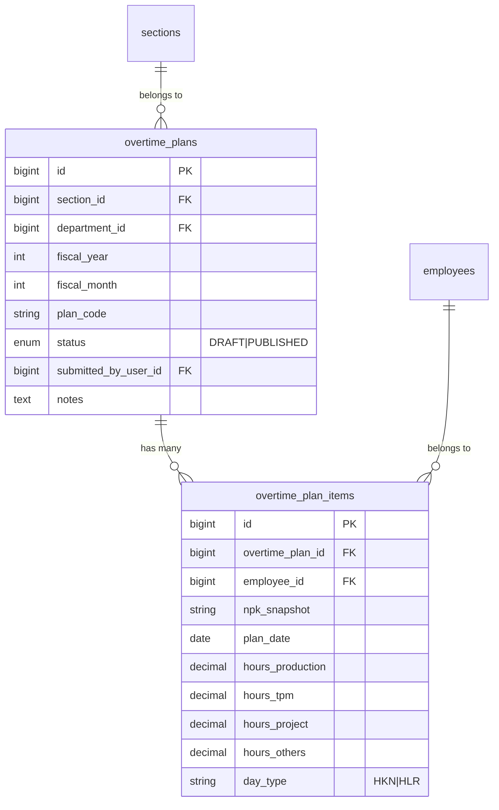

# Overtime Planning OT

## Overview

The Planning OT feature provides a monthly planning grid where team leaders and managers can
schedule overtime hours per employee, per day, across four overtime categories (Production, TPM,
Project, Others). Plans are saved as **DRAFT** and then published (**PUBLISHED**) to lock the
record. This feature replaced the earlier "Input Lembur" form, which is now repurposed for
SPL Excel imports.

---

## Architecture Diagram

```mermaid
flowchart TD
    A[User clicks Planning OT in sidebar] --> B[OvertimePlanningController@create]
    B --> C[Loads departments / sections / calendar_days]
    C --> D[Returns overtime/Planning Inertia page]
    D --> E[User fills monthly grid per employee × day × category]
    E --> F{Existing plan?}
    F -- No --> G[POST /overtime/planning store]
    F -- Yes --> H[PUT /overtime/planning/:id update]
    G --> I[OvertimePlan::updateOrCreate]
    H --> I
    I --> J[OvertimePlanItem::updateOrCreate per row]
    J --> K[Redirect to edit page]
    K --> L{Publish?}
    L -- Yes --> M[PATCH /overtime/planning/:id/publish]
    M --> N[status = PUBLISHED]
```

---

## Data Model



---

## Key Files & UI Mapping

| Layer          | File / Route / Menu                                            | Purpose                               |
| -------------- | -------------------------------------------------------------- | ------------------------------------- |
| Sidebar Menu   | **Planning OT**                                                | User entry point                      |
| Page (List)    | `resources/js/pages/overtime/PlanningIndex.vue`                | Lists all plans with filter           |
| Page (Grid)    | `resources/js/pages/overtime/Planning.vue`                     | Monthly planning grid                 |
| Controller     | `app/Http/Controllers/Overtime/OvertimePlanningController.php` | CRUD + roster API                     |
| Store Request  | `app/Http/Requests/Overtime/StorePlanningRequest.php`          | Validation + auth gate                |
| Update Request | `app/Http/Requests/Overtime/UpdatePlanningRequest.php`         | Validation + auth gate                |
| Model          | `app/Models/OvertimePlan.php`                                  | Plan header                           |
| Model          | `app/Models/OvertimePlanItem.php`                              | Per-day per-employee row              |
| Factory        | `database/factories/OvertimePlanFactory.php`                   | Test seeding                          |
| Factory        | `database/factories/OvertimePlanItemFactory.php`               | Test seeding                          |
| Migration      | `2026_09_22_132412_create_overtime_plans_table.php`            | DDL                                   |
| Migration      | `2026_09_22_132413_create_overtime_plan_items_table.php`       | DDL                                   |
| Feature Tests  | `tests/Feature/OvertimePlanningTest.php`                       | 15 tests covering auth, CRUD, publish |

---

## Routes

| Method | URI                                     | Name                        | Auth Gate                                           |
| ------ | --------------------------------------- | --------------------------- | --------------------------------------------------- |
| GET    | `/overtime/planning`                    | `overtime.planning.index`   | admin / manager / team_leader                       |
| GET    | `/overtime/planning/create`             | `overtime.planning.create`  | admin / manager / team_leader                       |
| POST   | `/overtime/planning`                    | `overtime.planning.store`   | admin / manager / team_leader                       |
| GET    | `/overtime/planning/{plan}/edit`        | `overtime.planning.edit`    | admin / manager / team_leader (scoped)              |
| PUT    | `/overtime/planning/{plan}`             | `overtime.planning.update`  | admin / manager / team_leader (scoped)              |
| PATCH  | `/overtime/planning/{plan}/publish`     | `overtime.planning.publish` | admin / manager / team_leader (scoped)              |
| DELETE | `/overtime/planning/{plan}`             | `overtime.planning.destroy` | admin / manager / team_leader (scoped — draft only) |
| GET    | `/overtime/planning/roster/{sectionId}` | `overtime.planning.roster`  | authenticated (JSON API)                            |

---

## Flow Explanation

1. **User opens Planning OT** — sidebar navigates to `PlanningIndex` showing all accessible plans.
2. **Create new plan** — user clicks "Buat Planning Baru" to open the monthly Excel-parity grid for the
   current month. Department and section dropdowns filter the roster.
3. **Fill the grid** — each day exposes four inline cells (A/B/C/D). Keyboard navigation
   (Tab / arrows / Enter) moves focus; typing replaces the selected value. No modal.
4. **Monitoring panel** — below the day grid (tabs): Weekly Hours + Conversi Idx / Plan vs Actual
   weekly index (P from grid, A from approved `overtime_items`). Day grid itself only has
   identity + day × A/B/C/D + Total Jam.
5. **Save as Draft** — `StorePlanningRequest` validates, `updateOrCreate` upserts the plan header,
   then `OvertimePlanItem::updateOrCreate` upserts each row. `plan_date` is normalized with
   `Carbon::startOfDay()` to avoid SQLite/MySQL date-format divergence.
6. **Publish** — a separate `PATCH` route sets `status = PUBLISHED`. Published plans cannot be deleted.

---

## Decisions & Trade-offs

- **Separate tables from `overtime_submissions`** — planning data has different semantics
  (projected hours by category, not realized hours by submission) and different approval lifecycle.
  Reusing `overtime_submissions` would require nullable columns and schema contortions.
  See ADR-037.
- **`Carbon::startOfDay()` in `updateOrCreate` WHERE keys** — Eloquent's `date` cast stores as
  `Y-m-d H:i:s` in SQLite but MySQL accepts `Y-m-d` on DATE columns. Passing a Carbon object
  ensures the formatted value matches across both drivers. See `.ai/rules/app.md`.
- **Four categories mapped to OT codes** — Production (61, 62), TPM (65, 66), Project/Kaizen
  (67, 68), Others (remaining codes). Mirrors the physical SPL template format.

---

## Related

- [SPL Excel Import](./spl-excel-import.md) — feature for importing realized overtime from SPL Excel files
- [ADR-037: Separate Tables for Planned vs Realized Overtime](../decisions/037-planned-vs-realized-overtime-tables.md)
- [Daily Overtime SPKL](./daily-overtime-spkl.md) — original realized-overtime submission workflow
