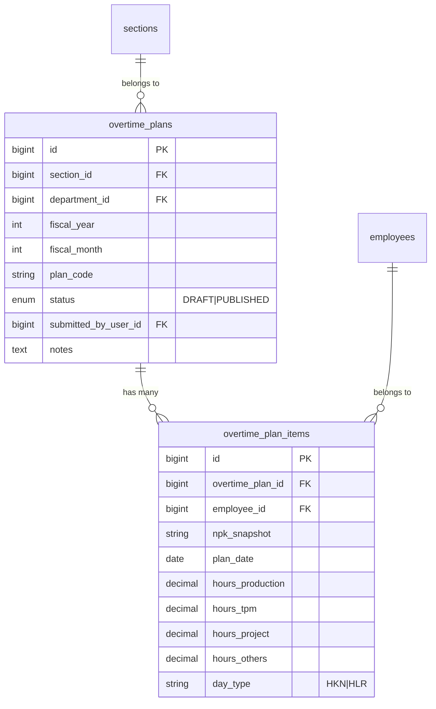

# Overtime Planning OT

## Overview

The Planning OT feature provides a monthly Excel-parity planning grid where team leaders and
managers schedule overtime hours per employee, per day, across four overtime categories
(Production / A, TPM / B, Project / C, Others / D). Plans use a **DRAFT → PUBLISHED** lifecycle.
Day types (HKN/HLR) come from `operational_calendars` (Indonesian weekends + national holidays
via `OperationalCalendarService::ensureYearSeeded`). A separate monitoring panel below the grid
shows weekly hours, Conversi Idx, and Plan vs Actual index against approved realized overtime.

---

## Architecture Diagram

```mermaid
flowchart TD
    A[User opens Planning OT] --> B[OvertimePlanningController@create or edit]
    B --> C[ensureYearSeeded + calendar_days + roster + actuals]
    C --> D[Inertia overtime/Planning]
    D --> E[Excel grid entry A/B/C/D + keyboard nav]
    E --> F[Monitoring tabs Weekly / Plan vs Actual]
    F --> G{Save draft?}
    G -->|POST/PUT| H[OvertimePlan updateOrCreate + PlanItems]
    H --> I[Redirect edit]
    I --> J{Publish?}
    J -->|PATCH| K[status PUBLISHED]
```

---

## Data Model



---

## Key Files & UI Mapping

| Layer          | File / Route / Menu                                            | Purpose                                     |
| -------------- | -------------------------------------------------------------- | ------------------------------------------- |
| Sidebar Menu   | **Planning OT**                                                | User entry point                            |
| Page (List)    | `resources/js/pages/overtime/PlanningIndex.vue`                | Lists plans                                 |
| Page (Grid)    | `resources/js/pages/overtime/Planning.vue`                     | Excel grid + monitoring tabs                |
| Composable     | `resources/js/composables/useSpreadsheetNav.ts`                | Tab / arrow / Enter cell navigation         |
| Controller     | `app/Http/Controllers/Overtime/OvertimePlanningController.php` | CRUD, roster, calendar, actuals aggregation |
| Calendar       | `app/Services/OperationalCalendarService.php`                  | HKN/HLR seed (ID national holidays)         |
| Store Request  | `app/Http/Requests/Overtime/StorePlanningRequest.php`          | Validation + auth                           |
| Update Request | `app/Http/Requests/Overtime/UpdatePlanningRequest.php`         | Validation + auth                           |
| Models         | `OvertimePlan`, `OvertimePlanItem`                             | Plan header + day rows                      |
| Feature Tests  | `tests/Feature/OvertimePlanningTest.php`                       | Auth, CRUD, actuals props                   |
| Browser Tests  | `tests/Browser/Overtime/PlanningSpreadsheetBrowserTest.php`    | Grid entry + monitoring UI                  |

---

## Routes

| Method | URI                                     | Name                        | Auth Gate                                           |
| ------ | --------------------------------------- | --------------------------- | --------------------------------------------------- |
| GET    | `/overtime/planning`                    | `overtime.planning.index`   | admin / manager / team_leader                       |
| GET    | `/overtime/planning/create`             | `overtime.planning.create`  | admin / manager / team_leader                       |
| POST   | `/overtime/planning`                    | `overtime.planning.store`   | admin / manager / team_leader                       |
| GET    | `/overtime/planning/{plan}/edit`        | `overtime.planning.edit`    | admin / manager / team_leader (scoped)              |
| PUT    | `/overtime/planning/{plan}`             | `overtime.planning.update`  | admin / manager / team_leader (scoped)              |
| PATCH  | `/overtime/planning/{plan}/publish`     | `overtime.planning.publish` | admin / manager / team_leader (scoped)              |
| DELETE | `/overtime/planning/{plan}`             | `overtime.planning.destroy` | admin / manager / team_leader (scoped — draft only) |
| GET    | `/overtime/planning/roster/{sectionId}` | `overtime.planning.roster`  | authenticated (JSON API)                            |

---

## Flow Explanation

1. **User opens Planning OT** — sidebar → `PlanningIndex`.
2. **Create / edit** — year/month dropdowns + department/section; controller seeds calendar year,
   loads roster, and aggregates `actuals` from approved `overtime_items`.
3. **Fill grid** — inline A/B/C/D cells; Tab/arrows/Enter; green fill for non-zero; HLR day bands
   tinted red. Published plans are read-only.
4. **Monitoring** — separate panel under the grid: **Jam Mingguan** (Conversi Idx, W1–W5, GT HOUR)
   and **Plan vs Actual** (index P from plan, A from approved OT). Week buckets: days 1–7 → W1 … 29+ → W5.
5. **Section change** — full Inertia reload (not client-only roster fetch) so `actuals` stay correct.
6. **Save draft / publish** — upsert plan + items; publish locks the document.

---

## Decisions & Trade-offs

- **Separate tables from submissions** — see ADR-037.
- **Excel-parity UI without modal** — see ADR-038.
- **Index multipliers** — HKN × 1.5 / HLR × 2.0 (`DashboardKpiService` constants), not Excel VLOOKUP tables.
- **Carbon::startOfDay()** on `plan_date` upsert keys — SQLite/MySQL date cast portability.

---

## Related

- [SPL Excel Import](./spl-excel-import.md)
- [Operational Calendar Management](./operational-calendar-management.md)
- [ADR-037: Planned vs Realized Overtime Tables](../decisions/037-planned-vs-realized-overtime-tables.md)
- [ADR-038: Excel-Parity Planning Grid UX](../decisions/038-excel-parity-planning-grid-ux.md)
- [Daily Overtime SPKL](./daily-overtime-spkl.md)
