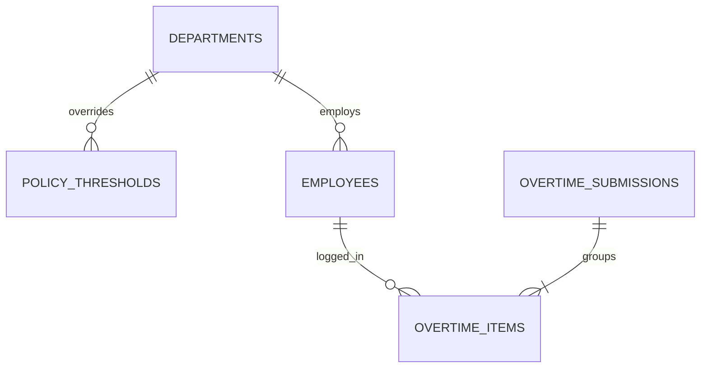

# Overtime Policy Soft Warning Indicators

## Overview

The **Overtime Policy Soft Warning Indicators** feature provides real-time, non-blocking visual feedback to frontline Team Leaders and Department Managers when employees approach or exceed company overtime fatigue thresholds (BR-06). By evaluating cumulative weekly hours and multi-week fatigue patterns without disabling form submissions, the system preserves factory shift continuity while upholding worker welfare monitoring.

## Architecture Diagram

```mermaid
flowchart TD
    TL[Team Leader / Supervisor] -->|Inputs Hours on Timesheet| OIR[OvertimeItemRow.vue]
    OIR -->|Debounced 500ms or Blur| OPC[useOvertimePolicyCheck Composable]
    OPC -->|GET /overtime/policy-check| OSC[OvertimeSubmissionController@policyCheck]

    OSC -->|Evaluate Request| OPE[OvertimePolicyEvaluator]
    OPE -->|Fetch Thresholds| PTS[PolicyThresholdService]
    PTS -->|Plant Default / Dept Override| PT[(policy_thresholds)]

    OPE -->|Aggregate Weekly Hours| DB[(overtime_items + overtime_submissions)]
    OPE -->|Return DTO| PW[PolicyWarning DTO]
    PW --> OSC
    OSC -->|JSON Response| OPC
    OPC -->|Reactive State| BADGE[Render Warning / Danger Badge on Row]

    subgraph SubmissionExecution["Atomic Batch Submission"]
        SOA[SubmitOvertimeAction] -->|Evaluate & Cache Warning| OPE
    end

    subgraph ManagerReview["Detail Review Surface"]
        SDM[SubmissionDetailModal.vue] -->|Inspect Line Items| LINEBADGE[Surface Warning Badge in Modal]
    end
```

## Data Model



## Key Files & UI Mapping

| Layer             | File / Route / Menu                                              | Purpose                                                              |
| :---------------- | :--------------------------------------------------------------- | :------------------------------------------------------------------- |
| Sidebar Menu      | `Overtime Entry` (`/overtime/submissions/create`)                | User entry point for submitting daily shifts                         |
| Row Component     | `resources/js/components/overtime/OvertimeItemRow.vue`           | Evaluates employee hours and displays inline advisory warning pills  |
| Detail Modal      | `resources/js/components/overtime/SubmissionDetailModal.vue`     | Displays policy warnings for each line item during managerial review |
| Composable        | `resources/js/composables/useOvertimePolicyCheck.ts`             | Debounced reactive client-side policy evaluation query               |
| Controller        | `app/Http/Controllers/Overtime/OvertimeSubmissionController.php` | Handles `GET /overtime/policy-check` and embeds warnings in `show()` |
| Evaluator Service | `app/Services/Policy/OvertimePolicyEvaluator.php`                | Computes rolling weekly overtime and multi-week fatigue streaks      |
| DTO               | `app/DTOs/PolicyWarning.php`                                     | Type-safe data transfer object for policy evaluation results         |
| Route             | `routes/web.php` (`overtime.policy-check`)                       | Authenticated API endpoint scoped by section access                  |

## Flow Explanation

1. **User triggers**: A Team Leader enters overtime hours for an employee on the daily timesheet (`Overtime Entry`).
2. **Debounced evaluation**: As hours are typed or when an hour input field loses focus (`@blur`), `useOvertimePolicyCheck` dispatches a debounced query (500ms) to `GET /overtime/policy-check`.
3. **Threshold resolution**: `OvertimePolicyEvaluator` queries `PolicyThresholdService::getForDepartment()` to retrieve either a department-specific threshold override or the plant-wide default (`weekly_soft_limit_hours` default 20.0 hrs, `consecutive_weeks_alert` default 3 weeks).
4. **Calendar and hours aggregation**:
    - The operational date is parsed in `Asia/Jakarta` (WIB) to define the Monday-to-Sunday weekly boundary.
    - Non-rejected overtime items for the employee are summed for the current week, plus the additional hours entered on the active form.
    - Previous 12 weeks are examined to calculate consecutive weeks exceeding the weekly threshold.
5. **Advisory response**:
    - If consecutive weeks exceed `consecutive_weeks_alert`, a **Critical Red Badge** is returned: `🔴 Beban Kerja Tinggi: X minggu berturut-turut melebihi batas`.
    - If weekly cumulative hours exceed `weekly_soft_limit_hours`, a **Caution Yellow Badge** is returned: `⚠️ Batas mingguan terlampaui (X/Y jam)`.
    - Otherwise, `level: none` is returned.
6. **Non-blocking submission (BR-06)**: The Team Leader can proceed to submit the batch without restrictions or mandatory popups.
7. **Managerial visibility**: In `SubmissionDetailModal`, each worker row displays the identical advisory badge so managers can factor fatigue risk into shift scheduling.

## API Endpoints & Routes

| Method | URI                      | Controller Action                          | Purpose                                | Auth / Middleware                        |
| :----- | :----------------------- | :----------------------------------------- | :------------------------------------- | :--------------------------------------- |
| GET    | `/overtime/policy-check` | `OvertimeSubmissionController@policyCheck` | Evaluate policy limits for an employee | `auth`, `role:admin,manager,team_leader` |

## Decisions & Trade-offs

- **Strictly Advisory (Non-Blocking BR-06)**: Shift operations on the factory floor cannot be delayed during manufacturing bursts. Advisory badges alert supervisors without locking or blocking timesheet submissions.
- **Client-Side Debouncing (500ms)**: Fast keystroke entry is debounced to avoid flooding the backend with intermediate evaluation requests.
- **WIB Operational Week Standardization**: All week start and end boundaries are pinned to `Asia/Jakarta` (Monday 00:00 to Sunday 23:59:59) to prevent UTC date roll-over anomalies on night shifts (23:00 WIB).

## Related

- [Epic-03: Daily Overtime Entry & SPKL Workflow](../../scrum/Epic-03.md)
- [ADR-015: Advisory Overtime Policy Soft Warning Indicators](../decisions/015-advisory-overtime-policy-soft-warning-indicators.md)
- [Daily Overtime Entry & Flexible SPKL Workflow](./daily-overtime-spkl.md)
