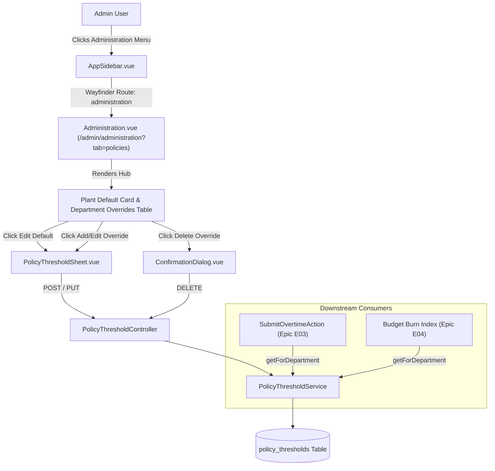
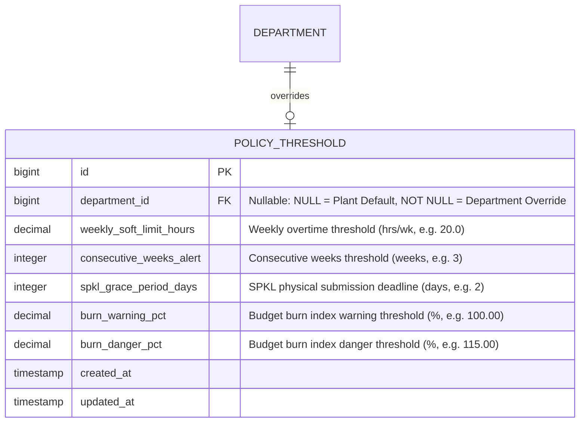

# Policy Threshold Configuration & Hierarchical Fallback

## Overview

The Policy Threshold Configuration module (Story **[E02-04]**) allows factory administrators to define and maintain company policy thresholds for overtime safety limits, SPKL submission deadlines, and budget burn alert levels. Adhering to the **Epic-02 UX Plan**, this capability lives inside the consolidated **Administration Hub** (`/admin/administration?tab=policies`), avoiding administrative screen sprawl. The architecture features a **hierarchical fallback engine** (`PolicyThresholdService`), where every department automatically inherits the plant-wide default policy unless a customized departmental override is explicitly provisioned.

## Architecture Diagram

## Data Model

## Key Files & UI Mapping

| Layer                 | File / Route / Menu                                                                                                     | Purpose                                                                                                     |
| --------------------- | ----------------------------------------------------------------------------------------------------------------------- | ----------------------------------------------------------------------------------------------------------- |
| **Sidebar Menu**      | `Administration`                                                                                                        | Administrative entry point visible only to Admin role (`/admin/administration`)                             |
| **Page Component**    | `resources/js/pages/admin/Administration.vue`                                                                           | Consolidated 2-tab Administration Hub (`policies` and `users`)                                              |
| **Form Sheet**        | `resources/js/components/admin/PolicyThresholdSheet.vue`                                                                | Slide-in drawer for editing plant defaults and configuring department overrides                             |
| **Dialog Component**  | `resources/js/components/admin/ConfirmationDialog.vue`                                                                  | Reusable modal dialog for verifying department override removal                                             |
| **Hub Controller**    | `app/Http/Controllers/Admin/AdministrationController.php`                                                               | Renders Administration Hub with plant default and department status metrics                                 |
| **Policy Controller** | `app/Http/Controllers/Admin/PolicyThresholdController.php`                                                              | Handles threshold store, update, and override deletion                                                      |
| **Service Layer**     | `app/Services/PolicyThresholdService.php`                                                                               | Hierarchical inheritance engine (`getForDepartment`, `getPlantDefault`, `saveOverride`)                     |
| **Model**             | `app/Models/PolicyThreshold.php`                                                                                        | Eloquent model with `scopePlantDefault` and `scopeForDepartment`                                            |
| **Form Requests**     | `app/Http/Requests/Admin/StorePolicyThresholdRequest.php` `app/Http/Requests/Admin/UpdatePolicyThresholdRequest.php` | Request validation enforcing numeric limits and logical constraints (`burn_danger_pct >= burn_warning_pct`) |
| **Factory**           | `database/factories/PolicyThresholdFactory.php`                                                                         | Model factory supporting `plantDefault()` and `forDepartment()` states                                      |

## Flow Explanation

### 1. Plant-wide Default Configuration

1. Plant baseline parameters are stored in `policy_thresholds` where `department_id IS NULL`.
2. On initial deployment or fresh installs, `PolicyThresholdService::getPlantDefault()` automatically seeds baseline values (20.0 hrs/wk, 3 weeks alert, 2 days grace, 100% warning, 115% danger) if unseeded.
3. The administrator edits plant-wide defaults via the top summary card. Changes take effect immediately on next page load for analytics and for new timesheet entries.

### 2. Department Override Lifecycle

1. Administrators configure a department-specific override by opening the slide-in drawer and selecting a target department.
2. The system saves the record with `department_id = $deptId`. Only one override record can exist per department.
3. In the UI, the department row immediately switches its inheritance status badge from `Standar Pabrik (Inherited)` to `Kustom / Override Aktif`.
4. If an administrator deletes an override via `ConfirmationDialog`, the custom record is removed and the department seamlessly reverts to inheriting the plant-wide default.

### 3. Downstream Hierarchical Fallback Consumption

1. Downstream services (e.g. `SubmitOvertimeAction` in E03 or `BurnIndexCalculator` in E04) call `PolicyThresholdService::getForDepartment($departmentId)`.
2. The service queries for an override where `department_id = $departmentId`.
3. If an override exists, it is returned; otherwise, the method transparently returns the plant-wide default.

## Decisions & Trade-offs

- **Nullable Foreign Key for Baseline**: Rather than splitting baseline policies into a separate table or config file, a single `policy_thresholds` table with a nullable `department_id` is used. This ensures identical schema, validation rules, and casts across baseline and override records.
- **Drawer over Dedicated Route**: Adhering to the zero administrative bloat philosophy of Epic-02, policy thresholds are modified in slide-in drawers (`Sheet`) rather than dedicated route pages.
- **Immediate Propagation without Invalidation Latency**: Threshold checks run directly via Eloquent lookups without stale caching, ensuring regulatory updates take immediate effect across production lines.

## Related

- [Department & Section Hierarchy Management](department-section-management.md)
- [ADR-010: Policy Threshold Hierarchical Inheritance Fallback](../decisions/010-policy-threshold-hierarchical-inheritance-fallback.md)
- [Policy Threshold Configuration User Guide](../../user-docs/guides/policy-threshold-configuration.md)
