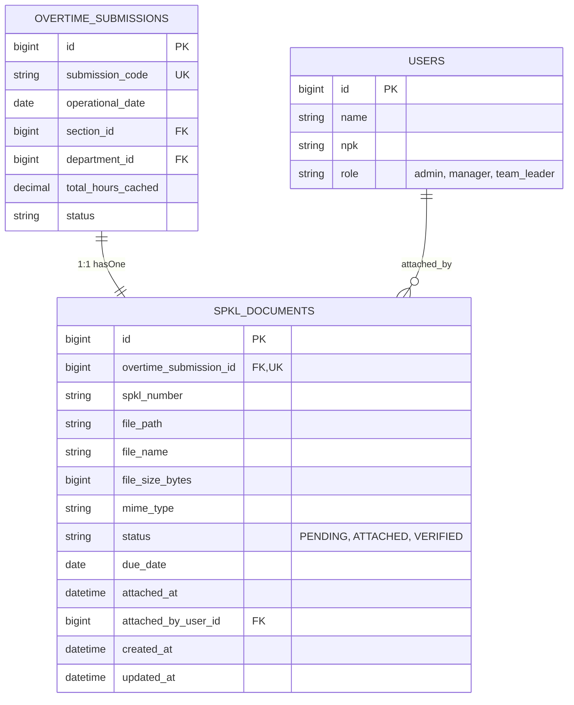

# SPKL Flexible Post-Shift Attachment & Lifecycle Workflow

## Overview

In automotive manufacturing operations, overtime work is initiated dynamically on the factory floor (e.g. line recovery, die repairs, or supplier delays) while physical paperwork—the _Surat Perintah Kerja Lembur_ (SPKL)—is circulating physically for supervisor signatures.

To enforce **Business Rule BR-05 (Non-Blocking SPKL)**, the system permits Team Leaders to submit shift overtime hours and lock financial cost snapshots immediately upon shift completion without being blocked by physical paperwork. The SPKL attachment workflow enables flexible post-shift document attachment (scan/photo upload up to 3 MB or physical document number entry), private disk file isolation, automatic file replacement without orphan leakage, manager verification, and secure file serving via temporary signed URLs.

---

## Architecture Diagram

```mermaid
flowchart TD
    subgraph UI [Frontend User Surfaces]
        SC[PostSubmissionSuccessCard<br/>'Lampirkan SPKL Sekarang']
        IH[Overtime History Table Row<br/>'Lampirkan SPKL']
        DM[SubmissionDetailModal<br/>'Lampirkan SPKL' / 'Verifikasi SPKL']
        US[SpklUploadSheet<br/>Slide-in Right Drawer]
    end

    subgraph Backend [Laravel Application Services]
        SC -->|Trigger Event| US
        IH -->|Open Sheet| US
        DM -->|Open Sheet| US

        US -->|POST /overtime/submissions/{id}/spkl| SDC_Attach[SpklDocumentController@attach]
        SDC_Attach --> REQ[AttachSpklDocumentRequest]
        REQ --> ACT[AttachSpklDocumentAction]

        DM -->|PATCH /overtime/submissions/{id}/spkl/verify| SDC_Verify[SpklDocumentController@verify]
        DM -->|GET /overtime/submissions/{id}/spkl/download| SDC_DL[SpklDocumentController@download]
    end

    subgraph Storage_Layer [Storage & Database]
        ACT -->|Store file / Replace prior| DISK[(Storage Disk: spkl-private)]
        ACT -->|Update status: ATTACHED| DB[(Database: spkl_documents)]
        SDC_Verify -->|Update status: VERIFIED| DB
        SDC_DL -->|Generate 15-min signed URL| SURL[Storage::temporaryUrl]
        SURL --> DISK
    end
```

---

## Data Model



---

## Key Files & UI Mapping

| Layer             | File / Route / Component                                         | Purpose                                                                                                 |
| :---------------- | :--------------------------------------------------------------- | :------------------------------------------------------------------------------------------------------ |
| **Drawer UI**     | `resources/js/components/overtime/SpklUploadSheet.vue`           | Slide-in drawer with drag-drop zone, camera photo picker, SPKL number input, and countdown banner.      |
| **Success Card**  | `resources/js/components/overtime/PostSubmissionSuccessCard.vue` | Post-submission prompt offering immediate _"Lampirkan SPKL Sekarang"_ entry point.                      |
| **Modal UI**      | `resources/js/components/overtime/SubmissionDetailModal.vue`     | Renders SPKL audit status, download button, and Manager verification action.                            |
| **History Hub**   | `resources/js/pages/overtime/Index.vue`                          | Lists submissions with SPKL badge (`Terlampir`, `Pending`, `⚠️ Terlambat`) and row attachment trigger.  |
| **Form Request**  | `app/Http/Requests/Overtime/AttachSpklDocumentRequest.php`       | Validates file format (`pdf,jpeg,png`), max size (`3072 KB`), and section access authorization.         |
| **Domain Action** | `app/Actions/Overtime/AttachSpklDocumentAction.php`              | Atomic transaction to store file on private disk, purge prior file, and transition state to `ATTACHED`. |
| **Controller**    | `app/Http/Controllers/Overtime/SpklDocumentController.php`       | Exposes `attach()`, `verify()`, and `download()` methods with RBAC checks.                              |
| **Model**         | `app/Models/SpklDocument.php`                                    | Eloquent entity with `isDueOverdue(): bool` and status query scopes.                                    |
| **Disk Config**   | `config/filesystems.php`                                         | Defines `spkl-private` disk with `serve => true` and dedicated URL path.                                |

---

## Flow Explanation

### 1. Attachment Trigger

- **From Form**: When a Team Leader submits an overtime timesheet on `/overtime/submissions/create`, the submission record is atomically saved with a linked `SpklDocument` in `PENDING` state with a 2-day grace period `due_date`. The `PostSubmissionSuccessCard` displays _"Lampirkan SPKL Sekarang"_. Clicking it slides out `SpklUploadSheet`.
- **From History Hub**: In `/overtime/submissions`, any row displays a _"Lampirkan SPKL"_ action button.
- **From Detail Modal**: Opening the read-only detail modal provides a _"Lampirkan SPKL"_ or _"Ganti Berkas"_ button. Following the single-layer dialog UX constraint, clicking it closes the modal and opens the slide-in drawer.

### 2. File Validation & Upload

- The user can drag-and-drop a scan/photo or use native camera capture (`accept=".pdf,image/png,image/jpeg,image/jpg"`).
- Client-side validation checks file size (≤ 3 MB) and format.
- Team Leaders can also input an optional physical SPKL registration number (e.g. `SPKL/PROD/2026/IX/089`). Alternatively, if a scanner/camera is temporarily unavailable, entering the physical reference number alone transitions the document to `ATTACHED`.
- Form data is dispatched to `POST /overtime/submissions/{submission}/spkl`.

### 3. Backend Storage & Orphan File Cleanup

- `AttachSpklDocumentRequest` validates section access (`$user->canAccessSection($submission->section_id)`).
- `AttachSpklDocumentAction` executes within a database transaction:
    1. Checks if a prior file exists in `spkl_documents.file_path` on the `spkl-private` disk. If present, it deletes the old file to prevent disk bloat.
    2. Stores the newly uploaded file under `submissions/{submission_id}/{filename}` on `spkl-private`.
    3. Updates `spkl_documents` metadata (`file_name`, `file_size_bytes`, `mime_type`, `spkl_number`, `status = 'ATTACHED'`, `attached_at = now()`, `attached_by_user_id = $userId`).

### 4. Manager Verification

- Department Managers or Plant Administrators review the timesheet and attached document.
- In `SubmissionDetailModal`, a Manager clicks _"Verifikasi SPKL"_.
- The request hits `PATCH /overtime/submissions/{submission}/spkl/verify`.
- Backend checks role (`$user->isManager() || $user->isAdmin()`), section scope, and document state (`ATTACHED`).
- The status transitions to `VERIFIED`.

### 5. Secure File Serving

- SPKL documents are stored on a private disk outside the public `public/` web server docroot.
- When an authorized user clicks _"Unduh SPKL"_, `GET /overtime/submissions/{submission}/spkl/download` executes authorization checks and returns a temporary signed URL valid for 15 minutes (`Storage::disk('spkl-private')->temporaryUrl()`).

---

## API Endpoints & Routes

| Method  | URI                                                | Controller Action                 | Purpose                                | Auth & Roles                                          |
| :------ | :------------------------------------------------- | :-------------------------------- | :------------------------------------- | :---------------------------------------------------- |
| `POST`  | `/overtime/submissions/{submission}/spkl`          | `SpklDocumentController@attach`   | Upload scan/photo or enter SPKL number | `auth, role:admin,manager,team_leader`, section check |
| `PATCH` | `/overtime/submissions/{submission}/spkl/verify`   | `SpklDocumentController@verify`   | Verify attached SPKL document          | `auth, role:admin,manager`, department check          |
| `GET`   | `/overtime/submissions/{submission}/spkl/download` | `SpklDocumentController@download` | Download or get signed temporary URL   | `auth, role:admin,manager,team_leader`, section check |

---

## Decisions & Trade-offs

1. **Private Disk vs Public Storage**: Manufacturing SPKL forms contain operator names, overtime hours, and supervisor signatures. Storing them in `storage/app/public` would expose audit documents. Storing in `spkl-private` outside the web root with signed temporary URLs ensures strict RBAC access.
2. **Non-Blocking Paperwork (BR-05)**: Mandating SPKL upload before timesheet submission caused end-of-shift administrative bottlenecks in factory plants. Allowing post-shift attachment with an automated due-date countdown ensures immediate payroll calculation while preserving audit compliance.
3. **Single Drawer Depth**: Rather than stacking an upload modal on top of the timesheet detail modal, clicking _"Lampirkan SPKL"_ from the modal cleanly closes the modal and opens the slide-in sheet, strictly adhering to the 1-layer dialog rule.
4. **Physical Number Fallback**: In case factory cameras or scanners are temporarily down, Team Leaders can attach the physical reference number alone, transitioning the document to `ATTACHED` without halting compliance.

---

## Related Documentation

- **[ADR-003: Non-Blocking SPKL Document Attachment with Policy Grace Periods](../decisions/003-non-blocking-spkl-document-workflow.md)**
- **[End-User Guide: SPKL Document Attachment](../../user-docs/guides/spkl-document-attachment.md)**
- **[Epic-03 Scrum Source of Truth](../../scrum/Epic-03.md)**
