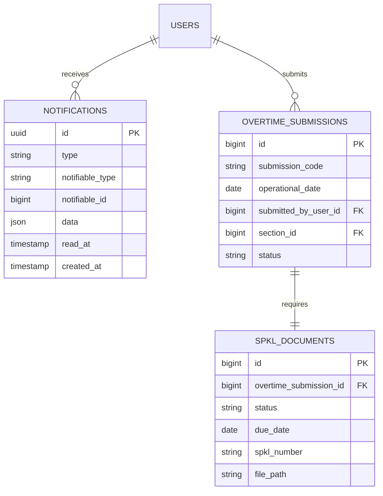

# SPKL Pending Reminder & In-App Notifications (E03-05)

## Overview

The SPKL Pending Reminder system automates the tracking of post-shift overtime order forms (_Surat Perintah Kerja Lembur_). Because the application enforces a non-blocking workflow (BR-05) allowing shifts to proceed before physical paperwork is uploaded, this feature monitors pending SPKL documents and delivers timely in-app alerts to submitting Team Leaders before and after the 48-hour grace period expires.

## Architecture Diagram

```mermaid
flowchart TD
    Scheduler["Cron Scheduler (08:00 WIB)"] --> ConsoleCommand["DispatchSpklRemindersCommand<br/>(php artisan overtime:spkl-reminders)"]
    ConsoleCommand --> Job["SendSpklReminderJob"]

    subgraph Evaluation [Evaluation Engine (Asia/Jakarta)]
        Job --> OverdueCheck["Query Overdue: status = PENDING & due_date <= today"]
        Job --> PreDueCheck["Query Pre-due: status = PENDING & due_date == tomorrow"]
        OverdueCheck --> UserPref{"User Preference Enabled?<br/>(spkl_pending_reminder)"}
        PreDueCheck --> UserPref
        UserPref -->|Yes| Idempotency{"Already Sent Today?"}
        UserPref -->|No| Skip[Skip]
        Idempotency -->|No| StoreNotif["Store Database Notification"]
        Idempotency -->|Yes| Skip
    end

    StoreNotif --> DB["notifications table"]

    subgraph Client [Client UI & Resolution]
        DB --> InertiaMiddleware["HandleInertiaRequests: unread_notifications_count"]
        InertiaMiddleware --> TopbarBell["NotificationBell.vue (Badge Pill)"]
        TopbarBell --> Popover["Notification Dropdown List"]
        Popover -->|Click Lampirkan| Drawer["SpklUploadSheet.vue"]
        Drawer -->|Upload Success| MarkRead["PATCH /notifications/{id}/read"]
        MarkRead --> Decrement["Decrement Badge & Clear Item"]
    end
```

## Data Model



## Key Files & UI Mapping

| Layer               | File / Route / Menu                                                                                | Purpose                                                                 |
| ------------------- | -------------------------------------------------------------------------------------------------- | ----------------------------------------------------------------------- |
| Topbar Component    | `resources/js/components/NotificationBell.vue`                                                     | Topbar bell icon with unread badge counter and popover list             |
| Topbar Container    | `resources/js/components/AppSidebarHeader.vue`                                                     | Embeds bell next to the live WIB clock                                  |
| Drawer Component    | `resources/js/components/overtime/SpklUploadSheet.vue`                                             | 1-click SPKL attachment drawer launched directly from notification card |
| Controller          | `app/Http/Controllers/NotificationController.php`                                                  | Handles `index`, `markAsRead`, and `markAllAsRead` API requests         |
| Notifications       | `app/Notifications/SpklOverdueNotification.php`<br/>`app/Notifications/SpklPreDueNotification.php` | Queued database notification definitions                                |
| Background Job      | `app/Jobs/SendSpklReminderJob.php`                                                                 | Evaluates pending SPKL documents in `Asia/Jakarta` time                 |
| Artisan Command     | `app/Console/Commands/DispatchSpklRemindersCommand.php`                                            | CLI entry point dispatched daily at 08:00 WIB via scheduler             |
| Schedule Definition | `routes/console.php`                                                                               | Schedules `overtime:spkl-reminders` at 08:00 WIB daily                  |

## Flow Explanation

1. **Scheduled Daily Trigger**:
    - At 08:00 WIB every morning, Laravel's scheduler executes `php artisan overtime:spkl-reminders`.
    - The command dispatches `SendSpklReminderJob` to the background queue (or executes synchronously with `--sync`).
2. **Pending Document Evaluation**:
    - `SendSpklReminderJob` queries `SpklDocument` records where `status = 'PENDING'` in Western Indonesia Time (`Asia/Jakarta`).
    - Overdue records (`due_date <= today`) trigger `SpklOverdueNotification`.
    - Pre-due records (`due_date == tomorrow`) trigger `SpklPreDueNotification`.
3. **Preference & Idempotency Safeguards**:
    - The job inspects the submitting Team Leader's effective preferences (`spkl_pending_reminder`). If disabled, reminders are suppressed.
    - The job inspects existing notifications sent today for the same submission and reminder type to prevent duplicate alerts.
4. **In-App Topbar Badge & Popover**:
    - On page visits, `HandleInertiaRequests` shares `unread_notifications_count` to immediately display the red badge pill on the bell icon.
    - Clicking the bell opens `NotificationBell.vue`, which queries `GET /notifications` for detailed cards showing submission code, section, and due dates.
5. **User Journey 5 Resolution**:
    - Clicking **Lampirkan** on a notification card opens `SpklUploadSheet` preloaded with the target submission's metadata.
    - Upon successful document upload, the notification is automatically marked as read (`PATCH /notifications/{id}/read`), resolving the alert and decrementing the topbar counter without leaving the current view.
    - Alternatively, supervisors can dismiss notifications using the checkmark icon or click **Tandai Semua Dibaca**.
6. **Non-Blocking Rule (BR-05)**:
    - Overdue notifications are purely advisory. Team Leaders retain unrestricted access to timesheet submission forms (`/overtime/submissions/create`).

## API Endpoints & Routes

| Method | URI                        | Controller Action                      | Purpose                                               | Auth           |
| ------ | -------------------------- | -------------------------------------- | ----------------------------------------------------- | -------------- |
| GET    | `/notifications`           | `NotificationController@index`         | Fetch unread notifications for the authenticated user | auth, verified |
| PATCH  | `/notifications/{id}/read` | `NotificationController@markAsRead`    | Mark a specific notification as read                  | auth, verified |
| PATCH  | `/notifications/read-all`  | `NotificationController@markAllAsRead` | Mark all unread notifications as read                 | auth, verified |

## Decisions & Trade-offs

- **Database Channel over Email/SMS**: In-app notifications provide immediate factory floor visibility on shopfloor rugged terminals and smartphones without dependency on external mail gateways or SMS delivery costs.
- **Idempotency Guard**: Running reminders twice in a single day (e.g. manual dispatch during testing or retry on worker restart) will not produce duplicate notifications for the same submission.
- **Client-Side Slide-In Sheet Integration**: Embedding `SpklUploadSheet` directly inside `NotificationBell.vue` fulfills the User Journey 5 requirement of resolving overdue files in 3 clicks without page transitions.

## Related

- `docs/scrum/Epic-03.md` — Epic 03: Daily Overtime Entry & SPKL Workflow
- `docs/scrum/Epic-03-ux-plan.md` — UX Plan & User Journey 5 Specification
- `docs/dev-docs/decisions/014-automated-spkl-reminders-and-in-app-notifications.md` — ADR-014
- `docs/dev-docs/features/spkl-document-workflow.md` — SPKL Document Workflow Feature Documentation
