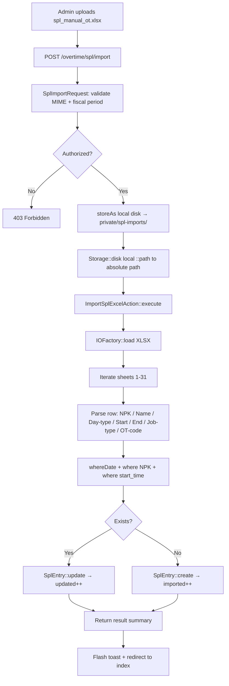
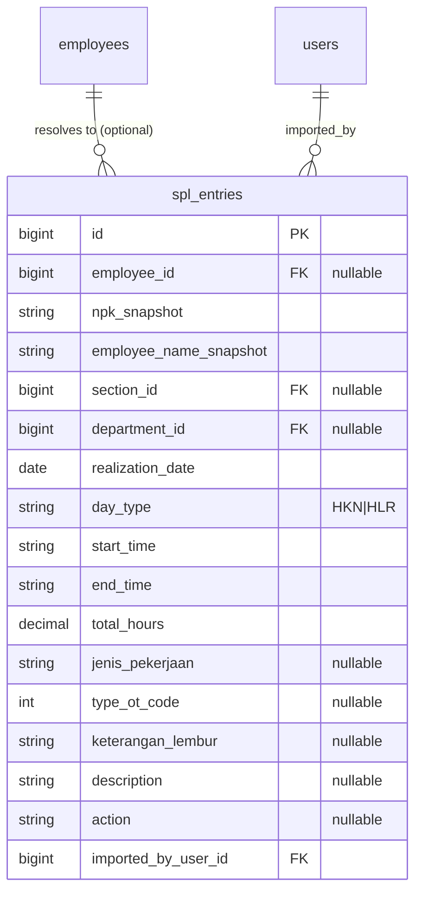

# SPL Excel Import

## Overview

The SPL Import feature allows administrators and managers to upload the factory's standard
`spl_manual_ot.xlsx` file to persist realized overtime records into the database. Each Excel
sheet is named after the day-of-month (1–31). The system upserts records using the composite
key **NPK + Realization Date + Start Time**, so re-uploading the same file updates existing
rows rather than duplicating them.

---

## Architecture Diagram

---

## Data Model

Unique constraint: `(npk_snapshot, realization_date, start_time)` — the upsert key.

---

## Key Files & UI Mapping

| Layer          | File / Route / Menu                                     | Purpose                                 |
| -------------- | ------------------------------------------------------- | --------------------------------------- |
| Sidebar Menu   | **Input Lembur (SPL)**                                  | User entry point                        |
| Page           | `resources/js/pages/overtime/SplImport.vue`             | Upload form + entries table             |
| Controller     | `app/Http/Controllers/Overtime/SplImportController.php` | Upload, list, delete                    |
| Import Action  | `app/Actions/Overtime/ImportSplExcelAction.php`         | PhpSpreadsheet parsing + upsert         |
| Import Request | `app/Http/Requests/Overtime/SplImportRequest.php`       | MIME / size / fiscal period validation  |
| Model          | `app/Models/SplEntry.php`                               | Realized overtime row                   |
| Factory        | `database/factories/SplEntryFactory.php`                | Test seeding                            |
| Migration      | `2026_09_22_132414_create_spl_entries_table.php`        | DDL                                     |
| Feature Tests  | `tests/Feature/SplImportTest.php`                       | Auth, unit action, controller, deletion |

---

## Routes

| Method | URI                     | Name                   | Auth Gate       |
| ------ | ----------------------- | ---------------------- | --------------- |
| GET    | `/overtime/spl`         | `overtime.spl.index`   | admin / manager |
| POST   | `/overtime/spl/import`  | `overtime.spl.import`  | admin / manager |
| DELETE | `/overtime/spl/{entry}` | `overtime.spl.destroy` | admin only      |

---

## Excel Template Structure

The `spl_manual_ot.xlsx` reference file contains one sheet per working day:

| Sheet Name       | Meaning                              |
| ---------------- | ------------------------------------ |
| `1` through `31` | Day of the fiscal month              |
| Other sheets     | Reference data (skipped by importer) |

Each sheet, starting at **row 13**:

| Column | Index | Content                                               |
| ------ | ----- | ----------------------------------------------------- |
| A      | 1     | Row number                                            |
| B      | 2     | Employee name (`NAMA KARYAWAN`)                       |
| C      | 3     | NPK/SAP                                               |
| D      | 4     | Day code (`HKN` / `HLR`)                              |
| E      | 5     | Start time (`MULAI`)                                  |
| F      | 6     | End time (`SELESAI`)                                  |
| G      | 7     | Total hours (computed, ignored — recalculated by app) |
| H      | 8     | Job type (`JENIS PEKERJAAN`)                          |
| J      | 10    | OT type code                                          |
| K      | 11    | Overtime notes                                        |

---

## Total Hours Calculation

The action recalculates total hours from raw start/end times rather than trusting the
Excel formula:

1. Parse start/end to minutes-since-midnight.
2. Handle overnight shifts by adding 1440 min when `end ≤ start`.
3. Floor to nearest 0.25 h.
4. Deduct break if either `12:46` or `18:46` falls within the window:
    - **HLR** (holiday): −1.25 h
    - **HKN** (workday): −0.5 h
5. Clamp to zero minimum.

---

## Storage Path Note

The `local` disk is configured with root `storage_path('app/private')`. The controller uses
`Storage::disk('local')->path($relativePath)` to resolve the absolute path rather than
hardcoding `storage_path('app/...')`, which would produce the wrong directory.

---

## Decisions & Trade-offs

- **Separate `spl_entries` table** — realized overtime from paper SPLs has different provenance,
  approval lifecycle, and data fields compared to the electronic overtime submission flow.
  See ADR-037.
- **`whereDate()` for upsert lookup** — `realization_date` has a `date` Eloquent cast.
  SQLite stores it as `Y-m-d H:i:s` text, so a plain `->where('realization_date', '2026-09-05')`
  fails. `->whereDate(...)` uses SQL `DATE()` which works on both drivers.
- **PhpSpreadsheet 5.x compatibility** — `getCellByColumnAndRow()` was removed in v5.
  The action uses `Coordinate::stringFromColumnIndex($col) . $row` via the `cellValue()`
  helper method instead.

---

## Related

- [Overtime Planning OT](./overtime-planning-ot.md)
- [ADR-037: Separate Tables for Planned vs Realized Overtime](../decisions/037-planned-vs-realized-overtime-tables.md)
- [Daily Overtime SPKL](./daily-overtime-spkl.md)
