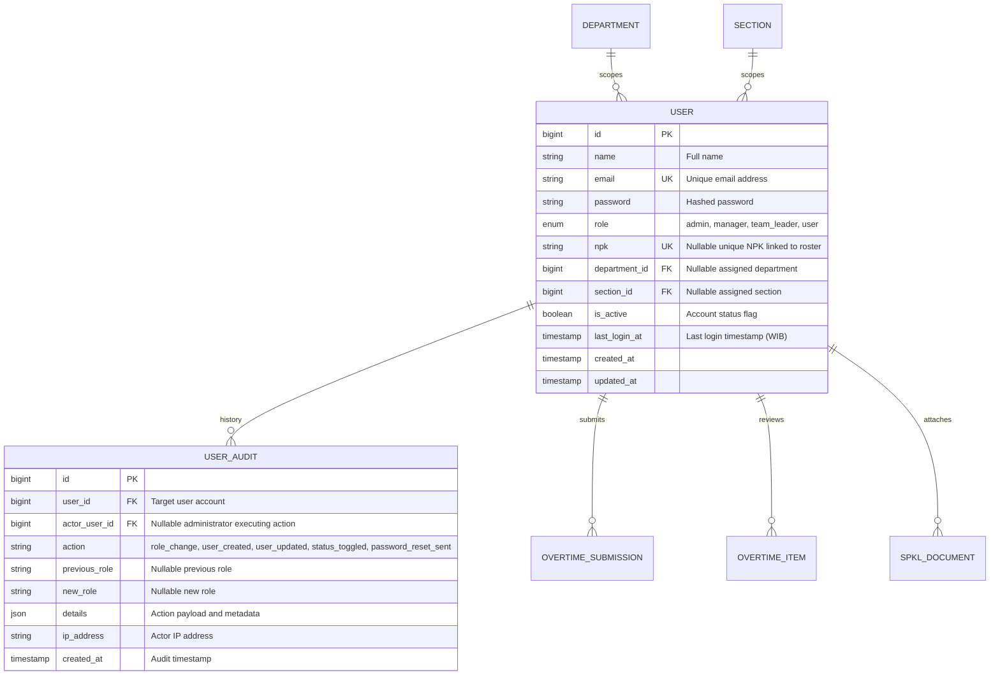

# User Account Management & Role-Based Access Control (RBAC)

## Overview

The User Account Management module (Story **[E02-05]**) provides centralized lifecycle administration, role-based access control (RBAC), and credential management for system accounts. Fully compliant with the **Epic-02 UX Plan**, this surface resides inside the consolidated **Administration Hub** (`/admin/administration?tab=users`) alongside Policy Thresholds, eliminating administrative screen fragmentation. The architecture features **immutable self-protection guards** against administrator self-lockout, an automated **role-change audit trail** (`user_audits`), and strict referential integrity checks preventing the deletion of accounts with historical overtime records.

## Architecture Diagram

```mermaid
flowchart TD
    Admin[Admin User] -->|Clicks Administration Menu| Sidebar[AppSidebar.vue]
    Sidebar -->|Wayfinder Route: administration| Hub["Administration.vue (/admin/administration?tab=users)"]
    Hub -->|Renders Directory| Table[User Accounts Table & Filter Toolbar]

    Table -->|Click + Add User| Sheet[UserFormSheet.vue]
    Table -->|Click Edit User| Sheet
    Table -->|Click Status Toggle| StatusDialog[ConfirmationDialog.vue]
    Table -->|Click Reset Password| ResetDialog[ConfirmationDialog.vue]
    Table -->|Click Delete User| DeleteDialog[ConfirmationDialog.vue]

    Sheet -->|POST /admin/users| UserCtrl[UserController@store]
    Sheet -->|PUT /admin/users/{user}| UserCtrlUpdate[UserController@update]
    StatusDialog -->|PUT /admin/users/{user}| UserCtrlUpdate
    ResetDialog -->|POST /admin/users/{user}/reset-password| UserCtrlReset[UserController@sendResetLink]
    DeleteDialog -->|DELETE /admin/users/{user}| UserCtrlDelete[UserController@destroy]

    UserCtrl --> UserSvc[UserService]
    UserCtrlUpdate --> UserSvc
    UserCtrlReset --> UserSvc
    UserCtrlDelete --> UserSvc

    UserSvc --> UsersDB[(users Table)]
    UserSvc --> AuditsDB[(user_audits Table)]
    UserSvc --> PasswordBroker[Password::broker]

    subgraph Authentication & Event Listeners
        UserLogin[User Logs In via Fortify] --> AuthEvent[Illuminate\Auth\Events\Login]
        AuthEvent --> Listener[UpdateUserLastLogin]
        Listener -->|Stamps last_login_at| UsersDB
    end
```

## Data Model



## Key Files & UI Mapping

| Layer                | File / Route / Menu                                       | Purpose                                                                              |
| -------------------- | --------------------------------------------------------- | ------------------------------------------------------------------------------------ |
| **Sidebar Menu**     | `Administration`                                          | Administrative entry point visible only to Admin role (`/admin/administration`)      |
| **Page Component**   | `resources/js/pages/admin/Administration.vue`             | Consolidated 2-tab Administration Hub (`policies` and `users`)                       |
| **Form Sheet**       | `resources/js/components/admin/UserFormSheet.vue`         | Slide-in drawer for user provisioning and credential updates                         |
| **Dialog Component** | `resources/js/components/admin/ConfirmationDialog.vue`    | Reusable modal dialog for status toggles, password resets, and user deletion         |
| **Hub Controller**   | `app/Http/Controllers/Admin/AdministrationController.php` | Renders Administration Hub passing paginated users, KPI counters, roles, and filters |
| **User Controller**  | `app/Http/Controllers/Admin/UserController.php`           | Handles store, update, destroy, and password reset link dispatch                     |
| **Service Layer**    | `app/Services/UserService.php`                            | User lifecycle business logic, self-lockout guards, and audit logging                |
| **Form Requests**    | `app/Http/Requests/Admin/StoreUserRequest.php`            | Validates user creation, role enums, unique credentials, and section-dept hierarchy  |
| **Form Requests**    | `app/Http/Requests/Admin/UpdateUserRequest.php`           | Validates updates and enforces self-lockout guards against deactivation and demotion |
| **Event Listener**   | `app/Listeners/UpdateUserLastLogin.php`                   | Listens to authentication events and stamps `last_login_at`                          |
| **Wayfinder Routes** | `resources/js/routes/admin/users/index.ts`                | Auto-generated typed route bindings for user administration                          |

## Flow Explanation

### 1. User Provisioning (`POST /admin/users`)

1. **Trigger**: Admin clicks `+ Add User Account` in `/admin/administration?tab=users`.
2. **Drawer Presentation**: `UserFormSheet.vue` opens with empty fields and default role `user`.
3. **Cascading Validation**: When Admin selects a Department, the Section selector dynamically filters to active child sections of that department.
4. **Submission**: Handled by `StoreUserRequest` validating required name, unique lowercase email, password requirements, role enum, and section hierarchy.
5. **Execution**: `UserService::create()` hashes password, persists user, and records a `user_created` audit entry in `user_audits`.
6. **Feedback**: Flash success notification displayed, drawer closes, and new user appears in the paginated directory.

### 2. Role-Change Auditing & Self-Lockout Protection (`PUT /admin/users/{user}`)

1. **Self-Lockout Interception**: If an Admin attempts to update their own account (`auth()->id() === $user->id`), both `UpdateUserRequest` and `UserService::update()` block attempts to set `is_active = false` or change `role` to anything other than `admin`.
2. **Audit Recording**: If the target user's role is modified, `UserService` records a `role_change` audit entry capturing `user_id`, `actor_user_id`, `previous_role`, `new_role`, and IP address.
3. **Session Enforcement**: Deactivated users (`is_active = false`) are blocked from authentication in `FortifyServiceProvider` and rejected by `EnsureRole` middleware.

### 3. Password Reset Trigger (`POST /admin/users/{user}/reset-password`)

1. **Trigger**: Admin clicks the key icon on a user row in the directory.
2. **Confirmation**: `ConfirmationDialog.vue` prompts confirmation with details on the 60-minute link expiration.
3. **Broker Dispatch**: Calls `Password::broker()->sendResetLink(['email' => $user->email])`.
4. **Audit Entry**: Logs `password_reset_sent` in `user_audits`.
