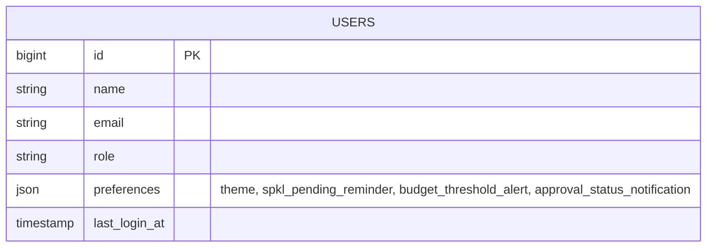

# User Preferences & Display Standards (E02-06)

## Overview

User Preferences & Display Standards enables authenticated users to customize their visual experience (theme mode: Light, Dark, System), configure operational notification channel alerts (SPKL pending reminders, budget threshold alerts, and approval status notifications), and review company-enforced manufacturing plant display standards (WIB timezone, DD/MM/YYYY date formatting, and Rupiah currency).

## Architecture Diagram

```mermaid
flowchart TD
    subgraph UI_Surface [User Interface Surface]
        AvatarMenu[User Avatar Dropdown] --> SettingsRoute[/settings/profile]
        SettingsRoute --> NavItem[Preferences Tab]
        NavItem --> PrefPage[resources/js/pages/settings/Preferences.vue]
    end

    subgraph Client_State [Client-Side State]
        PrefPage --> ThemeHook[useAppearance Composable]
        ThemeHook --> DOMClass[html.dark class toggle]
    end

    subgraph Backend_Pipeline [Laravel Backend Pipeline]
        PrefPage -->|PATCH /settings/preferences| FormReq[UpdatePreferencesRequest]
        FormReq --> Controller[PreferencesController@update]
        Controller --> UserModal[User Model]
        UserModal --> DB[(users.preferences JSON)]
    end
```

## Data Model



## Key Files & UI Mapping

| Layer              | File / Route / Menu                                                        | Purpose                                                 |
| ------------------ | -------------------------------------------------------------------------- | ------------------------------------------------------- |
| Avatar Menu        | User Avatar Dropdown -> `Settings`                                         | User entry point in UI                                  |
| Sidebar Navigation | `resources/js/layouts/settings/Layout.vue`                                 | Navigation item `Preferences`                           |
| Page Component     | `resources/js/pages/settings/Preferences.vue`                              | Interactive preferences page                            |
| Composable         | `resources/js/composables/useAppearance.ts`                                | Reactive theme state & class toggle                     |
| Controller         | `app/Http/Controllers/Settings/PreferencesController.php`                  | Renders and updates preferences                         |
| Form Request       | `app/Http/Requests/Settings/UpdatePreferencesRequest.php`                  | Validates theme & notification flags                    |
| Model              | `app/Models/User.php`                                                      | Casts `preferences` as JSON array with default fallback |
| Migration          | `database/migrations/2026_01_03_000001_add_preferences_to_users_table.php` | Adds `preferences` column                               |

## Flow Explanation

1. **User triggers:** The user clicks their avatar menu at the bottom-left sidebar, selects **Settings**, and clicks **Preferences** in the settings sidebar navigation.
2. **Request handling:** The request is routed to `PreferencesController@edit`, which retrieves the user's preferences via `User::getEffectivePreferences()`, merging stored preferences with company defaults.
3. **Client-side theme toggle:** When the user selects a theme radio card (Light, Dark, or System), `useAppearance().updateAppearance()` is immediately executed, updating local storage and toggling the `dark` class on the `<html>` root without reloading the page.
4. **Form submission:** Submitting the form triggers a PATCH request to `PreferencesController@update` with validation rules enforcing valid theme choices (`light`, `dark`, `system`) and booleans for notification flags.
5. **Response:** A flash toast (`Preferences updated successfully.`) is returned, and updated preferences persist in `users.preferences`.

## API Endpoints & Routes

| Method | URI                     | Controller Action              | Purpose                 | Auth           |
| ------ | ----------------------- | ------------------------------ | ----------------------- | -------------- |
| GET    | `/settings/preferences` | `PreferencesController@edit`   | Show preferences form   | auth, verified |
| PATCH  | `/settings/preferences` | `PreferencesController@update` | Update user preferences | auth, verified |

## Decisions & Trade-offs

- **JSON Column Storage vs. Dedicated Table:** Storing preferences directly in a `users.preferences` JSON column avoids schema bloat and unnecessary database joins for simple key-value UI flags while allowing future preference keys to be added without migrations.
- **Client-Side Immediate Theme Switching:** Rather than waiting for a full round-trip page refresh to apply dark mode, `useAppearance` mutates the document DOM immediately, giving instant visual feedback while persisting the selection via Inertia.
- **Read-Only Plant Standards Banner:** Plant timezone (`WIB`), date format (`DD/MM/YYYY`), and currency (`Rp`) are displayed as fixed corporate standards to prevent discrepancies across shift rosters and manufacturing audit trails.

## Related

- Feature Doc: [User Account Management](user-account-management.md)
- ADR: [012 - User Preferences and Display Standards](../decisions/012-user-preferences-and-display-standards.md)
- User Guide: [User Preferences & Display Standards](../../user-docs/guides/user-preferences-settings.md)
