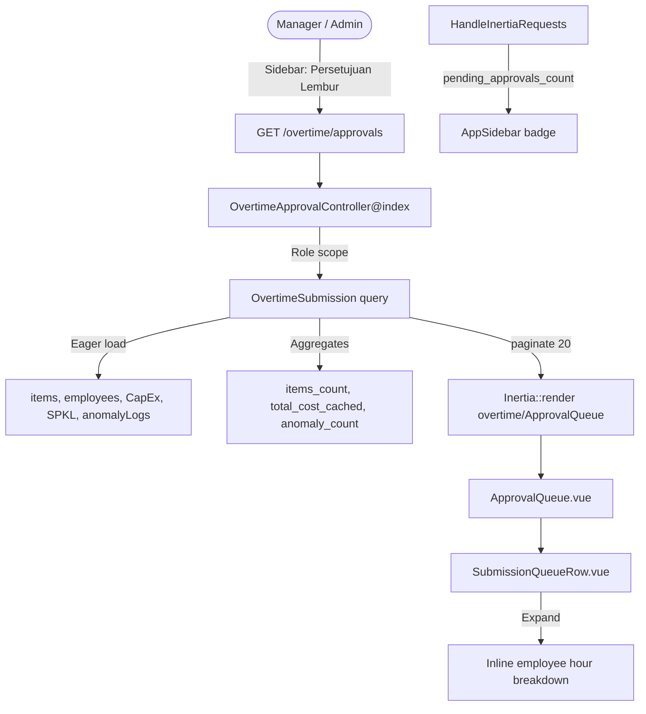
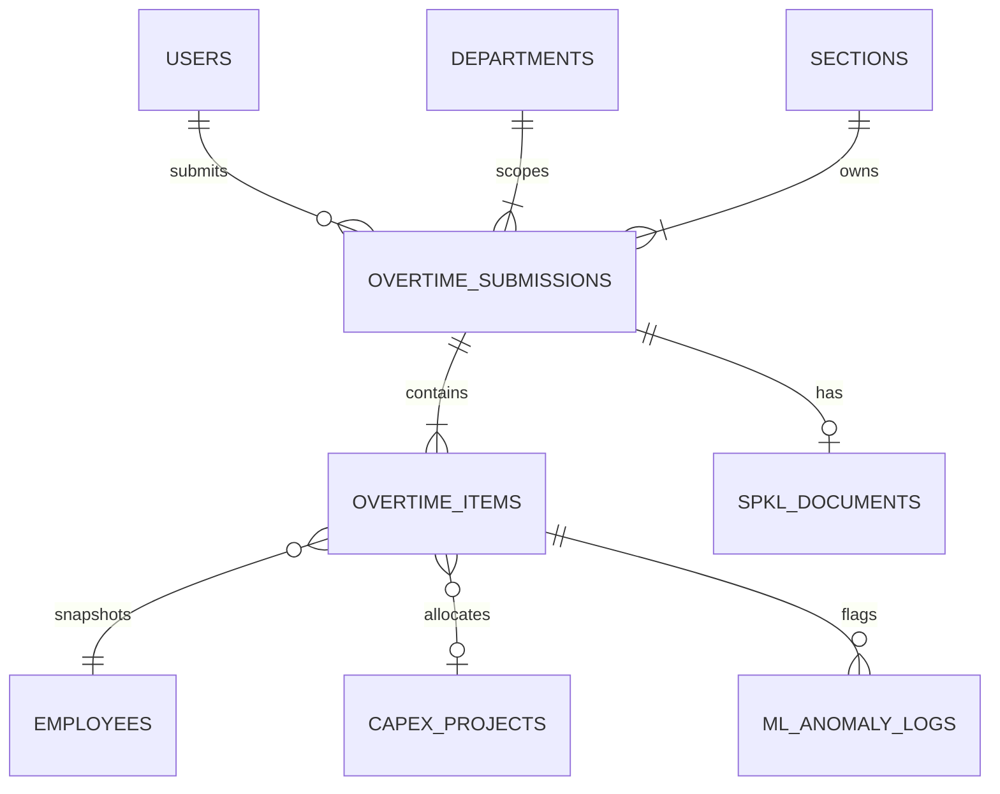

# Verification & Pending Approval Queue (E04-01)

## Overview

The **Pending Approval Queue** is the Manager/Admin morning-standup workspace for reviewing overtime submissions. Story **E04-01** delivers a single consolidated queue at **Persetujuan Lembur** (`/overtime/approvals`) with department scoping, server-side filters/sort/pagination, expandable inline employee summaries, non-blocking SPKL badges, and ML anomaly count pills. Item-level approve/reject (E04-02), bulk actions (E04-03), export (E04-04), audit drawer (E04-05), and force-unlock (E04-06) build on this hub without adding extra sidebar routes.

## Architecture Diagram

## Data Model

## Key Files & UI Mapping

| Layer           | File / Route / Menu                                            | Purpose                                                             |
| --------------- | -------------------------------------------------------------- | ------------------------------------------------------------------- |
| Sidebar Menu    | **Persetujuan Lembur** (`data-test=nav-overtime-approvals`)    | Single Manager/Admin entry; dynamic pending badge                   |
| Page Component  | `resources/js/pages/overtime/ApprovalQueue.vue`                | Queue hub: status tabs, filters, pagination, checkboxes shell       |
| Row Component   | `resources/js/components/overtime/SubmissionQueueRow.vue`      | Expandable row summary + SPKL/anomaly/status badges + Review button |
| Controller      | `app/Http/Controllers/Overtime/OvertimeApprovalController.php` | Scoped listing, filters, sorting, aggregates                        |
| Shared Props    | `app/Http/Middleware/HandleInertiaRequests.php`                | Shares `pending_approvals_count` for sidebar badge                  |
| Route           | `GET /overtime/approvals` → `overtime.approvals`               | Wayfinder: `@/routes/overtime` → `approvals()`                      |
| Auth Middleware | `role:admin,manager`                                           | Team Leaders and Operators receive 403                              |

## Flow Explanation

1. **User triggers** — Manager/Admin clicks **Persetujuan Lembur** in the sidebar (badge shows pending `SUBMITTED` + `PARTIALLY_APPROVED` count for their scope).
2. **Request handling** — `OvertimeApprovalController@index` scopes Managers to `department_id`, Admins plant-wide; applies status/section/SPKL/date/sort query params.
3. **Business logic** — Defaults to last 7 days (WIB) and status `SUBMITTED` (UX morning workload). Eager-loads items for expand panel; computes `items_count`, `total_cost_cached`, and undismissed `anomaly_count`.
4. **Response** — Inertia renders `overtime/ApprovalQueue` with paginated rows (20/page). Expanding a row shows NPK, hours split (Prod/TPM/CapEx/Others), CapEx tags, and anomaly hints without leaving the page.

## API Endpoints & Routes

| Method | URI                   | Controller Action                  | Purpose                                | Auth                         |
| ------ | --------------------- | ---------------------------------- | -------------------------------------- | ---------------------------- |
| GET    | `/overtime/approvals` | `OvertimeApprovalController@index` | Filtered approval queue (Inertia page) | `auth`, `role:admin,manager` |

### Query Parameters

| Param           | Type   | Default            | Description                                                                 |
| --------------- | ------ | ------------------ | --------------------------------------------------------------------------- |
| `status`        | string | `SUBMITTED`        | `SUBMITTED`, `PARTIALLY_APPROVED`, `APPROVED`, `REJECTED`, `PENDING`, `ALL` |
| `department_id` | int    | —                  | Admin-only department filter                                                |
| `section_id`    | int    | —                  | Section filter (must be accessible)                                         |
| `spkl_status`   | string | —                  | `PENDING`, `ATTACHED`, `VERIFIED`, `OVERDUE`, `NONE`                        |
| `date_from`     | date   | today−6 days (WIB) | Inclusive operational date start                                            |
| `date_to`       | date   | today (WIB)        | Inclusive operational date end                                              |
| `sort`          | string | `date`             | `date`, `section`, `total_hours`                                            |
| `direction`     | string | `desc`             | `asc` or `desc`                                                             |
| `page`          | int    | 1                  | Pagination page                                                             |

`PENDING` status alias returns both `SUBMITTED` and `PARTIALLY_APPROVED` (active workload).

## Decisions & Trade-offs

- **Single route + query tabs (not split pages):** UX hard constraint — status switching uses `?status=` on `/overtime/approvals` only.
- **Default status = SUBMITTED:** Matches UX standup risk mitigation; managers still reach partial/all via tabs.
- **Default date window = last 7 days:** Prevents queue overload while remaining adjustable via presets.
- **SPKL never blocks review:** Badges are advisory (BR-05) with tooltip explaining non-blocking policy.
- **Review button shell for E04-01:** Visible per UX inventory; opens Approval Modal in E04-02.
- **Checkbox shell for E04-01:** Present for bulk UX continuity; bulk processing arrives in E04-03.

## Related

- [Epic-04: Verification & Approval Lifecycle](../../scrum/Epic-04.md)
- [Epic-04 UX Plan](../../scrum/Epic-04-ux-plan.md)
- [Daily Overtime Entry & SPKL Workflow](./daily-overtime-spkl.md)
- [ADR-003: Non-Blocking SPKL Document Workflow](../decisions/003-non-blocking-spkl-document-workflow.md)
- [User Guide: Overtime Approvals Queue](../../user-docs/guides/overtime-approvals.md)
