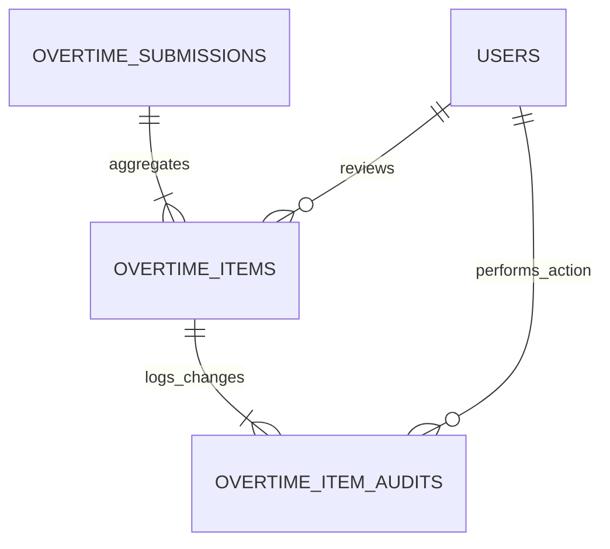

# Verification & Granular Approval Lifecycle

## Overview

The **Verification & Granular Approval Lifecycle** provides department heads, section managers, and plant administrators with an auditable queue to inspect daily overtime submissions. It supports item-level partial decisions—allowing reviewers to approve specific workers while rejecting or requesting revisions on others—with optimistic concurrency control and immutable audit logging.

## Architecture Diagram

```mermaid
flowchart TD
    MGR[Manager / Reviewer] -->|Opens Queue| OAC[OvertimeApprovalController@index]
    OAC -->|Fetches Pending Items| DB[(PostgreSQL Database)]
    MGR -->|Partial Decision / Bulk Approve| OAC2[OvertimeApprovalController@bulkReview]
    OAC2 -->|Validate Lock & Decision| BAR[BulkApprovalRequest]
    BAR --> AOIA[ApproveOvertimeItemAction]

    subgraph ApprovalTx["Approval Transaction (Item-Level)"]
        AOIA --> LOCK[Verify lock_version & Lock Row]
        AOIA --> SNAP[Lock Immutable Rate & Total Cost Snapshot]
        AOIA --> STAT[Update item status APPROVED / REJECTED]
        AOIA --> AUDIT[Append to overtime_item_audits]
    end

    AOIA --> ROLLUP[Recalculate Submission Header Status]
    AOIA -->|Dispatch Queue| SNAPJOB[RecalculateMonthlyBurnSnapshotJob]
    OAC2 -->|Inertia Visit Refresh| MGR
```

## Data Model



## Key Files & UI Mapping

| Layer          | File / Route / Menu                                     | Purpose                                                                |
| -------------- | ------------------------------------------------------- | ---------------------------------------------------------------------- |
| Sidebar Menu   | `Verifikasi & Persetujuan` (`/overtime/approvals`)      | Review queue for Department Managers & Admins                          |
| Page Component | `resources/js/pages/Overtime/ApprovalQueue.vue`         | Approval matrix table with batch select and filter tabs                |
| Review Modal   | `resources/js/components/Overtime/QuickReviewModal.vue` | Detailed line audit with employee stats and SPKL viewer                |
| Controller     | `app/Http/Controllers/OvertimeApprovalController.php`   | Lean controller querying queues and processing decisions               |
| Action         | `app/Actions/Overtime/ApproveOvertimeItemAction.php`    | Handles item transitions, rate snapshotting, and audit logging         |
| Action         | `app/Actions/Overtime/RejectOvertimeItemAction.php`     | Handles item rejections with mandatory reason recording                |
| Request        | `app/Http/Requests/BulkApprovalRequest.php`             | Validates array of item decisions, rejection notes, and `lock_version` |
| Audit Model    | `App\Models\OvertimeItemAudit`                          | Immutable audit log model capturing user, state change, and IP         |

## Flow Explanation

1. **User triggers**: A Department Manager navigates to **Verifikasi & Persetujuan**. The queue defaults to submissions from their department with status `SUBMITTED` or `PARTIALLY_APPROVED`.
2. **Item-level review**: The manager can inspect submission details in a slide-out audit modal:
    - Worker name, NPK, and position.
    - Day type (`HKN` vs `HLR`) and hour breakdown across Production, TPM, CapEx, and Others.
    - SPKL document status (`Terlampir` vs `Belum Ada Lampiran`).
    - Employee's current weekly burn rate to prevent fatigue overload.
3. **Granular decision execution**:
    - **Approve Selected**: Sets selected items to `APPROVED`, snapshots labor rate, and writes audit record.
    - **Reject Selected**: Sets item to `REJECTED`, requires a mandatory business justification (e.g., _"Reassigned to normal shift"_, _"Exceeds monthly allocation"_), and preserves audit trail.
4. **Optimistic concurrency lock**: During processing, each item verifies its `lock_version`. If another manager concurrently reviewed the item, a 409 Conflict error is returned prompting a refresh.
5. **Submission rollup**: Once all items in a submission are processed, the parent submission header status updates automatically to `APPROVED`, `PARTIALLY_APPROVED`, or `REJECTED`.
6. **Snapshot recalculation**: `RecalculateMonthlyBurnSnapshotJob` is dispatched to keep dashboard metrics synchronized.

## API Endpoints & Routes

| Method | URI                               | Controller Action                       | Purpose                                   | Auth / Middleware            |
| ------ | --------------------------------- | --------------------------------------- | ----------------------------------------- | ---------------------------- |
| GET    | `/overtime/approvals`             | `OvertimeApprovalController@index`      | Filterable queue of pending submissions   | `auth`, `role:manager,admin` |
| GET    | `/overtime/approvals/{id}`        | `OvertimeApprovalController@show`       | Itemized audit detail view                | `auth`, `role:manager,admin` |
| POST   | `/overtime/approvals/review-item` | `OvertimeApprovalController@reviewItem` | Single item approve/reject decision       | `auth`, `role:manager,admin` |
| POST   | `/overtime/approvals/bulk-review` | `OvertimeApprovalController@bulkReview` | Batch decision execution on multiple rows | `auth`, `role:manager,admin` |

## Decisions & Trade-offs

- **Item-Level vs. Batch-Only Approval**: Factory shifts frequently feature 20 valid worker entries and 1 disputed entry. Batch-only rejection would delay payroll and reporting for the 20 valid workers. Granular approval resolves this friction.
- **Mandatory Rejection Justification**: Rejections require an explicit explanation to ensure full transparency for Team Leaders and HR compliance.

## Related

- [ADR-002: Immutable Rate Snapshotting](../decisions/002-immutable-labor-rate-snapshotting.md)
- [ADR-005: Denormalized Monthly Burn Snapshots](../decisions/005-denormalized-monthly-burn-snapshots.md)
- [Epic-04: Verification & Approval Lifecycle](../../scrum/Epic-04.md)
