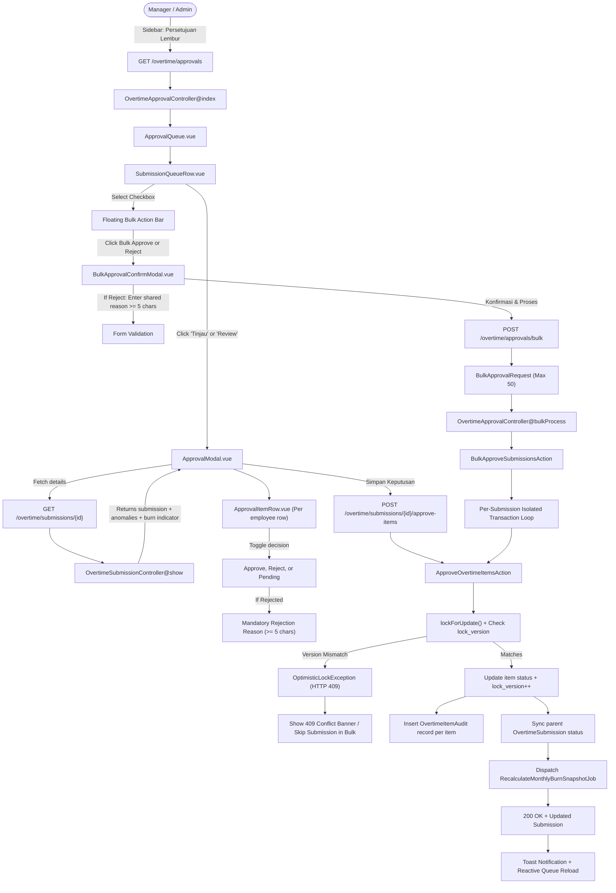
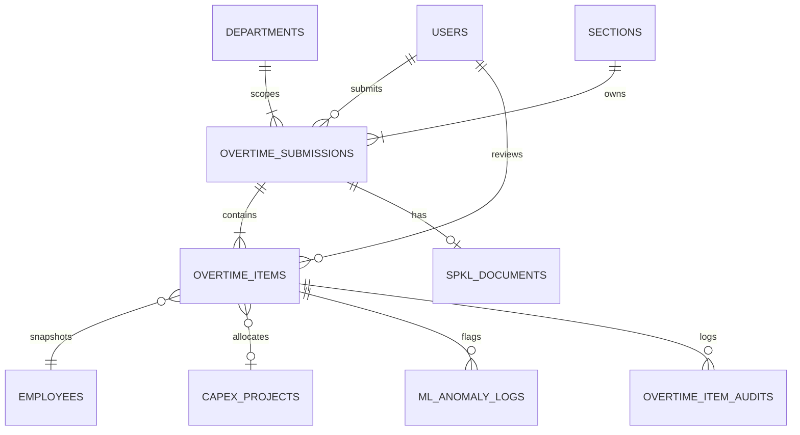

# Verification, Pending Approval Queue, Item-Level Approvals, Bulk Decisions & Overtime Export (E04-01, E04-02, E04-03 & E04-04)

## Overview

The **Approval Queue & Item-Level Decision System** is the Manager/Admin morning-standup workspace for reviewing and deciding overtime submissions.

- **E04-01** provides the consolidated queue at **Persetujuan Lembur** (`/overtime/approvals`) with department scoping, server-side filters/sort/pagination, expandable inline employee summaries, non-blocking SPKL badges, and ML anomaly count pills.
- **E04-02** delivers the interactive **Approval Modal** (`ApprovalModal.vue` & `ApprovalItemRow.vue`) enabling granular item-level decisions (`APPROVED`, `REJECTED`, `PENDING`), mandatory rejection reasons (min 5 characters per BR-10), optimistic locking (`lock_version` with HTTP 409 conflict handling), immutable audit logging (`OvertimeItemAudit`), Section Monthly Budget Burn indicators, and parent submission status synchronization (`SUBMITTED` → `APPROVED` | `PARTIALLY_APPROVED` | `REJECTED`).
- **E04-03** introduces high-speed **Bulk Approval & Rejection** directly on the queue table, allowing approvers to select up to 50 submissions via row checkboxes, inspect totals in a floating toolbar, confirm in a centralized modal with mandatory rejection reasoning, process batches with per-submission transaction isolation, and receive feedback via an auto-dismissing result toast.
- **E04-04** adds the **Streaming Overtime Data Export** (`ExportButton.vue` & `OvertimeExportService`) allowing approvers to download filtered records in CSV and Excel (.xlsx) formats with 19 standardized columns, \(O(1)\) constant-memory streaming via `LazyCollection`, department authority enforcement, and dual audit logging in `export_logs` and `overtime_item_audits`.

## Architecture Diagram



## Data Model



## Key Files & UI Mapping

| Layer           | File / Route / Menu                                              | Purpose                                                                           |
| --------------- | ---------------------------------------------------------------- | --------------------------------------------------------------------------------- |
| Sidebar Menu    | **Persetujuan Lembur** (`data-test=nav-overtime-approvals`)      | Single Manager/Admin entry; dynamic pending badge                                 |
| Page Component  | `resources/js/pages/overtime/ApprovalQueue.vue`                  | Queue hub: status tabs, filters, pagination, checkboxes, modal & bulk bar         |
| Row Component   | `resources/js/components/overtime/SubmissionQueueRow.vue`        | Expandable row summary + SPKL/anomaly/status badges + Review button               |
| Modal Component | `resources/js/components/overtime/ApprovalModal.vue`             | Full review modal: burn bar, SPKL badge, batch actions, conflict banner, totals   |
| Bulk Modal      | `resources/js/components/overtime/BulkApprovalConfirmModal.vue`  | Two-step bulk action confirmation dialog with summary and rejection reason input  |
| Result Toast    | `resources/js/components/overtime/BulkActionResultToast.vue`     | Floating result banner with processed/skipped counters and collapsible skip log   |
| Item Row        | `resources/js/components/overtime/ApprovalItemRow.vue`           | Employee item row: hours breakdown, CapEx tag, anomaly badge, decision, reason    |
| Export Button   | `resources/js/components/overtime/ExportButton.vue`              | Header action popover menu: CSV/XLSX download trigger with active filter summary  |
| Service         | `app/Services/OvertimeExportService.php`                         | LazyCollection cursor streaming, 19-column mapping, native OpenXML XLSX packaging |
| Model           | `app/Models/ExportLog.php`                                       | Audit trail model tracking export actor, format, counts, and filters              |
| Controller      | `app/Http/Controllers/Overtime/OvertimeApprovalController.php`   | `index()`, `approveItems()`, `bulkProcess()`, and `export()` endpoints            |
| Controller      | `app/Http/Controllers/Overtime/OvertimeSubmissionController.php` | `show()` enhanced with anomaly logs and section burn indicator                    |
| Action          | `app/Actions/Overtime/ApproveOvertimeItemsAction.php`            | Concurrency locking, status transitions, audit ledger, job dispatch               |
| Action          | `app/Actions/Overtime/BulkApproveSubmissionsAction.php`          | Bulk batch orchestrator with isolated try-catches and conflict skip aggregation   |
| Request         | `app/Http/Requests/Overtime/ApproveOvertimeItemsRequest.php`     | Form validation for decisions array, actions, and rejection reasons               |
| Request         | `app/Http/Requests/Overtime/BulkApprovalRequest.php`             | Form validation for bulk submissions (max 50) and shared rejection reasons        |
| Exception       | `app/Exceptions/OptimisticLockException.php`                     | HTTP 409 Conflict exception for stale lock versions                               |
| Route           | `POST /overtime/submissions/{submission}/approve-items`          | Wayfinder: `@/routes/overtime/submissions` → `approveItems()`                     |
| Route           | `POST /overtime/approvals/bulk`                                  | Wayfinder: `@/routes/overtime/approvals` → `bulk()`                               |
| Route           | `GET /overtime/approvals/export`                                 | Wayfinder: `@/routes/overtime/approvals` → `export()`                             |

## Flow Explanation

1. **User triggers review** — Manager/Admin clicks **Tinjau** or **Buka Review Lengkap →** on any submission row in `ApprovalQueue.vue`.
2. **Modal Opens & Preloads** — `ApprovalModal.vue` renders immediately with initial data and loads live fresh details from `GET /overtime/submissions/{id}` (including Section Monthly Burn index, anomaly logs, and latest `lock_version`).
3. **Item Decisions** — Approvers decide per worker using segmented buttons (`Setuju`, `Tolak`, `Pending`), or use standup quick actions (`Setujui Semua`, `Tolak Semua`).
4. **Mandatory Rejection Reason (BR-10)** — If any item is rejected, the reason textarea becomes mandatory (minimum 5 characters). For batch rejections, a shared prompt applies the reason to all rejected items with one click.
5. **Optimistic Concurrency Check (E04-02 / BR-08)** — When clicking **Simpan Keputusan**, decisions with item `lock_version` are sent via `POST /overtime/submissions/{submission}/approve-items`.
    - If another reviewer updated any row concurrently, `ApproveOvertimeItemsAction` throws `OptimisticLockException` (HTTP 409).
    - An amber conflict banner appears with **Muat Ulang Data Terbaru** button, ensuring no overwrite occurs.
6. **Persistence & Ledger Writing** — Within a database transaction (`lockForUpdate()`):
    - Overtime item statuses are updated with `reviewed_by_user_id`, timestamp, and incremented `lock_version`.
    - An immutable audit trail entry is inserted into `overtime_item_audits` capturing before/after states.
    - Parent submission status is atomically recalculated (`APPROVED`, `PARTIALLY_APPROVED`, or `REJECTED`).
    - `RecalculateMonthlyBurnSnapshotJob` is dispatched for the section.
7. **Reactive Queue Update** — The modal closes, a green toast confirms the counts, and the queue table reloads preserving pagination and filter state.
8. **Bulk Approval & Rejection Flow (E04-03)**:
    - Manager or Admin selects up to 50 submissions using the table checkboxes or the header "Select All" toggle.
    - The **Floating Bulk Action Bar** renders with live selected count, total employees, and cumulative hours.
    - Approver clicks **Setujui Terpilih** or **Tolak Terpilih**, opening `BulkApprovalConfirmModal.vue`.
    - If rejecting, entering a shared rejection reason (>= 5 characters) is strictly enforced before the confirm button enables.
    - Request is dispatched to `POST /overtime/approvals/bulk`.
    - `BulkApproveSubmissionsAction` processes each submission in an isolated `try-catch` block calling `ApproveOvertimeItemsAction`:
        - If one submission has an `OptimisticLockException` or department mismatch, it rolls back and logs a skip entry without aborting the other submissions in the batch.
        - Each successful submission creates individual `OvertimeItemAudit` records per item and dispatches `RecalculateMonthlyBurnSnapshotJob`.
    - A structured JSON response is returned and displayed in `BulkActionResultToast.vue` with processed vs skipped tallies and a collapsible conflict log.
9. **Filtered Overtime Data Export (E04-04)**:
    - Approver clicks the **Export Data** button in the queue header (`ExportButton.vue`).
    - A popover displays a summary reminder of active filters and two format options:
        - **Unduh Format CSV (.csv)**: Generates UTF-8 BOM CSV for ERP, payroll, and spreadsheet ingestion.
        - **Unduh Format Excel (.xlsx)**: Generates a styled OpenXML spreadsheet with bold headings and numeric typing.
    - Request calls `GET /overtime/approvals/export` with query filters (`format`, `status`, `department_id`, `section_id`, `date_from`, `date_to`, `spkl_status`).
    - The controller enforces department scoping for Managers (`abort(403)` on foreign department access).
    - `OvertimeExportService` queries `OvertimeItem` via `LazyCollection` cursor, streaming results row by row into the response.
    - The export action is synchronously logged in `export_logs` and `overtime_item_audits`.

## API Endpoints & Routes

| Method | URI                                                | Controller Action                         | Purpose                                       | Auth                         |
| ------ | -------------------------------------------------- | ----------------------------------------- | --------------------------------------------- | ---------------------------- |
| GET    | `/overtime/approvals`                              | `OvertimeApprovalController@index`        | Filtered approval queue (Inertia page)        | `auth`, `role:admin,manager` |
| GET    | `/overtime/approvals/export`                       | `OvertimeApprovalController@export`       | Streamed CSV/XLSX export with audit logging   | `auth`, `role:admin,manager` |
| GET    | `/overtime/submissions/{submission}`               | `OvertimeSubmissionController@show`       | Submission detail + burn + anomalies (JSON)   | `auth` (authorized scope)    |
| POST   | `/overtime/submissions/{submission}/approve-items` | `OvertimeApprovalController@approveItems` | Commit item approvals/rejections with locking | `auth`, `role:admin,manager` |
| POST   | `/overtime/approvals/bulk`                         | `OvertimeApprovalController@bulkProcess`  | Process bulk approvals/rejections (max 50)    | `auth`, `role:admin,manager` |

### POST /overtime/approvals/bulk Payload

```json
{
    "submission_ids": [10, 11, 12],
    "action": "APPROVED"
}
```

Or for bulk rejection:

```json
{
    "submission_ids": [10, 11, 12],
    "action": "REJECTED",
    "rejection_reason": "Target shift terpenuhi, alokasi lembur ditiadakan."
}
```

#### Bulk Response Example (200 OK)

```json
{
    "processed_submissions_count": 2,
    "skipped_submissions_count": 1,
    "processed_items_count": 8,
    "skipped_items_count": 3,
    "processed_submission_ids": [10, 11],
    "skipped": [
        {
            "id": 12,
            "code": "OT-20260908-PRESS-002",
            "reason": "Data pengajuan telah diperbarui oleh reviewer lain."
        }
    ],
    "message": "Proses massal: 8 item berhasil disetujui (3 item dilewati)."
}
```

### POST /overtime/submissions/{submission}/approve-items Payload

```json
{
    "decisions": [
        {
            "item_id": 101,
            "action": "APPROVED",
            "lock_version": 1
        },
        {
            "item_id": 102,
            "action": "REJECTED",
            "rejection_reason": "Pekerjaan tidak tercantum dalam SPKL resmi",
            "lock_version": 1
        }
    ]
}
```

## Decisions & Trade-offs

- **Single Surface Architecture:** Review is conducted via a high-density modal over `/overtime/approvals` instead of redirecting to a new page or wizard, preserving standup context.
- **Optimistic Locking via `lock_version`:** Prevents silent overwrites when two shift managers review simultaneous submissions.
- **Auditing Immutability:** Financial rate snapshots remain untouched per `OvertimeItemObserver`; approval audits are appended to `overtime_item_audits` rather than modifying financial records.
- **Asynchronous Snapshot Recalculation:** `RecalculateMonthlyBurnSnapshotJob` is queued post-transaction to maintain sub-second approval response times.

### Query Parameters

| Param           | Type   | Default            | Description                                                                 |
| --------------- | ------ | ------------------ | --------------------------------------------------------------------------- |
| `status`        | string | `SUBMITTED`        | `SUBMITTED`, `PARTIALLY_APPROVED`, `APPROVED`, `REJECTED`, `PENDING`, `ALL` |
| `department_id` | int    | —                  | Admin-only department filter                                                |
| `section_id`    | int    | —                  | Section filter (must be accessible)                                         |
| `spkl_status`   | string | —                  | `PENDING`, `ATTACHED`, `VERIFIED`, `OVERDUE`, `NONE`                        |
| `date_from`     | date   | today−6 days (WIB) | Inclusive operational date start                                            |
| `date_to`       | date   | today (WIB)        | Inclusive operational date end                                              |
| `sort`          | string | `date`             | `date`, `section`, `total_hours`                                            |
| `direction`     | string | `desc`             | `asc` or `desc`                                                             |
| `page`          | int    | 1                  | Pagination page                                                             |

`PENDING` status alias returns both `SUBMITTED` and `PARTIALLY_APPROVED` (active workload).

## Decisions & Trade-offs

- **Single route + query tabs (not split pages):** UX hard constraint — status switching uses `?status=` on `/overtime/approvals` only.
- **Default status = SUBMITTED:** Matches UX standup risk mitigation; managers still reach partial/all via tabs.
- **Default date window = last 7 days:** Prevents queue overload while remaining adjustable via presets.
- **SPKL never blocks review:** Badges are advisory (BR-05) with tooltip explaining non-blocking policy.
- **Review button shell for E04-01:** Visible per UX inventory; opens Approval Modal in E04-02.
- **Checkbox shell for E04-01:** Present for bulk UX continuity; bulk processing arrives in E04-03.

## Related

- [Epic-04: Verification & Approval Lifecycle](../../scrum/Epic-04.md)
- [Epic-04 UX Plan](../../scrum/Epic-04-ux-plan.md)
- [Daily Overtime Entry & SPKL Workflow](./daily-overtime-spkl.md)
- [ADR-003: Non-Blocking SPKL Document Workflow](../decisions/003-non-blocking-spkl-document-workflow.md)
- [User Guide: Overtime Approvals Queue](../../user-docs/guides/overtime-approvals.md)
